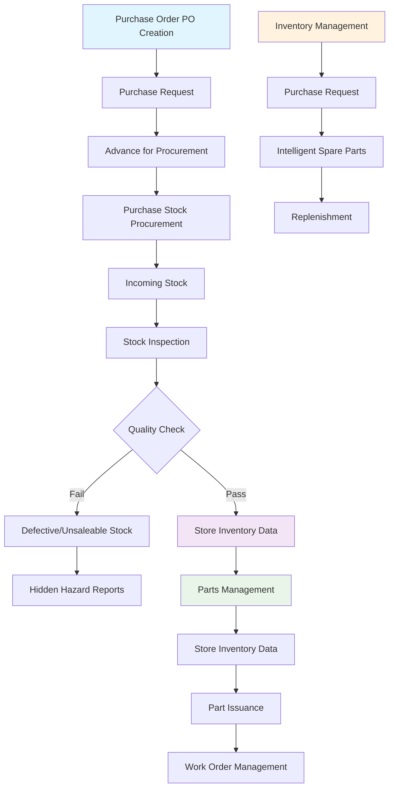
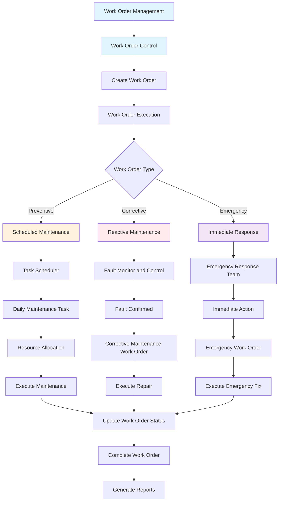
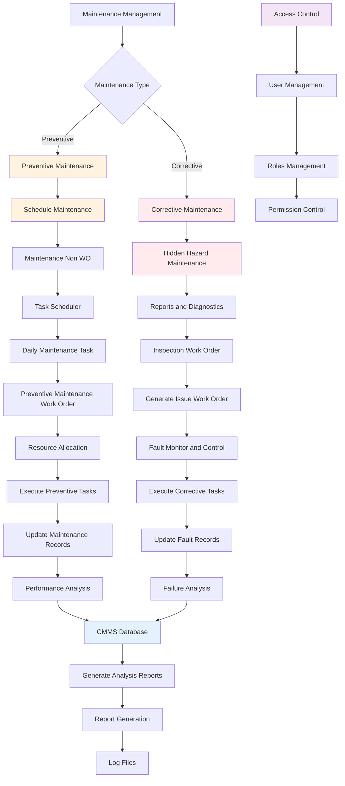
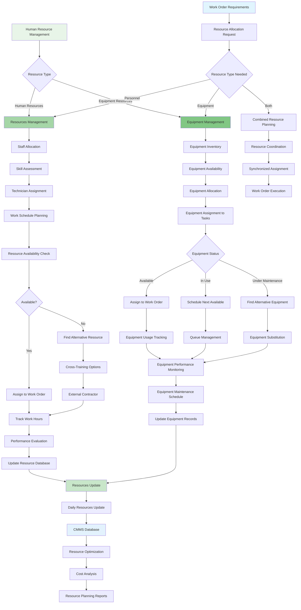

```mermaid
flowchart TD
    %% Asset Planning & Creation
    A[Asset Lifecycle Management] --> B[Asset Planning]
    B --> C[Asset Acquisition]
    C --> D[Asset Registration]
    D --> E[Asset Classification]
    
    %% Asset Classification & Hierarchy
    E --> F{Classification Type}
    F -->|Equipment| G[Equipment Classification]
    F -->|Location| H[Location Classification]
    F -->|Linear| I[Linear Asset Classification]
    
    G --> J[Asset Hierarchy Creation]
    H --> K[Location Hierarchy Creation]
    I --> L[Linear Network Creation]
    
    %% Asset Master Data Management
    J --> M[Asset Master Data]
    K --> M
    L --> M
    
    M --> N[Asset Specifications]
    N --> O[Technical Attributes]
    O --> P[Asset Criticality Assessment]
    P --> Q[Asset Risk Matrix]
    
    %% Asset Performance Management (APM)
    Q --> R[Asset Performance Management]
    R --> S[Condition Monitoring]
    S --> T{Monitoring Type}
    
    T -->|IoT Sensors| U[IoT Data Collection]
    T -->|Manual Inspection| V[Inspection Work Orders]
    T -->|Predictive Analytics| W[AI/ML Analysis]
    
    U --> X[Real-time Asset Health]
    V --> Y[Inspection Results]
    W --> Z[Predictive Insights]
    
    %% Asset Health & Performance Analysis
    X --> AA[Asset Health Dashboard]
    Y --> AA
    Z --> AA
    
    AA --> BB[Asset Health Score]
    BB --> CC[Performance KPIs]
    CC --> DD{Asset Status}
    
    DD -->|Healthy| EE[Continue Monitoring]
    DD -->|Warning| FF[Schedule PM]
    DD -->|Critical| GG[Generate Emergency WO]
    DD -->|Failed| HH[Corrective Maintenance]
    
    %% Asset Lifecycle States
    EE --> II[Asset State Management]
    FF --> JJ[Planned Maintenance State]
    GG --> KK[Emergency State]
    HH --> LL[Repair State]
    
    %% Asset Financial Management
    II --> MM[Asset Financial Tracking]
    JJ --> MM
    KK --> MM
    LL --> MM
    
    MM --> NN[Asset Depreciation]
    NN --> OO[Total Cost of Ownership TCO]
    OO --> PP[Asset ROI Analysis]
    PP --> QQ[Replacement Analysis]
    
    %% Asset Reliability & RCM
    QQ --> RR[Reliability Centered Maintenance]
    RR --> SS[Failure Mode Analysis]
    SS --> TT[Criticality Analysis]
    TT --> UU[Maintenance Strategy]
    
    UU --> VV{Maintenance Type}
    VV -->|Preventive| WW[PM Strategy]
    VV -->|Predictive| XX[PdM Strategy]
    VV -->|Condition Based| YY[CBM Strategy]
    VV -->|Run to Failure| ZZ[RTF Strategy]
    
    %% Work Order Generation
    WW --> AAA[Generate PM Work Orders]
    XX --> BBB[Generate PdM Work Orders]
    YY --> CCC[Generate CBM Work Orders]
    ZZ --> DDD[Reactive Work Orders]
    
    %% Asset Disposal & Retirement
    AAA --> EEE[Asset Lifecycle Review]
    BBB --> EEE
    CCC --> EEE
    DDD --> EEE
    
    EEE --> FFF{End of Life?}
    FFF -->|No| GGG[Continue Operations]
    FFF -->|Yes| HHH[Asset Retirement]
    
    GGG --> II
    HHH --> III[Disposal Planning]
    III --> JJJ[Asset Disposal]
    JJJ --> KKK[Asset Record Closure]
    
    style A fill:#1e88e5
    style R fill:#43a047
    style AA fill:#fb8c00
    style MM fill:#8e24aa
    style RR fill:#e53935
    style HHH fill:#6d4c41
```

# CMMS Business Process Flow Documentation

## Overview

This document provides a comprehensive breakdown of the Computerized Maintenance Management System (CMMS) business process flows based on the main process flow diagram. The CMMS system integrates multiple interconnected modules to provide end-to-end maintenance management capabilities.

## Main Process Flow Description

The main CMMS process flow diagram illustrates the interconnected nature of five core modules:

1. **Inventory Management** (Blue sections) - Handles procurement, stock management, and parts distribution
2. **Asset Management** (Green sections) - Manages asset lifecycle, performance monitoring, and resource allocation
3. **Work Order Management** (Purple sections) - Controls work order creation, execution, and completion
4. **Preventive & Corrective Maintenance** (Orange/Red sections) - Manages scheduled and reactive maintenance activities
5. **Human Resource Management** (Light Green sections) - Coordinates personnel and equipment resources

The flow demonstrates how data and processes flow between modules, with the central CMMS database serving as the integration hub for reporting, analytics, and data management. Each module feeds into and receives data from others, creating a comprehensive maintenance ecosystem.

---

## 1. Inventory Management Flow

### Description
The Inventory Management module handles the complete lifecycle of spare parts and materials, from procurement planning through distribution to work orders. This flow ensures optimal inventory levels while minimizing stockouts and excess inventory costs.

### Key Components
- **Procurement Process**: Purchase order creation, vendor management, and receiving
- **Quality Control**: Incoming inspection and quality assurance
- **Stock Management**: Inventory tracking, storage, and organization
- **Parts Distribution**: Issuance to work orders and consumption tracking
- **Replenishment**: Automatic reorder points and intelligent forecasting

### Business Process Flow

### Process Explanation
1. **Procurement Initiation**: Process begins with purchase order creation based on inventory requirements
2. **Vendor Management**: Purchase requests are processed through approved vendor channels
3. **Receiving & Quality**: Incoming stock undergoes inspection and quality verification
4. **Stock Management**: Approved items are stored with proper inventory data management
5. **Distribution**: Parts are issued to work orders based on maintenance requirements
6. **Replenishment**: System monitors stock levels and triggers automatic reordering

---

## 2. Asset Management Flow

### Description
The Asset Management module provides comprehensive lifecycle management of physical assets, from acquisition through disposal. Following IBM Maximo best practices, this module emphasizes asset performance monitoring, reliability-centered maintenance, and data-driven decision making.

### Key Components
- **Asset Hierarchy**: Structured classification and organization
- **Performance Monitoring**: Real-time health tracking and KPI management
- **Lifecycle Management**: From planning through retirement
- **Reliability Analysis**: RCM, failure mode analysis, and maintenance strategy optimization
- **Financial Tracking**: TCO, depreciation, and ROI analysis

### Business Process Flow

### Process Explanation
1. **Asset Planning & Acquisition**: Strategic planning and procurement of new assets
2. **Classification & Hierarchy**: Organizing assets into logical hierarchical structures
3. **Performance Monitoring**: Continuous monitoring using IoT, inspections, and analytics
4. **Health Assessment**: Real-time dashboards and scoring systems for asset health
5. **Maintenance Strategy**: RCM-based approach to determine optimal maintenance strategies
6. **Financial Management**: Comprehensive tracking of asset costs and ROI
7. **Lifecycle Management**: Managing assets from acquisition through retirement

---

## 3. Work Order Management Flow

### Description
The Work Order Management module serves as the central coordination point for all maintenance activities. It manages the creation, scheduling, execution, and completion of work orders while ensuring proper resource allocation and documentation.

### Key Components
- **Work Order Creation**: Multiple trigger sources (scheduled, reactive, predictive)
- **Resource Planning**: Coordination of personnel, tools, and materials
- **Execution Control**: Real-time tracking and status management
- **Documentation**: Comprehensive record keeping and reporting
- **Performance Analysis**: Work order metrics and optimization

### Business Process Flow

### Process Explanation
1. **Work Order Creation**: Various triggers generate work orders (scheduled PM, equipment failures, inspections)
2. **Classification**: Work orders are categorized by type and priority
3. **Resource Allocation**: System assigns appropriate personnel, tools, and materials
4. **Execution Tracking**: Real-time monitoring of work progress and status updates
5. **Completion & Documentation**: Final reporting and knowledge capture
6. **Performance Analysis**: Metrics collection for continuous improvement

---

## 4. Preventive & Corrective Maintenance Flow

### Description
This module manages both planned preventive maintenance activities and unplanned corrective maintenance responses. It ensures optimal maintenance strategies are applied based on asset criticality, failure modes, and business requirements.

### Key Components
- **Preventive Maintenance**: Scheduled, time-based, and condition-based maintenance
- **Corrective Maintenance**: Reactive maintenance for equipment failures
- **Maintenance Planning**: Strategic scheduling and resource optimization
- **Failure Analysis**: Root cause analysis and continuous improvement
- **Performance Tracking**: Maintenance effectiveness metrics

### Business Process Flow

### Process Explanation
1. **Maintenance Strategy Selection**: System determines appropriate maintenance approach
2. **Preventive Path**: Scheduled maintenance with task planning and resource allocation
3. **Corrective Path**: Reactive maintenance triggered by failures or issues
4. **Execution Management**: Coordinated execution of maintenance activities
5. **Documentation**: Comprehensive record keeping for analysis and compliance
6. **Continuous Improvement**: Performance analysis and strategy optimization

---

## 5. Human Resource Management Flow

### Description
The Human Resource Management module coordinates both human resources and equipment resources to ensure optimal allocation for maintenance activities. It manages skills, availability, scheduling, and performance tracking across all maintenance operations.

### Key Components
- **Personnel Management**: Skills assessment, scheduling, and performance tracking
- **Equipment Resource Management**: Tool and equipment allocation and tracking
- **Resource Coordination**: Integrated planning for complex maintenance tasks
- **Performance Analytics**: Resource utilization and efficiency metrics
- **Training & Development**: Skills management and capability building

### Business Process Flow

### Process Explanation
1. **Resource Type Identification**: System determines personnel and/or equipment needs
2. **Human Resource Management**: Skills matching, availability checking, and assignment
3. **Equipment Resource Management**: Tool allocation, scheduling, and tracking
4. **Integrated Planning**: Coordination of both resource types for complex tasks
5. **Performance Monitoring**: Tracking utilization, efficiency, and costs
6. **Optimization**: Continuous improvement of resource allocation strategies

---

## Integration & Data Flow

### Central CMMS Database
All modules integrate through a central CMMS database that provides:
- Real-time data synchronization
- Master data management
- Historical data retention
- Performance analytics
- Regulatory compliance reporting

### Key Integration Points
1. **Inventory → Work Orders**: Parts and materials allocation
2. **Assets → Maintenance**: Performance-driven maintenance strategies
3. **Work Orders → HR**: Resource allocation and scheduling
4. **Maintenance → Assets**: Performance feedback and health updates
5. **All Modules → Reporting**: Comprehensive analytics and KPIs

### Business Benefits
- **Operational Efficiency**: Streamlined processes and reduced downtime
- **Cost Optimization**: Better resource utilization and inventory management
- **Risk Management**: Proactive maintenance and failure prevention
- **Compliance**: Comprehensive documentation and audit trails
- **Decision Support**: Data-driven insights for strategic planning

---

## Conclusion

This comprehensive CMMS business process flow documentation provides a detailed roadmap for implementing an enterprise-grade maintenance management system. By following these interconnected processes, organizations can achieve optimal asset performance, reduced operational costs, and improved maintenance effectiveness.

The modular design ensures scalability and flexibility while maintaining data integrity and process consistency across all maintenance operations.