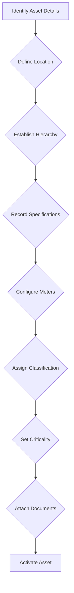
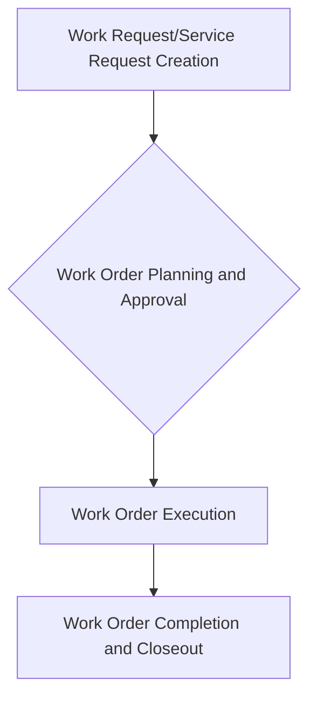
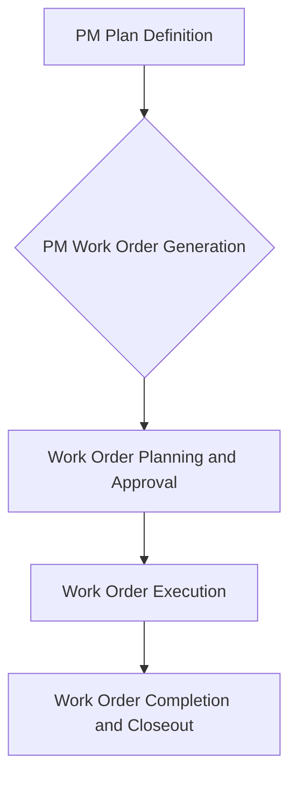

# Maintenance Management Information System (MMIS) - Technical Documentation

**Document Version:** 1.0  
**Date:** August 6, 2025  
**Author:** Manus AI
**Classification:** Comprehensive Technical Reference

---

## Table of Contents

1.  [Executive Summary](#1-executive-summary)
2.  [System Overview](#2-system-overview)
3.  [Database Architecture](#3-database-architecture)
4.  [Core Data Model](#4-core-data-model)
5.  [Application Designer Framework](#5-application-designer-framework)
6.  [Predictive Maintenance Framework](#6-predictive-maintenance-framework)
7.  [Integration and Configuration](#7-integration-and-configuration)
8.  [Security and Access Control](#8-security-and-access-control)
9.  [Performance Considerations](#9-performance-considerations)
10. [Implementation Roadmap](#10-implementation-roadmap)
11. [Technical Requirements](#11-technical-requirements)
12. [Appendices](#12-appendices)
13. [Business Process Documentation](#13-business-process-documentation)
    *   [Asset Management Process](#131-asset-management-process)
    *   [Work Order Management Process](#132-work-order-management-process)
    *   [Preventive Maintenance (PM) Management Process](#133-preventive-maintenance-pm-management-process)
    *   [Inventory Management Process](#134-inventory-management-process)
    *   [Procurement Management Process](#135-procurement-management-process)
    *   [Labor and Crew Management Process](#136-labor-and-crew-management-process)
    *   [Health, Safety, and Environment (HSE) Management Process](#137-health-safety-and-environment-hse-management-process)
    *   [Reporting and Analytics Process](#138-reporting-and-analytics-process)
    *   [Security and Access Control Process](#139-security-and-access-control-process)
    *   [Application Designer Process](#1310-application-designer-process)
    *   [Manufacturer and Model Management Process](#1311-manufacturer-and-model-management-process)
    *   [Asset Document Management Process](#1312-asset-document-management-process)
    *   [Asset Relationship Management Process](#1313-asset-relationship-management-process)
    *   [Asset Downtime Tracking Process](#1314-asset-downtime-tracking-process)
    *   [Job Plan Management Process](#1315-job-plan-management-process)
    *   [Problem, Cause, and Resolution Code Management Process](#1316-problem-cause-and-resolution-code-management-process)
    *   [Failure Code Management Process](#1317-failure-code-management-process)
    *   [Item Category Management Process](#1318-item-category-management-process)
    *   [Storeroom and Bin Management Process](#1319-storeroom-and-bin-management-process)
    *   [Physical Count and Cycle Count Management Process](#1320-physical-count-and-cycle-count-management-process)
    *   [Inventory Reservation Management Process](#1321-inventory-reservation-management-process)
    *   [Item Vendor Management Process](#1322-item-vendor-management-process)
    *   [Item Specification Management Process](#1323-item-specification-management-process)
    *   [Purchase Order Line Item Management Process](#1324-purchase-order-line-item-management-process)
    *   [Vendor Management Process](#1325-vendor-management-process)
    *   [Contract Management Process](#1326-contract-management-process)
    *   [Invoice Processing Management Process](#1327-invoice-processing-management-process)
    *   [Vendor Evaluation Management Process](#1328-vendor-evaluation-management-process)
    *   [Craft and Skill Management Process](#1329-craft-and-skill-management-process)
    *   [Certification Management Process](#1330-certification-management-process)
    *   [Labor Skill and Certification Assignment Process](#1331-labor-skill-and-certification-assignment-process)
    *   [Crew and Team Management Process](#1332-crew-and-team-management-process)
    *   [Labor Calendar and Shift Pattern Management Process](#1333-labor-calendar-and-shift-pattern-management-process)
    *   [Incident Investigation Management Process](#1334-incident-investigation-management-process)
    *   [Corrective Action Management Process](#1335-corrective-action-management-process)
    *   [Hazard and Risk Assessment Management Process](#1336-hazard-and-risk-assessment-management-process)
    *   [Safety Inspection Management Process](#1337-safety-inspection-management-process)
    *   [Environmental Monitoring Management Process](#1338-environmental-monitoring-management-process)
    *   [Report Management Process](#1339-report-management-process)
    *   [Dashboard and KPI Management Process](#1340-dashboard-and-kpi-management-process)
    *   [Data View Management Process](#1341-data-view-management-process)
    *   [IoT Device Management Process](#1342-iot-device-management-process)
    *   [Sensor Data Management Process](#1343-sensor-data-management-process)
    *   [Condition Monitoring Process](#1344-condition-monitoring-process)
    *   [Predictive Model Management Process](#1345-predictive-model-management-process)
    *   [Anomaly Detection Process](#1346-anomaly-detection-process)
    *   [Maintenance Recommendation Process](#1347-maintenance-recommendation-process)
    *   [Asset Health Index Management Process](#1348-asset-health-index-management-process)
    *   [Workflow Engine Management Process](#1349-workflow-engine-management-process)
    *   [System Configuration Management Process](#1350-system-configuration-management-process)
    *   [Notification Management Process](#1351-notification-management-process)
    *   [Unit of Measure (UOM) Management Process](#1352-unit-of-measure-uom-management-process)
    *   [Currency Management Process](#1353-currency-management-process)
    *   [Country Management Process](#1354-country-management-process)
    *   [Time Zone Management Process](#1355-time-zone-management-process)
    *   [Calendar Definition Management Process](#1356-calendar-definition-management-process)
    *   [Holiday Management Process](#1357-holiday-management-process)
    *   [Document Type Management Process](#1358-document-type-management-process)
14. [Acceptance Criteria](#14-acceptance-criteria)
15. [Functional Specification Document](#15-functional-specification-document)
16. [Requirements Traceability Matrix](#16-requirements-traceability-matrix)
17. [Development Readiness and AI Coding Assistants Report](#17-development-readiness-and-ai-coding-assistants-report)

---


## 1. Executive Summary

This document provides a comprehensive database design specification for a Maintenance Management Information System (MMIS) comparable to IBM Maximo. The system is designed to support enterprise-level maintenance operations with advanced features including:

- **Comprehensive Asset Management** with hierarchical structures
- **Work Order Management** with workflow automation
- **Inventory and Procurement** integration
- **Predictive Maintenance** capabilities with IoT integration
- **Application Designer** for system customization
- **Mobile and Offline** capabilities for field operations
- **Advanced Analytics** and reporting framework

The database design supports approximately **120+ tables** organized into logical modules, providing scalability for enterprise deployments while maintaining flexibility for customization.

## 2. System Overview

### 2.1 Business Objectives

The MMIS system addresses key maintenance management challenges:

- **Asset Lifecycle Management**: Complete tracking from acquisition to disposal
- **Maintenance Optimization**: Preventive, predictive, and corrective maintenance
- **Resource Management**: Labor, inventory, and vendor coordination
- **Compliance and Audit**: Regulatory compliance and audit trail maintenance
- **Cost Control**: Maintenance cost tracking and optimization
- **Performance Monitoring**: KPIs, analytics, and business intelligence

### 2.2 Functional Scope

The system encompasses these primary functional areas:

- Asset and Location Management
- Work Order and Task Management
- Preventive Maintenance Scheduling
- Inventory and Materials Management
- Procurement and Vendor Management
- Labor and Resource Management
- Workflow and Business Process Management
- Reporting and Analytics
- Mobile Field Operations
- Predictive Maintenance and Condition Monitoring

### 2.3 Non-Functional Requirements

- **Scalability**: Support for 100,000+ assets and 1M+ work orders annually
- **Performance**: Sub-second response times for common operations
- **Availability**: 99.9% uptime with disaster recovery capabilities
- **Security**: Role-based access control with audit logging
- **Integration**: RESTful APIs and standard integration protocols
- **Customization**: Metadata-driven configuration capabilities

## 3. Database Architecture

### 3.1 Architectural Principles

The database design follows these key principles:

1. **Normalization**: Third Normal Form (3NF) with selective denormalization for performance
2. **Modularity**: Logical separation of functional areas with defined interfaces
3. **Extensibility**: Metadata-driven framework supporting customization
4. **Auditability**: Comprehensive audit trails for all business transactions
5. **Scalability**: Partitioning strategies for high-volume tables
6. **Performance**: Optimized indexing and query patterns

### 3.2 Database Technology Recommendations

**Primary Database Options:**
- **PostgreSQL 15+**: Open-source, excellent JSON support, strong community
- **Oracle 19c+**: Enterprise-grade, advanced features, high performance
- **Microsoft SQL Server 2022+**: .NET integration, cloud capabilities

**Recommended Configuration:**
- **Time-Series Extension**: For sensor data (TimescaleDB for PostgreSQL)
- **Full-Text Search**: Integrated search capabilities
- **Partitioning**: Date-based partitioning for transaction tables
- **Replication**: Master-slave setup for read scalability

### 3.3 Data Volume Estimates

| Entity | Volume (5 Years) | Growth Rate | Partitioning Strategy |
|--------|-----------------|-------------|----------------------|
| Assets | 100,000 | 10% annually | By organization |
| Work Orders | 5,000,000 | 15% annually | By date (monthly) |
| Sensor Readings | 1,000,000,000 | 20% annually | By date (daily) |
| Inventory Transactions | 10,000,000 | 12% annually | By date (monthly) |
| Audit Records | 50,000,000 | 25% annually | By date (weekly) |

## 4. Core Data Model

### 4.1 Entity Relationship Overview

The core data model consists of these primary entity groups:

```
Asset Management Layer
├── Assets (hierarchical)
├── Asset Types and Classifications
├── Asset Specifications and Meters
├── Locations (hierarchical)
└── Manufacturers and Models

Work Management Layer
├── Work Orders
├── Work Order Tasks
├── Labor Transactions
├── Material Transactions
├── PM Schedules
└── Service Requests

Inventory Management Layer
├── Items and Categories
├── Inventory Balances
├── Storerooms and Bins
├── Inventory Transactions
└── Physical Counts

Procurement Layer
├── Purchase Requisitions
├── Purchase Orders
├── Vendors and Contracts
├── Receiving Records
└── Invoice Processing

Human Resources Layer
├── Labor Resources
├── Crafts and Skills
├── Certifications
├── Crews and Teams
└── Labor Calendars
```

### 4.2 Asset Management Schema

#### 4.2.1 Core Asset Tables

```sql
-- Primary asset registry
CREATE TABLE ASSETS (
    asset_id SERIAL PRIMARY KEY,
    asset_num VARCHAR(50) NOT NULL UNIQUE,
    description VARCHAR(255) NOT NULL,
    long_description TEXT,
    status VARCHAR(20) NOT NULL DEFAULT 'ACTIVE',
    asset_type_id INTEGER NOT NULL REFERENCES ASSET_TYPES(asset_type_id),
    parent_asset_id INTEGER REFERENCES ASSETS(asset_id),
    location_id INTEGER REFERENCES LOCATIONS(location_id),
    
    -- Financial Information
    purchase_price DECIMAL(15,2),
    purchase_date DATE,
    installation_date DATE,
    warranty_start_date DATE,
    warranty_end_date DATE,
    depreciation_method VARCHAR(20),
    salvage_value DECIMAL(15,2),
    
    -- Technical Information
    serial_number VARCHAR(100),
    model VARCHAR(100),
    manufacturer_id INTEGER REFERENCES MANUFACTURERS(manufacturer_id),
    criticality INTEGER CHECK (criticality BETWEEN 1 AND 5),
    
    -- Operational Information
    commission_date DATE,
    expected_life_years INTEGER,
    operating_hours DECIMAL(12,2) DEFAULT 0,
    last_inspection_date DATE,
    next_inspection_date DATE,
    
    -- Hierarchy and Classification
    hierarchy_path VARCHAR(500), -- Materialized path for efficient queries
    classification_code VARCHAR(50),
    
    -- Status and Lifecycle
    lifecycle_status VARCHAR(20), -- PLANNING, ACTIVE, MAINTENANCE, RETIRED
    retirement_date DATE,
    disposal_date DATE,
    
    -- Audit Fields
    created_date TIMESTAMP DEFAULT CURRENT_TIMESTAMP,
    created_by VARCHAR(50) NOT NULL,
    modified_date TIMESTAMP DEFAULT CURRENT_TIMESTAMP,
    modified_by VARCHAR(50),
    
    -- Constraints
    CONSTRAINT chk_asset_dates CHECK (
        (purchase_date IS NULL OR installation_date IS NULL OR purchase_date <= installation_date) AND
        (warranty_start_date IS NULL OR warranty_end_date IS NULL OR warranty_start_date < warranty_end_date)
    )
);

-- Asset type definitions
CREATE TABLE ASSET_TYPES (
    asset_type_id SERIAL PRIMARY KEY,
    type_code VARCHAR(20) NOT NULL UNIQUE,
    type_name VARCHAR(100) NOT NULL,
    description TEXT,
    parent_type_id INTEGER REFERENCES ASSET_TYPES(asset_type_id),
    hierarchy_level INTEGER DEFAULT 1,
    is_rotating BOOLEAN DEFAULT false,
    default_uom_id INTEGER REFERENCES UOM(uom_id),
    avg_maintenance_cost DECIMAL(15,2),
    expected_life_years INTEGER,
    attributes_schema JSON, -- Flexible schema for type-specific attributes
    created_date TIMESTAMP DEFAULT CURRENT_TIMESTAMP,
    created_by VARCHAR(50) NOT NULL
);

-- Asset specifications (key-value pairs)
CREATE TABLE ASSET_SPECIFICATIONS (
    spec_id SERIAL PRIMARY KEY,
    asset_id INTEGER NOT NULL REFERENCES ASSETS(asset_id) ON DELETE CASCADE,
    attribute_name VARCHAR(100) NOT NULL,
    attribute_value TEXT,
    uom_id INTEGER REFERENCES UOM(uom_id),
    is_required BOOLEAN DEFAULT false,
    display_sequence INTEGER,
    created_date TIMESTAMP DEFAULT CURRENT_TIMESTAMP,
    created_by VARCHAR(50) NOT NULL,
    UNIQUE (asset_id, attribute_name)
);

-- Asset meters for condition monitoring
CREATE TABLE ASSET_METERS (
    meter_id SERIAL PRIMARY KEY,
    asset_id INTEGER NOT NULL REFERENCES ASSETS(asset_id) ON DELETE CASCADE,
    meter_name VARCHAR(100) NOT NULL,
    description TEXT,
    meter_type VARCHAR(20) NOT NULL, -- GAUGE, COUNTER, CHARACTERISTIC
    uom_id INTEGER REFERENCES UOM(uom_id),
    reading_type VARCHAR(20) DEFAULT 'ABSOLUTE', -- ABSOLUTE, DELTA, CONTINUOUS
    rollover_value DECIMAL(18,6),
    min_value DECIMAL(18,6),
    max_value DECIMAL(18,6),
    precision_digits INTEGER DEFAULT 2,
    last_reading DECIMAL(18,6),
    last_reading_date TIMESTAMP,
    is_active BOOLEAN DEFAULT true,
    created_date TIMESTAMP DEFAULT CURRENT_TIMESTAMP,
    created_by VARCHAR(50) NOT NULL,
    UNIQUE (asset_id, meter_name)
);

-- Meter readings history
CREATE TABLE METER_READINGS (
    reading_id BIGSERIAL PRIMARY KEY,
    meter_id INTEGER NOT NULL REFERENCES ASSET_METERS(meter_id),
    reading_value DECIMAL(18,6) NOT NULL,
    reading_date TIMESTAMP NOT NULL DEFAULT CURRENT_TIMESTAMP,
    inspector_id INTEGER REFERENCES LABOR(labor_id),
    notes TEXT,
    reading_source VARCHAR(20) DEFAULT 'MANUAL', -- MANUAL, AUTOMATIC, IMPORTED
    quality_flag INTEGER DEFAULT 1, -- 1=Good, 2=Questionable, 3=Bad
    created_date TIMESTAMP DEFAULT CURRENT_TIMESTAMP,
    created_by VARCHAR(50) NOT NULL
) PARTITION BY RANGE (reading_date);

-- Create partitions for meter readings (example for monthly partitioning)
-- CREATE TABLE meter_readings_2025_01 PARTITION OF METER_READINGS
-- FOR VALUES FROM ('2025-01-01') TO ('2025-02-01');

#### 4.2.2 Location Management

```sql
-- Hierarchical location structure
CREATE TABLE LOCATIONS (
    location_id SERIAL PRIMARY KEY,
    location_code VARCHAR(50) NOT NULL UNIQUE,
    description VARCHAR(255) NOT NULL,
    long_description TEXT,
    location_type VARCHAR(20) NOT NULL, -- SITE, BUILDING, FLOOR, ROOM, AREA
    parent_location_id INTEGER REFERENCES LOCATIONS(location_id),
    
    -- Hierarchy Management
    hierarchy_path VARCHAR(500), -- Materialized path
    hierarchy_level INTEGER DEFAULT 1,
    
    -- Geographic Information
    address_id INTEGER REFERENCES ADDRESSES(address_id),
    latitude DECIMAL(10,6),
    longitude DECIMAL(10,6),
    elevation DECIMAL(8,2),
    
    -- Physical Attributes
    area DECIMAL(12,2),
    volume DECIMAL(15,2),
    capacity INTEGER,
    
    -- Operational Information
    status VARCHAR(20) DEFAULT 'ACTIVE',
    controlled_area_flag BOOLEAN DEFAULT false,
    safety_requirements TEXT,
    environmental_conditions TEXT,
    
    -- Audit Fields
    created_date TIMESTAMP DEFAULT CURRENT_TIMESTAMP,
    created_by VARCHAR(50) NOT NULL,
    modified_date TIMESTAMP DEFAULT CURRENT_TIMESTAMP,
    modified_by VARCHAR(50)
);

-- Address information
CREATE TABLE ADDRESSES (
    address_id SERIAL PRIMARY KEY,
    address_line1 VARCHAR(255),
    address_line2 VARCHAR(255),
    address_line3 VARCHAR(255),
    city VARCHAR(100),
    state_province VARCHAR(100),
    postal_code VARCHAR(20),
    country VARCHAR(3), -- ISO 3-letter country code
    time_zone VARCHAR(50),
    created_date TIMESTAMP DEFAULT CURRENT_TIMESTAMP,
    created_by VARCHAR(50) NOT NULL
);
```

## 4.3 Work Management Schema

#### 4.3.1 Work Order Management

```sql
-- Primary work order table
CREATE TABLE WORK_ORDERS (
    wo_id SERIAL PRIMARY KEY,
    wo_num VARCHAR(50) NOT NULL UNIQUE,
    description VARCHAR(255) NOT NULL,
    long_description TEXT,
    
    -- Classification
    status VARCHAR(20) NOT NULL DEFAULT 'DRAFT',
    priority INTEGER CHECK (priority BETWEEN 1 AND 5) DEFAULT 3,
    wo_type_id INTEGER REFERENCES WO_TYPES(wo_type_id),
    work_category VARCHAR(50), -- CORRECTIVE, PREVENTIVE, PREDICTIVE, PROJECT
    
    -- Asset and Location
    asset_id INTEGER REFERENCES ASSETS(asset_id),
    location_id INTEGER REFERENCES LOCATIONS(location_id),
    
    -- Scheduling Information
    reported_date TIMESTAMP DEFAULT CURRENT_TIMESTAMP,
    reported_by VARCHAR(100),
    target_start_date TIMESTAMP,
    target_end_date TIMESTAMP,
    scheduled_start TIMESTAMP,
    scheduled_end TIMESTAMP,
    actual_start TIMESTAMP,
    actual_end TIMESTAMP,
    
    -- Assignment
    assigned_to INTEGER REFERENCES LABOR(labor_id),
    supervisor_id INTEGER REFERENCES LABOR(labor_id),
    crew_id INTEGER REFERENCES CREWS(crew_id),
    
    -- Cost Information
    estimated_labor_hours DECIMAL(10,2),
    actual_labor_hours DECIMAL(10,2),
    estimated_material_cost DECIMAL(15,2),
    actual_material_cost DECIMAL(15,2),
    estimated_tool_cost DECIMAL(15,2),
    actual_tool_cost DECIMAL(15,2),
    estimated_service_cost DECIMAL(15,2),
    actual_service_cost DECIMAL(15,2),
    
    -- Problem Resolution
    problem_code_id INTEGER REFERENCES PROBLEM_CODES(problem_code_id),
    cause_code_id INTEGER REFERENCES CAUSE_CODES(cause_code_id),
    resolution_code_id INTEGER REFERENCES RESOLUTION_CODES(resolution_code_id),
    
    -- Hierarchy
    parent_wo_id INTEGER REFERENCES WORK_ORDERS(wo_id),
    pm_id INTEGER REFERENCES PM_SCHEDULES(pm_id),
    
    -- Workflow
    workflow_instance_id INTEGER,
    
    -- Safety and Compliance
    safety_requirements TEXT,
    permit_required BOOLEAN DEFAULT false,
    confined_space BOOLEAN DEFAULT false,
    lockout_tagout BOOLEAN DEFAULT false,
    
    -- Completion Information
    completion_notes TEXT,
    completion_verified_by VARCHAR(100),
    completion_verified_date TIMESTAMP,
    
    -- Audit Fields
    created_date TIMESTAMP DEFAULT CURRENT_TIMESTAMP,
    created_by VARCHAR(50) NOT NULL,
    modified_date TIMESTAMP DEFAULT CURRENT_TIMESTAMP,
    modified_by VARCHAR(50),
    
    -- Constraints
    CONSTRAINT chk_wo_dates CHECK (
        (target_start_date IS NULL OR target_end_date IS NULL OR target_start_date <= target_end_date) AND
        (scheduled_start IS NULL OR scheduled_end IS NULL OR scheduled_start <= scheduled_end) AND
        (actual_start IS NULL OR actual_end IS NULL OR actual_start <= actual_end)
    ),
    CONSTRAINT chk_wo_costs CHECK (
        estimated_labor_hours >= 0 AND actual_labor_hours >= 0 AND
        estimated_material_cost >= 0 AND actual_material_cost >= 0
    )
) PARTITION BY RANGE (created_date);

-- Work order types
CREATE TABLE WO_TYPES (
    wo_type_id SERIAL PRIMARY KEY,
    type_code VARCHAR(20) NOT NULL UNIQUE,
    type_name VARCHAR(100) NOT NULL,
    description TEXT,
    default_priority INTEGER CHECK (default_priority BETWEEN 1 AND 5),
    requires_asset BOOLEAN DEFAULT true,
    auto_numbering_format VARCHAR(50), -- Format for auto-generating WO numbers
    workflow_template VARCHAR(100),
    is_active BOOLEAN DEFAULT true,
    created_date TIMESTAMP DEFAULT CURRENT_TIMESTAMP,
    created_by VARCHAR(50) NOT NULL
);

-- Work order tasks (sub-activities)
CREATE TABLE WO_TASKS (
    task_id SERIAL PRIMARY KEY,
    wo_id INTEGER NOT NULL REFERENCES WORK_ORDERS(wo_id) ON DELETE CASCADE,
    task_num INTEGER NOT NULL,
    description VARCHAR(255) NOT NULL,
    long_description TEXT,
    
    -- Scheduling
    sequence_num INTEGER,
    estimated_hours DECIMAL(8,2),
    actual_hours DECIMAL(8,2),
    start_date TIMESTAMP,
    end_date TIMESTAMP,
    
    -- Assignment
    assigned_to INTEGER REFERENCES LABOR(labor_id),
    craft_id INTEGER REFERENCES CRAFTS(craft_id),
    
    -- Status
    status VARCHAR(20) DEFAULT 'PLANNED',
    completion_percentage INTEGER DEFAULT 0 CHECK (completion_percentage BETWEEN 0 AND 100),
    
    -- Requirements
    required_certifications JSON, -- Array of certification IDs
    
    -- Audit Fields
    created_date TIMESTAMP DEFAULT CURRENT_TIMESTAMP,
    created_by VARCHAR(50) NOT NULL,
    modified_date TIMESTAMP DEFAULT CURRENT_TIMESTAMP,
    modified_by VARCHAR(50),
    
    UNIQUE (wo_id, task_num)
);

-- Labor allocated to work orders
CREATE TABLE WO_LABOR (
    wo_labor_id SERIAL PRIMARY KEY,
    wo_id INTEGER NOT NULL REFERENCES WORK_ORDERS(wo_id) ON DELETE CASCADE,
    labor_id INTEGER NOT NULL REFERENCES LABOR(labor_id),
    estimated_hours DECIMAL(8,2),
    actual_hours DECIMAL(8,2),
    rate DECIMAL(10,2),
    cost DECIMAL(15,2),
    created_date TIMESTAMP DEFAULT CURRENT_TIMESTAMP,
    created_by VARCHAR(50) NOT NULL,
    UNIQUE (wo_id, labor_id)
);

-- Materials allocated to work orders
CREATE TABLE WO_MATERIALS (
    wo_material_id SERIAL PRIMARY KEY,
    wo_id INTEGER NOT NULL REFERENCES WORK_ORDERS(wo_id) ON DELETE CASCADE,
    item_id INTEGER NOT NULL REFERENCES ITEMS(item_id),
    storeroom_id INTEGER REFERENCES STOREROOMS(storeroom_id),
    bin_id INTEGER REFERENCES BINS(bin_id),
    estimated_quantity DECIMAL(12,4),
    actual_quantity DECIMAL(12,4),
    unit_cost DECIMAL(10,4),
    total_cost DECIMAL(15,2),
    required_date DATE,
    issued_date DATE,
    created_date TIMESTAMP DEFAULT CURRENT_TIMESTAMP,
    created_by VARCHAR(50) NOT NULL,
    UNIQUE (wo_id, item_id)
);

-- Tools allocated to work orders
CREATE TABLE WO_TOOLS (
    wo_tool_id SERIAL PRIMARY KEY,
    wo_id INTEGER NOT NULL REFERENCES WORK_ORDERS(wo_id) ON DELETE CASCADE,
    tool_id INTEGER NOT NULL REFERENCES ITEMS(item_id), -- Assuming tools are also items
    estimated_hours DECIMAL(8,2),
    actual_hours DECIMAL(8,2),
    rate DECIMAL(10,2),
    cost DECIMAL(15,2),
    created_date TIMESTAMP DEFAULT CURRENT_TIMESTAMP,
    created_by VARCHAR(50) NOT NULL,
    UNIQUE (wo_id, tool_id)
);

-- External services allocated to work orders
CREATE TABLE WO_SERVICES (
    wo_service_id SERIAL PRIMARY KEY,
    wo_id INTEGER NOT NULL REFERENCES WORK_ORDERS(wo_id) ON DELETE CASCADE,
    vendor_id INTEGER REFERENCES VENDORS(vendor_id),
    description VARCHAR(255) NOT NULL,
    estimated_cost DECIMAL(15,2),
    actual_cost DECIMAL(15,2),
    service_date DATE,
    invoice_id INTEGER REFERENCES INVOICE_PROCESSING(invoice_id),
    created_date TIMESTAMP DEFAULT CURRENT_TIMESTAMP,
    created_by VARCHAR(50) NOT NULL
);

-- Service requests (can be converted to work orders)
CREATE TABLE SERVICE_REQUESTS (
    sr_id SERIAL PRIMARY KEY,
    sr_num VARCHAR(50) NOT NULL UNIQUE,
    description VARCHAR(255) NOT NULL,
    long_description TEXT,
    status VARCHAR(20) NOT NULL DEFAULT 'NEW',
    reported_date TIMESTAMP DEFAULT CURRENT_TIMESTAMP,
    reported_by VARCHAR(100) NOT NULL,
    asset_id INTEGER REFERENCES ASSETS(asset_id),
    location_id INTEGER REFERENCES LOCATIONS(location_id),
    priority INTEGER CHECK (priority BETWEEN 1 AND 5) DEFAULT 3,
    wo_id INTEGER REFERENCES WORK_ORDERS(wo_id), -- Link to generated WO
    created_date TIMESTAMP DEFAULT CURRENT_TIMESTAMP,
    created_by VARCHAR(50) NOT NULL,
    modified_date TIMESTAMP DEFAULT CURRENT_TIMESTAMP,
    modified_by VARCHAR(50)
);

-- Preventive maintenance schedules
CREATE TABLE PM_SCHEDULES (
    pm_id SERIAL PRIMARY KEY,
    pm_num VARCHAR(50) NOT NULL UNIQUE,
    description VARCHAR(255) NOT NULL,
    long_description TEXT,
    status VARCHAR(20) NOT NULL DEFAULT 'ACTIVE',
    asset_id INTEGER REFERENCES ASSETS(asset_id),
    location_id INTEGER REFERENCES LOCATIONS(location_id),
    job_plan_id INTEGER REFERENCES JOB_PLANS(job_plan_id),
    
    -- Frequency
    frequency_type VARCHAR(20) NOT NULL, -- TIME, METER, CONDITION
    time_frequency INTEGER, -- e.g., 3 for 3 months
    time_unit VARCHAR(20), -- MONTHS, WEEKS, DAYS, YEARS
    meter_frequency DECIMAL(18,6), -- e.g., 500 for 500 hours
    meter_id INTEGER REFERENCES ASSET_METERS(meter_id),
    condition_threshold TEXT, -- JSON for complex conditions
    
    -- Scheduling
    next_due_date DATE,
    last_generation_date DATE,
    lead_time_days INTEGER DEFAULT 0,
    generate_wo_automatically BOOLEAN DEFAULT true,
    
    -- Audit Fields
    created_date TIMESTAMP DEFAULT CURRENT_TIMESTAMP,
    created_by VARCHAR(50) NOT NULL,
    modified_date TIMESTAMP DEFAULT CURRENT_TIMESTAMP,
    modified_by VARCHAR(50)
);

-- Job plans (templates for work orders)
CREATE TABLE JOB_PLANS (
    job_plan_id SERIAL PRIMARY KEY,
    jp_num VARCHAR(50) NOT NULL UNIQUE,
    description VARCHAR(255) NOT NULL,
    long_description TEXT,
    status VARCHAR(20) NOT NULL DEFAULT 'ACTIVE',
    created_date TIMESTAMP DEFAULT CURRENT_TIMESTAMP,
    created_by VARCHAR(50) NOT NULL,
    modified_date TIMESTAMP DEFAULT CURRENT_TIMESTAMP,
    modified_by VARCHAR(50)
);

-- Tasks within a job plan
CREATE TABLE JOB_PLAN_TASKS (
    jp_task_id SERIAL PRIMARY KEY,
    job_plan_id INTEGER NOT NULL REFERENCES JOB_PLANS(job_plan_id) ON DELETE CASCADE,
    task_num INTEGER NOT NULL,
    description VARCHAR(255) NOT NULL,
    estimated_hours DECIMAL(8,2),
    craft_id INTEGER REFERENCES CRAFTS(craft_id),
    created_date TIMESTAMP DEFAULT CURRENT_TIMESTAMP,
    created_by VARCHAR(50) NOT NULL,
    UNIQUE (job_plan_id, task_num)
);

-- Labor requirements for a job plan
CREATE TABLE JOB_PLAN_LABOR (
    jp_labor_id SERIAL PRIMARY KEY,
    job_plan_id INTEGER NOT NULL REFERENCES JOB_PLANS(job_plan_id) ON DELETE CASCADE,
    craft_id INTEGER NOT NULL REFERENCES CRAFTS(craft_id),
    estimated_hours DECIMAL(8,2),
    created_date TIMESTAMP DEFAULT CURRENT_TIMESTAMP,
    created_by VARCHAR(50) NOT NULL,
    UNIQUE (job_plan_id, craft_id)
);

-- Material requirements for a job plan
CREATE TABLE JOB_PLAN_MATERIALS (
    jp_material_id SERIAL PRIMARY KEY,
    job_plan_id INTEGER NOT NULL REFERENCES JOB_PLANS(job_plan_id) ON DELETE CASCADE,
    item_id INTEGER NOT NULL REFERENCES ITEMS(item_id),
    estimated_quantity DECIMAL(12,4),
    created_date TIMESTAMP DEFAULT CURRENT_TIMESTAMP,
    created_by VARCHAR(50) NOT NULL,
    UNIQUE (job_plan_id, item_id)
);

-- Tool requirements for a job plan
CREATE TABLE JOB_PLAN_TOOLS (
    jp_tool_id SERIAL PRIMARY KEY,
    job_plan_id INTEGER NOT NULL REFERENCES JOB_PLANS(job_plan_id) ON DELETE CASCADE,
    tool_id INTEGER NOT NULL REFERENCES ITEMS(item_id), -- Assuming tools are items
    estimated_hours DECIMAL(8,2),
    created_date TIMESTAMP DEFAULT CURRENT_TIMESTAMP,
    created_by VARCHAR(50) NOT NULL,
    UNIQUE (job_plan_id, tool_id)
);

-- Problem codes for work orders
CREATE TABLE PROBLEM_CODES (
    problem_code_id SERIAL PRIMARY KEY,
    code VARCHAR(50) NOT NULL UNIQUE,
    description VARCHAR(255) NOT NULL,
    created_date TIMESTAMP DEFAULT CURRENT_TIMESTAMP,
    created_by VARCHAR(50) NOT NULL
);

-- Cause codes for work orders
CREATE TABLE CAUSE_CODES (
    cause_code_id SERIAL PRIMARY KEY,
    code VARCHAR(50) NOT NULL UNIQUE,
    description VARCHAR(255) NOT NULL,
    problem_code_id INTEGER REFERENCES PROBLEM_CODES(problem_code_id),
    created_date TIMESTAMP DEFAULT CURRENT_TIMESTAMP,
    created_by VARCHAR(50) NOT NULL
);

-- Resolution codes for work orders
CREATE TABLE RESOLUTION_CODES (
    resolution_code_id SERIAL PRIMARY KEY,
    code VARCHAR(50) NOT NULL UNIQUE,
    description VARCHAR(255) NOT NULL,
    created_date TIMESTAMP DEFAULT CURRENT_TIMESTAMP,
    created_by VARCHAR(50) NOT NULL
);

-- Failure codes for detailed asset failure analysis
CREATE TABLE FAILURE_CODES (
    failure_code_id SERIAL PRIMARY KEY,
    code VARCHAR(50) NOT NULL UNIQUE,
    description VARCHAR(255) NOT NULL,
    asset_type_id INTEGER REFERENCES ASSET_TYPES(asset_type_id),
    created_date TIMESTAMP DEFAULT CURRENT_TIMESTAMP,
    created_by VARCHAR(50) NOT NULL
);
```

### 4.4 Inventory Management Schema

#### 4.4.1 Item Master and Inventory

```sql
-- Item master for all parts, materials, tools
CREATE TABLE ITEMS (
    item_id SERIAL PRIMARY KEY,
    item_num VARCHAR(50) NOT NULL UNIQUE,
    description VARCHAR(255) NOT NULL,
    long_description TEXT,
    item_type VARCHAR(20) NOT NULL, -- MATERIAL, TOOL, SERVICE
    uom_id INTEGER NOT NULL REFERENCES UOM(uom_id),
    item_category_id INTEGER REFERENCES ITEM_CATEGORIES(item_category_id),
    
    -- Procurement Information
    default_vendor_id INTEGER REFERENCES VENDORS(vendor_id),
    lead_time_days INTEGER,
    last_cost DECIMAL(15,4),
    avg_cost DECIMAL(15,4),
    
    -- Inventory Control
    safety_stock DECIMAL(12,4) DEFAULT 0,
    reorder_point DECIMAL(12,4) DEFAULT 0,
    bin_controlled BOOLEAN DEFAULT false,
    lot_controlled BOOLEAN DEFAULT false,
    serial_controlled BOOLEAN DEFAULT false,
    
    -- Audit Fields
    created_date TIMESTAMP DEFAULT CURRENT_TIMESTAMP,
    created_by VARCHAR(50) NOT NULL,
    modified_date TIMESTAMP DEFAULT CURRENT_TIMESTAMP,
    modified_by VARCHAR(50)
);

-- Item categories for classification
CREATE TABLE ITEM_CATEGORIES (
    item_category_id SERIAL PRIMARY KEY,
    category_code VARCHAR(50) NOT NULL UNIQUE,
    category_name VARCHAR(100) NOT NULL,
    description TEXT,
    parent_category_id INTEGER REFERENCES ITEM_CATEGORIES(item_category_id),
    created_date TIMESTAMP DEFAULT CURRENT_TIMESTAMP,
    created_by VARCHAR(50) NOT NULL
);

-- Inventory balances by storeroom and item
CREATE TABLE INVENTORY_BALANCES (
    inv_balance_id SERIAL PRIMARY KEY,
    item_id INTEGER NOT NULL REFERENCES ITEMS(item_id),
    storeroom_id INTEGER NOT NULL REFERENCES STOREROOMS(storeroom_id),
    bin_id INTEGER REFERENCES BINS(bin_id),
    current_balance DECIMAL(12,4) NOT NULL DEFAULT 0,
    reserved_balance DECIMAL(12,4) NOT NULL DEFAULT 0,
    available_balance DECIMAL(12,4) NOT NULL DEFAULT 0,
    last_physical_count_date DATE,
    last_issue_date DATE,
    last_receipt_date DATE,
    created_date TIMESTAMP DEFAULT CURRENT_TIMESTAMP,
    created_by VARCHAR(50) NOT NULL,
    modified_date TIMESTAMP DEFAULT CURRENT_TIMESTAMP,
    modified_by VARCHAR(50),
    UNIQUE (item_id, storeroom_id, bin_id)
);

-- Storerooms (physical inventory locations)
CREATE TABLE STOREROOMS (
    storeroom_id SERIAL PRIMARY KEY,
    storeroom_code VARCHAR(50) NOT NULL UNIQUE,
    name VARCHAR(100) NOT NULL,
    description TEXT,
    location_id INTEGER REFERENCES LOCATIONS(location_id),
    is_main BOOLEAN DEFAULT false,
    created_date TIMESTAMP DEFAULT CURRENT_TIMESTAMP,
    created_by VARCHAR(50) NOT NULL
);

-- Bins within storerooms
CREATE TABLE BINS (
    bin_id SERIAL PRIMARY KEY,
    storeroom_id INTEGER NOT NULL REFERENCES STOREROOMS(storeroom_id) ON DELETE CASCADE,
    bin_code VARCHAR(50) NOT NULL,
    description TEXT,
    created_date TIMESTAMP DEFAULT CURRENT_TIMESTAMP,
    created_by VARCHAR(50) NOT NULL,
    UNIQUE (storeroom_id, bin_code)
);

-- Inventory transactions (issues, receipts, transfers, adjustments)
CREATE TABLE INVENTORY_TRANSACTIONS (
    inv_trans_id BIGSERIAL PRIMARY KEY,
    item_id INTEGER NOT NULL REFERENCES ITEMS(item_id),
    storeroom_id INTEGER NOT NULL REFERENCES STOREROOMS(storeroom_id),
    bin_id INTEGER REFERENCES BINS(bin_id),
    transaction_type VARCHAR(20) NOT NULL, -- ISSUE, RECEIPT, TRANSFER, ADJUSTMENT, RETURN
    quantity DECIMAL(12,4) NOT NULL,
    unit_cost DECIMAL(10,4),
    total_cost DECIMAL(15,2),
    transaction_date TIMESTAMP NOT NULL DEFAULT CURRENT_TIMESTAMP,
    wo_id INTEGER REFERENCES WORK_ORDERS(wo_id),
    po_id INTEGER REFERENCES PURCHASE_ORDERS(po_id),
    receipt_id INTEGER REFERENCES RECEIVING_RECORDS(receipt_id),
    notes TEXT,
    performed_by VARCHAR(50) NOT NULL,
    created_date TIMESTAMP DEFAULT CURRENT_TIMESTAMP,
    created_by VARCHAR(50) NOT NULL
) PARTITION BY RANGE (transaction_date);

-- Records of received goods against purchase orders
CREATE TABLE RECEIVING_RECORDS (
    receipt_id SERIAL PRIMARY KEY,
    po_id INTEGER NOT NULL REFERENCES PURCHASE_ORDERS(po_id),
    item_id INTEGER NOT NULL REFERENCES ITEMS(item_id),
    received_quantity DECIMAL(12,4) NOT NULL,
    received_date TIMESTAMP NOT NULL DEFAULT CURRENT_TIMESTAMP,
    inspector_id INTEGER REFERENCES LABOR(labor_id),
    condition_notes TEXT,
    is_inspected BOOLEAN DEFAULT false,
    invoice_id INTEGER REFERENCES INVOICE_PROCESSING(invoice_id),
    created_date TIMESTAMP DEFAULT CURRENT_TIMESTAMP,
    created_by VARCHAR(50) NOT NULL
);

-- Physical inventory count records
CREATE TABLE PHYSICAL_COUNTS (
    physical_count_id SERIAL PRIMARY KEY,
    storeroom_id INTEGER NOT NULL REFERENCES STOREROOMS(storeroom_id),
    count_date DATE NOT NULL DEFAULT CURRENT_TIMESTAMP,
    status VARCHAR(20) NOT NULL DEFAULT 'IN_PROGRESS',
    counted_by VARCHAR(50),
    approved_by VARCHAR(50),
    approval_date TIMESTAMP,
    notes TEXT,
    created_date TIMESTAMP DEFAULT CURRENT_TIMESTAMP,
    created_by VARCHAR(50) NOT NULL
);

-- Cycle count records
CREATE TABLE CYCLE_COUNTS (
    cycle_count_id SERIAL PRIMARY KEY,
    storeroom_id INTEGER NOT NULL REFERENCES STOREROOMS(storeroom_id),
    item_id INTEGER REFERENCES ITEMS(item_id),
    bin_id INTEGER REFERENCES BINS(bin_id),
    count_date DATE NOT NULL DEFAULT CURRENT_TIMESTAMP,
    status VARCHAR(20) NOT NULL DEFAULT 'IN_PROGRESS',
    counted_by VARCHAR(50),
    approved_by VARCHAR(50),
    approval_date TIMESTAMP,
    notes TEXT,
    created_date TIMESTAMP DEFAULT CURRENT_TIMESTAMP,
    created_by VARCHAR(50) NOT NULL
);

-- Inventory reservations for future use
CREATE TABLE INVENTORY_RESERVATIONS (
    reservation_id SERIAL PRIMARY KEY,
    item_id INTEGER NOT NULL REFERENCES ITEMS(item_id),
    storeroom_id INTEGER NOT NULL REFERENCES STOREROOMS(storeroom_id),
    quantity DECIMAL(12,4) NOT NULL,
    reserved_date TIMESTAMP NOT NULL DEFAULT CURRENT_TIMESTAMP,
    required_date DATE,
    wo_id INTEGER REFERENCES WORK_ORDERS(wo_id),
    status VARCHAR(20) NOT NULL DEFAULT 'PENDING', -- PENDING, FULFILLED, CANCELLED
    created_date TIMESTAMP DEFAULT CURRENT_TIMESTAMP,
    created_by VARCHAR(50) NOT NULL
);

-- Association between items and vendors
CREATE TABLE ITEM_VENDORS (
    item_vendor_id SERIAL PRIMARY KEY,
    item_id INTEGER NOT NULL REFERENCES ITEMS(item_id),
    vendor_id INTEGER NOT NULL REFERENCES VENDORS(vendor_id),
    vendor_item_num VARCHAR(100),
    unit_cost DECIMAL(15,4),
    lead_time_days INTEGER,
    min_order_qty DECIMAL(12,4),
    max_order_qty DECIMAL(12,4),
    is_default BOOLEAN DEFAULT false,
    created_date TIMESTAMP DEFAULT CURRENT_TIMESTAMP,
    created_by VARCHAR(50) NOT NULL,
    UNIQUE (item_id, vendor_id)
);

-- Detailed specifications for inventory items
CREATE TABLE ITEM_SPECIFICATIONS (
    item_spec_id SERIAL PRIMARY KEY,
    item_id INTEGER NOT NULL REFERENCES ITEMS(item_id) ON DELETE CASCADE,
    attribute_name VARCHAR(100) NOT NULL,
    attribute_value TEXT,
    uom_id INTEGER REFERENCES UOM(uom_id),
    created_date TIMESTAMP DEFAULT CURRENT_TIMESTAMP,
    created_by VARCHAR(50) NOT NULL,
    UNIQUE (item_id, attribute_name)
);
```

### 4.5 Procurement Schema

#### 4.5.1 Purchase Requisitions and Orders

```sql
-- Purchase requisitions
CREATE TABLE PURCHASE_REQUISITIONS (
    pr_id SERIAL PRIMARY KEY,
    pr_num VARCHAR(50) NOT NULL UNIQUE,
    description VARCHAR(255) NOT NULL,
    long_description TEXT,
    status VARCHAR(20) NOT NULL DEFAULT 'DRAFT',
    requested_by VARCHAR(100) NOT NULL,
    request_date TIMESTAMP DEFAULT CURRENT_TIMESTAMP,
    required_date DATE,
    wo_id INTEGER REFERENCES WORK_ORDERS(wo_id),
    total_estimated_cost DECIMAL(15,2),
    approved_by VARCHAR(100),
    approval_date TIMESTAMP,
    created_date TIMESTAMP DEFAULT CURRENT_TIMESTAMP,
    created_by VARCHAR(50) NOT NULL,
    modified_date TIMESTAMP DEFAULT CURRENT_TIMESTAMP,
    modified_by VARCHAR(50)
);

-- Purchase orders
CREATE TABLE PURCHASE_ORDERS (
    po_id SERIAL PRIMARY KEY,
    po_num VARCHAR(50) NOT NULL UNIQUE,
    description VARCHAR(255) NOT NULL,
    long_description TEXT,
    status VARCHAR(20) NOT NULL DEFAULT 'DRAFT',
    vendor_id INTEGER NOT NULL REFERENCES VENDORS(vendor_id),
    order_date TIMESTAMP DEFAULT CURRENT_TIMESTAMP,
    required_date DATE,
    total_cost DECIMAL(15,2),
    approved_by VARCHAR(100),
    approval_date TIMESTAMP,
    created_date TIMESTAMP DEFAULT CURRENT_TIMESTAMP,
    created_by VARCHAR(50) NOT NULL,
    modified_date TIMESTAMP DEFAULT CURRENT_TIMESTAMP,
    modified_by VARCHAR(50)
);

-- Line items within a purchase order
CREATE TABLE PO_LINES (
    po_line_id SERIAL PRIMARY KEY,
    po_id INTEGER NOT NULL REFERENCES PURCHASE_ORDERS(po_id) ON DELETE CASCADE,
    line_num INTEGER NOT NULL,
    item_id INTEGER REFERENCES ITEMS(item_id),
    description VARCHAR(255) NOT NULL,
    quantity DECIMAL(12,4) NOT NULL,
    unit_cost DECIMAL(15,4) NOT NULL,
    line_cost DECIMAL(15,2) NOT NULL,
    uom_id INTEGER REFERENCES UOM(uom_id),
    received_quantity DECIMAL(12,4) DEFAULT 0,
    status VARCHAR(20) DEFAULT 'OPEN',
    created_date TIMESTAMP DEFAULT CURRENT_TIMESTAMP,
    created_by VARCHAR(50) NOT NULL,
    UNIQUE (po_id, line_num)
);

-- Vendor master data
CREATE TABLE VENDORS (
    vendor_id SERIAL PRIMARY KEY,
    vendor_code VARCHAR(50) NOT NULL UNIQUE,
    name VARCHAR(255) NOT NULL,
    description TEXT,
    address_id INTEGER REFERENCES ADDRESSES(address_id),
    contact_person VARCHAR(100),
    phone VARCHAR(20),
    email VARCHAR(100),
    website VARCHAR(255),
    status VARCHAR(20) DEFAULT 'ACTIVE',
    payment_terms VARCHAR(50),
    created_date TIMESTAMP DEFAULT CURRENT_TIMESTAMP,
    created_by VARCHAR(50) NOT NULL,
    modified_date TIMESTAMP DEFAULT CURRENT_TIMESTAMP,
    modified_by VARCHAR(50)
);

-- Vendor contact persons
CREATE TABLE VENDOR_CONTACTS (
    contact_id SERIAL PRIMARY KEY,
    vendor_id INTEGER NOT NULL REFERENCES VENDORS(vendor_id) ON DELETE CASCADE,
    first_name VARCHAR(100) NOT NULL,
    last_name VARCHAR(100) NOT NULL,
    title VARCHAR(100),
    email VARCHAR(100),
    phone VARCHAR(20),
    is_primary BOOLEAN DEFAULT false,
    created_date TIMESTAMP DEFAULT CURRENT_TIMESTAMP,
    created_by VARCHAR(50) NOT NULL
);

-- Contracts with vendors
CREATE TABLE CONTRACTS (
    contract_id SERIAL PRIMARY KEY,
    contract_num VARCHAR(50) NOT NULL UNIQUE,
    description VARCHAR(255) NOT NULL,
    vendor_id INTEGER NOT NULL REFERENCES VENDORS(vendor_id),
    start_date DATE NOT NULL,
    end_date DATE,
    total_value DECIMAL(18,2),
    status VARCHAR(20) NOT NULL DEFAULT 'ACTIVE',
    terms_and_conditions TEXT,
    created_date TIMESTAMP DEFAULT CURRENT_TIMESTAMP,
    created_by VARCHAR(50) NOT NULL,
    modified_date TIMESTAMP DEFAULT CURRENT_TIMESTAMP,
    modified_by VARCHAR(50)
);

-- Line items within a contract
CREATE TABLE CONTRACT_LINES (
    contract_line_id SERIAL PRIMARY KEY,
    contract_id INTEGER NOT NULL REFERENCES CONTRACTS(contract_id) ON DELETE CASCADE,
    line_num INTEGER NOT NULL,
    item_id INTEGER REFERENCES ITEMS(item_id),
    description VARCHAR(255) NOT NULL,
    quantity DECIMAL(12,4),
    unit_cost DECIMAL(15,4),
    line_cost DECIMAL(15,2),
    uom_id INTEGER REFERENCES UOM(uom_id),
    created_date TIMESTAMP DEFAULT CURRENT_TIMESTAMP,
    created_by VARCHAR(50) NOT NULL,
    UNIQUE (contract_id, line_num)
);

-- Invoice processing records
CREATE TABLE INVOICE_PROCESSING (
    invoice_id SERIAL PRIMARY KEY,
    invoice_num VARCHAR(50) NOT NULL UNIQUE,
    vendor_id INTEGER NOT NULL REFERENCES VENDORS(vendor_id),
    invoice_date DATE NOT NULL,
    due_date DATE,
    total_amount DECIMAL(15,2) NOT NULL,
    currency_id INTEGER REFERENCES CURRENCIES(currency_id),
    status VARCHAR(20) NOT NULL DEFAULT 'RECEIVED', -- RECEIVED, MATCHED, APPROVED, PAID
    po_id INTEGER REFERENCES PURCHASE_ORDERS(po_id),
    receipt_id INTEGER REFERENCES RECEIVING_RECORDS(receipt_id),
    notes TEXT,
    created_date TIMESTAMP DEFAULT CURRENT_TIMESTAMP,
    created_by VARCHAR(50) NOT NULL,
    modified_date TIMESTAMP DEFAULT CURRENT_TIMESTAMP,
    modified_by VARCHAR(50)
);

-- Vendor evaluation records
CREATE TABLE VENDOR_EVALUATIONS (
    evaluation_id SERIAL PRIMARY KEY,
    vendor_id INTEGER NOT NULL REFERENCES VENDORS(vendor_id),
    evaluation_date DATE NOT NULL DEFAULT CURRENT_TIMESTAMP,
    evaluated_by VARCHAR(100) NOT NULL,
    score DECIMAL(5,2),
    notes TEXT,
    created_date TIMESTAMP DEFAULT CURRENT_TIMESTAMP,
    created_by VARCHAR(50) NOT NULL
);
```

### 4.6 Human Resources Schema

#### 4.6.1 Labor and Crew Management

```sql
-- Labor master data
CREATE TABLE LABOR (
    labor_id SERIAL PRIMARY KEY,
    labor_code VARCHAR(50) NOT NULL UNIQUE,
    first_name VARCHAR(100) NOT NULL,
    last_name VARCHAR(100) NOT NULL,
    email VARCHAR(100),
    phone VARCHAR(20),
    craft_id INTEGER REFERENCES CRAFTS(craft_id),
    supervisor_id INTEGER REFERENCES LABOR(labor_id),
    calendar_id INTEGER REFERENCES CALENDAR_DEFINITIONS(calendar_id),
    shift_id INTEGER REFERENCES SHIFT_PATTERNS(shift_id),
    status VARCHAR(20) DEFAULT 'ACTIVE',
    hire_date DATE,
    termination_date DATE,
    hourly_rate DECIMAL(10,2),
    created_date TIMESTAMP DEFAULT CURRENT_TIMESTAMP,
    created_by VARCHAR(50) NOT NULL,
    modified_date TIMESTAMP DEFAULT CURRENT_TIMESTAMP,
    modified_by VARCHAR(50)
);

-- Crafts (job roles)
CREATE TABLE CRAFTS (
    craft_id SERIAL PRIMARY KEY,
    craft_code VARCHAR(50) NOT NULL UNIQUE,
    description VARCHAR(255) NOT NULL,
    default_hourly_rate DECIMAL(10,2),
    created_date TIMESTAMP DEFAULT CURRENT_TIMESTAMP,
    created_by VARCHAR(50) NOT NULL
);

-- Skills associated with crafts or labor
CREATE TABLE SKILLS (
    skill_id SERIAL PRIMARY KEY,
    skill_code VARCHAR(50) NOT NULL UNIQUE,
    description VARCHAR(255) NOT NULL,
    created_date TIMESTAMP DEFAULT CURRENT_TIMESTAMP,
    created_by VARCHAR(50) NOT NULL
);

-- Certifications for labor
CREATE TABLE CERTIFICATIONS (
    certification_id SERIAL PRIMARY KEY,
    cert_code VARCHAR(50) NOT NULL UNIQUE,
    description VARCHAR(255) NOT NULL,
    expiry_period_months INTEGER,
    created_date TIMESTAMP DEFAULT CURRENT_TIMESTAMP,
    created_by VARCHAR(50) NOT NULL
);

-- Labor skills (many-to-many)
CREATE TABLE LABOR_SKILLS (
    labor_skill_id SERIAL PRIMARY KEY,
    labor_id INTEGER NOT NULL REFERENCES LABOR(labor_id) ON DELETE CASCADE,
    skill_id INTEGER NOT NULL REFERENCES SKILLS(skill_id) ON DELETE CASCADE,
    proficiency_level INTEGER CHECK (proficiency_level BETWEEN 1 AND 5),
    created_date TIMESTAMP DEFAULT CURRENT_TIMESTAMP,
    created_by VARCHAR(50) NOT NULL,
    UNIQUE (labor_id, skill_id)
);

-- Labor certifications (many-to-many)
CREATE TABLE LABOR_CERTIFICATIONS (
    labor_cert_id SERIAL PRIMARY KEY,
    labor_id INTEGER NOT NULL REFERENCES LABOR(labor_id) ON DELETE CASCADE,
    certification_id INTEGER NOT NULL REFERENCES CERTIFICATIONS(certification_id) ON DELETE CASCADE,
    issue_date DATE NOT NULL,
    expiry_date DATE,
    created_date TIMESTAMP DEFAULT CURRENT_TIMESTAMP,
    created_by VARCHAR(50) NOT NULL,
    UNIQUE (labor_id, certification_id)
);

-- Crews (teams of labor)
CREATE TABLE CREWS (
    crew_id SERIAL PRIMARY KEY,
    crew_code VARCHAR(50) NOT NULL UNIQUE,
    description VARCHAR(255) NOT NULL,
    lead_labor_id INTEGER REFERENCES LABOR(labor_id),
    created_date TIMESTAMP DEFAULT CURRENT_TIMESTAMP,
    created_by VARCHAR(50) NOT NULL
);

-- Members of a crew
CREATE TABLE CREW_MEMBERS (
    crew_member_id SERIAL PRIMARY KEY,
    crew_id INTEGER NOT NULL REFERENCES CREWS(crew_id) ON DELETE CASCADE,
    labor_id INTEGER NOT NULL REFERENCES LABOR(labor_id) ON DELETE CASCADE,
    start_date DATE NOT NULL,
    end_date DATE,
    created_date TIMESTAMP DEFAULT CURRENT_TIMESTAMP,
    created_by VARCHAR(50) NOT NULL,
    UNIQUE (crew_id, labor_id)
);

-- Labor transactions (time entries)
CREATE TABLE LABOR_TRANSACTIONS (
    labor_trans_id BIGSERIAL PRIMARY KEY,
    labor_id INTEGER NOT NULL REFERENCES LABOR(labor_id),
    wo_id INTEGER REFERENCES WORK_ORDERS(wo_id),
    transaction_date TIMESTAMP NOT NULL DEFAULT CURRENT_TIMESTAMP,
    hours_spent DECIMAL(8,2) NOT NULL,
    rate DECIMAL(10,2),
    cost DECIMAL(15,2),
    description TEXT,
    created_date TIMESTAMP DEFAULT CURRENT_TIMESTAMP,
    created_by VARCHAR(50) NOT NULL
) PARTITION BY RANGE (transaction_date);

-- Calendar definitions for labor and scheduling
CREATE TABLE CALENDAR_DEFINITIONS (
    calendar_id SERIAL PRIMARY KEY,
    calendar_code VARCHAR(50) NOT NULL UNIQUE,
    description VARCHAR(255) NOT NULL,
    is_default BOOLEAN DEFAULT false,
    created_date TIMESTAMP DEFAULT CURRENT_TIMESTAMP,
    created_by VARCHAR(50) NOT NULL
);

-- Shift patterns for labor
CREATE TABLE SHIFT_PATTERNS (
    shift_id SERIAL PRIMARY KEY,
    shift_code VARCHAR(50) NOT NULL UNIQUE,
    description VARCHAR(255) NOT NULL,
    start_time TIME NOT NULL,
    end_time TIME NOT NULL,
    total_hours DECIMAL(4,2),
    created_date TIMESTAMP DEFAULT CURRENT_TIMESTAMP,
    created_by VARCHAR(50) NOT NULL
);
```

### 4.7 HSE Management Schema

#### 4.7.1 Safety and Environmental Records

```sql
-- Safety plans for work activities
CREATE TABLE SAFETY_PLANS (
    safety_plan_id SERIAL PRIMARY KEY,
    plan_code VARCHAR(50) NOT NULL UNIQUE,
    description VARCHAR(255) NOT NULL,
    long_description TEXT,
    status VARCHAR(20) NOT NULL DEFAULT 'ACTIVE',
    created_date TIMESTAMP DEFAULT CURRENT_TIMESTAMP,
    created_by VARCHAR(50) NOT NULL,
    modified_date TIMESTAMP DEFAULT CURRENT_TIMESTAMP,
    modified_by VARCHAR(50)
);

-- Permits to work
CREATE TABLE PERMITS (
    permit_id SERIAL PRIMARY KEY,
    permit_num VARCHAR(50) NOT NULL UNIQUE,
    description VARCHAR(255) NOT NULL,
    long_description TEXT,
    status VARCHAR(20) NOT NULL DEFAULT 'DRAFT',
    wo_id INTEGER REFERENCES WORK_ORDERS(wo_id),
    asset_id INTEGER REFERENCES ASSETS(asset_id),
    location_id INTEGER REFERENCES LOCATIONS(location_id),
    issue_date TIMESTAMP,
    expiry_date TIMESTAMP,
    issued_by VARCHAR(100),
    approved_by VARCHAR(100),
    created_date TIMESTAMP DEFAULT CURRENT_TIMESTAMP,
    created_by VARCHAR(50) NOT NULL,
    modified_date TIMESTAMP DEFAULT CURRENT_TIMESTAMP,
    modified_by VARCHAR(50)
);

-- Incident records
CREATE TABLE INCIDENTS (
    incident_id SERIAL PRIMARY KEY,
    incident_num VARCHAR(50) NOT NULL UNIQUE,
    title VARCHAR(255) NOT NULL,
    description TEXT,
    incident_date TIMESTAMP NOT NULL,
    reported_by VARCHAR(100) NOT NULL,
    asset_id INTEGER REFERENCES ASSETS(asset_id),
    location_id INTEGER REFERENCES LOCATIONS(location_id),
    severity VARCHAR(20), -- LOW, MEDIUM, HIGH, CRITICAL
    status VARCHAR(20) NOT NULL DEFAULT 'REPORTED', -- REPORTED, INVESTIGATING, CLOSED
    created_date TIMESTAMP DEFAULT CURRENT_TIMESTAMP,
    created_by VARCHAR(50) NOT NULL,
    modified_date TIMESTAMP DEFAULT CURRENT_TIMESTAMP,
    modified_by VARCHAR(50)
);

-- Incident investigations
CREATE TABLE INCIDENT_INVESTIGATIONS (
    investigation_id SERIAL PRIMARY KEY,
    incident_id INTEGER NOT NULL REFERENCES INCIDENTS(incident_id) ON DELETE CASCADE,
    investigator_id INTEGER REFERENCES LABOR(labor_id),
    start_date TIMESTAMP,
    end_date TIMESTAMP,
    findings TEXT,
    root_cause TEXT,
    recommendations TEXT,
    status VARCHAR(20) DEFAULT 'IN_PROGRESS',
    created_date TIMESTAMP DEFAULT CURRENT_TIMESTAMP,
    created_by VARCHAR(50) NOT NULL
);

-- Corrective actions from incidents or audits
CREATE TABLE CORRECTIVE_ACTIONS (
    action_id SERIAL PRIMARY KEY,
    action_code VARCHAR(50) NOT NULL UNIQUE,
    description VARCHAR(255) NOT NULL,
    long_description TEXT,
    incident_id INTEGER REFERENCES INCIDENTS(incident_id),
    safety_inspection_id INTEGER REFERENCES SAFETY_INSPECTIONS(inspection_id),
    assigned_to INTEGER REFERENCES LABOR(labor_id),
    target_completion_date DATE,
    actual_completion_date DATE,
    status VARCHAR(20) NOT NULL DEFAULT 'OPEN',
    effectiveness_verified BOOLEAN DEFAULT false,
    created_date TIMESTAMP DEFAULT CURRENT_TIMESTAMP,
    created_by VARCHAR(50) NOT NULL,
    modified_date TIMESTAMP DEFAULT CURRENT_TIMESTAMP,
    modified_by VARCHAR(50)
);

-- Hazard records
CREATE TABLE HAZARDS (
    hazard_id SERIAL PRIMARY KEY,
    hazard_code VARCHAR(50) NOT NULL UNIQUE,
    description VARCHAR(255) NOT NULL,
    long_description TEXT,
    location_id INTEGER REFERENCES LOCATIONS(location_id),
    asset_id INTEGER REFERENCES ASSETS(asset_id),
    severity VARCHAR(20), -- LOW, MEDIUM, HIGH
    status VARCHAR(20) DEFAULT 'ACTIVE',
    control_measures TEXT,
    created_date TIMESTAMP DEFAULT CURRENT_TIMESTAMP,
    created_by VARCHAR(50) NOT NULL
);

-- Risk assessments
CREATE TABLE RISK_ASSESSMENTS (
    risk_assessment_id SERIAL PRIMARY KEY,
    assessment_code VARCHAR(50) NOT NULL UNIQUE,
    description VARCHAR(255) NOT NULL,
    assessment_date DATE NOT NULL DEFAULT CURRENT_TIMESTAMP,
    assessed_by VARCHAR(100) NOT NULL,
    location_id INTEGER REFERENCES LOCATIONS(location_id),
    asset_id INTEGER REFERENCES ASSETS(asset_id),
    likelihood VARCHAR(20), -- RARE, UNLIKELY, POSSIBLE, LIKELY, ALMOST_CERTAIN
    severity VARCHAR(20), -- INSIGNIFICANT, MINOR, MODERATE, MAJOR, CATASTROPHIC
    risk_level VARCHAR(20), -- LOW, MEDIUM, HIGH, EXTREME
    control_measures_implemented TEXT,
    created_date TIMESTAMP DEFAULT CURRENT_TIMESTAMP,
    created_by VARCHAR(50) NOT NULL
);

-- Safety inspections
CREATE TABLE SAFETY_INSPECTIONS (
    inspection_id SERIAL PRIMARY KEY,
    inspection_num VARCHAR(50) NOT NULL UNIQUE,
    description VARCHAR(255) NOT NULL,
    inspection_date DATE NOT NULL DEFAULT CURRENT_TIMESTAMP,
    inspected_by VARCHAR(100) NOT NULL,
    location_id INTEGER REFERENCES LOCATIONS(location_id),
    asset_id INTEGER REFERENCES ASSETS(asset_id),
    status VARCHAR(20) NOT NULL DEFAULT 'PLANNED', -- PLANNED, IN_PROGRESS, COMPLETED
    findings TEXT,
    recommendations TEXT,
    created_date TIMESTAMP DEFAULT CURRENT_TIMESTAMP,
    created_by VARCHAR(50) NOT NULL
);

-- Environmental monitoring data
CREATE TABLE ENVIRONMENTAL_MONITORING (
    monitoring_id BIGSERIAL PRIMARY KEY,
    monitoring_point_code VARCHAR(50) NOT NULL,
    description VARCHAR(255),
    location_id INTEGER REFERENCES LOCATIONS(location_id),
    parameter_name VARCHAR(100) NOT NULL,
    reading_value DECIMAL(18,6) NOT NULL,
    uom_id INTEGER REFERENCES UOM(uom_id),
    reading_date TIMESTAMP NOT NULL DEFAULT CURRENT_TIMESTAMP,
    threshold_min DECIMAL(18,6),
    threshold_max DECIMAL(18,6),
    is_exceeded BOOLEAN DEFAULT false,
    created_date TIMESTAMP DEFAULT CURRENT_TIMESTAMP,
    created_by VARCHAR(50) NOT NULL
) PARTITION BY RANGE (reading_date);
```

### 4.8 Reporting and Analytics Schema

#### 4.8.1 Reports and Dashboards

```sql
-- Report definitions
CREATE TABLE REPORTS (
    report_id SERIAL PRIMARY KEY,
    report_code VARCHAR(50) NOT NULL UNIQUE,
    name VARCHAR(255) NOT NULL,
    description TEXT,
    report_type VARCHAR(50), -- OPERATIONAL, ANALYTICAL, COMPLIANCE
    data_source TEXT, -- SQL query or view name
    template_path VARCHAR(255),
    is_active BOOLEAN DEFAULT true,
    created_date TIMESTAMP DEFAULT CURRENT_TIMESTAMP,
    created_by VARCHAR(50) NOT NULL,
    modified_date TIMESTAMP DEFAULT CURRENT_TIMESTAMP,
    modified_by VARCHAR(50)
);

-- Parameters for reports
CREATE TABLE REPORT_PARAMETERS (
    param_id SERIAL PRIMARY KEY,
    report_id INTEGER NOT NULL REFERENCES REPORTS(report_id) ON DELETE CASCADE,
    param_name VARCHAR(100) NOT NULL,
    param_type VARCHAR(50) NOT NULL, -- TEXT, NUMBER, DATE, DROPDOWN
    default_value TEXT,
    is_required BOOLEAN DEFAULT false,
    options_source TEXT, -- SQL query for dropdowns
    created_date TIMESTAMP DEFAULT CURRENT_TIMESTAMP,
    created_by VARCHAR(50) NOT NULL,
    UNIQUE (report_id, param_name)
);

-- Dashboard definitions
CREATE TABLE DASHBOARDS (
    dashboard_id SERIAL PRIMARY KEY,
    dashboard_code VARCHAR(50) NOT NULL UNIQUE,
    name VARCHAR(255) NOT NULL,
    description TEXT,
    layout_config JSON, -- JSON structure defining widget layout
    is_public BOOLEAN DEFAULT false,
    created_date TIMESTAMP DEFAULT CURRENT_TIMESTAMP,
    created_by VARCHAR(50) NOT NULL,
    modified_date TIMESTAMP DEFAULT CURRENT_TIMESTAMP,
    modified_by VARCHAR(50)
);

-- Widgets within dashboards
CREATE TABLE DASHBOARD_WIDGETS (
    widget_id SERIAL PRIMARY KEY,
    dashboard_id INTEGER NOT NULL REFERENCES DASHBOARDS(dashboard_id) ON DELETE CASCADE,
    widget_type VARCHAR(50) NOT NULL, -- CHART, TABLE, KPI, TEXT
    title VARCHAR(255),
    data_source TEXT, -- SQL query, KPI ID, Report ID
    config JSON, -- Widget specific configuration (e.g., chart type, colors)
    position_x INTEGER,
    position_y INTEGER,
    width INTEGER,
    height INTEGER,
    created_date TIMESTAMP DEFAULT CURRENT_TIMESTAMP,
    created_by VARCHAR(50) NOT NULL
);

-- KPI definitions
CREATE TABLE KPI_DEFINITIONS (
    kpi_id SERIAL PRIMARY KEY,
    kpi_code VARCHAR(50) NOT NULL UNIQUE,
    name VARCHAR(255) NOT NULL,
    description TEXT,
    calculation_method TEXT, -- SQL query or formula
    target_value DECIMAL(18,6),
    uom_id INTEGER REFERENCES UOM(uom_id),
    is_active BOOLEAN DEFAULT true,
    created_date TIMESTAMP DEFAULT CURRENT_TIMESTAMP,
    created_by VARCHAR(50) NOT NULL,
    modified_date TIMESTAMP DEFAULT CURRENT_TIMESTAMP,
    modified_by VARCHAR(50)
);

-- KPI calculation history
CREATE TABLE KPI_CALCULATIONS (
    kpi_calc_id BIGSERIAL PRIMARY KEY,
    kpi_id INTEGER NOT NULL REFERENCES KPI_DEFINITIONS(kpi_id),
    calculated_value DECIMAL(18,6) NOT NULL,
    calculation_date TIMESTAMP NOT NULL DEFAULT CURRENT_TIMESTAMP,
    created_date TIMESTAMP DEFAULT CURRENT_TIMESTAMP,
    created_by VARCHAR(50) NOT NULL
) PARTITION BY RANGE (calculation_date);

-- Data views for simplified data access
CREATE TABLE DATA_VIEWS (
    data_view_id SERIAL PRIMARY KEY,
    view_name VARCHAR(100) NOT NULL UNIQUE,
    description TEXT,
    view_definition TEXT, -- SQL VIEW definition
    is_public BOOLEAN DEFAULT false,
    created_date TIMESTAMP DEFAULT CURRENT_TIMESTAMP,
    created_by VARCHAR(50) NOT NULL,
    modified_date TIMESTAMP DEFAULT CURRENT_TIMESTAMP,
    modified_by VARCHAR(50)
);

-- Scheduled reports
CREATE TABLE SCHEDULED_REPORTS (
    scheduled_report_id SERIAL PRIMARY KEY,
    report_id INTEGER NOT NULL REFERENCES REPORTS(report_id),
    schedule_type VARCHAR(20) NOT NULL, -- DAILY, WEEKLY, MONTHLY, CRON
    cron_expression VARCHAR(100),
    last_run_date TIMESTAMP,
    next_run_date TIMESTAMP,
    recipient_emails TEXT, -- Comma separated emails
    status VARCHAR(20) DEFAULT 'ACTIVE',
    created_date TIMESTAMP DEFAULT CURRENT_TIMESTAMP,
    created_by VARCHAR(50) NOT NULL,
    modified_date TIMESTAMP DEFAULT CURRENT_TIMESTAMP,
    modified_by VARCHAR(50)
);
```

### 4.9 Security and Access Control Schema

#### 4.9.1 User and Role Management

```sql
-- User master data
CREATE TABLE USERS (
    user_id SERIAL PRIMARY KEY,
    username VARCHAR(50) NOT NULL UNIQUE,
    password_hash VARCHAR(255) NOT NULL,
    email VARCHAR(100) NOT NULL UNIQUE,
    first_name VARCHAR(100),
    last_name VARCHAR(100),
    status VARCHAR(20) NOT NULL DEFAULT 'ACTIVE', -- ACTIVE, INACTIVE, LOCKED
    last_login TIMESTAMP,
    created_date TIMESTAMP DEFAULT CURRENT_TIMESTAMP,
    created_by VARCHAR(50) NOT NULL,
    modified_date TIMESTAMP DEFAULT CURRENT_TIMESTAMP,
    modified_by VARCHAR(50)
);

-- Security groups (roles)
CREATE TABLE SECURITY_GROUPS (
    group_id SERIAL PRIMARY KEY,
    group_code VARCHAR(50) NOT NULL UNIQUE,
    description VARCHAR(255) NOT NULL,
    is_active BOOLEAN DEFAULT true,
    created_date TIMESTAMP DEFAULT CURRENT_TIMESTAMP,
    created_by VARCHAR(50) NOT NULL
);

-- Permissions (granular access rights)
CREATE TABLE PERMISSIONS (
    permission_id SERIAL PRIMARY KEY,
    permission_code VARCHAR(100) NOT NULL UNIQUE,
    description VARCHAR(255) NOT NULL,
    module VARCHAR(50), -- e.g., ASSET, WO, INV
    action VARCHAR(50), -- e.g., CREATE, READ, UPDATE, DELETE
    created_date TIMESTAMP DEFAULT CURRENT_TIMESTAMP,
    created_by VARCHAR(50) NOT NULL
);

-- Many-to-many: Security groups to permissions
CREATE TABLE GROUP_PERMISSIONS (
    group_permission_id SERIAL PRIMARY KEY,
    group_id INTEGER NOT NULL REFERENCES SECURITY_GROUPS(group_id) ON DELETE CASCADE,
    permission_id INTEGER NOT NULL REFERENCES PERMISSIONS(permission_id) ON DELETE CASCADE,
    created_date TIMESTAMP DEFAULT CURRENT_TIMESTAMP,
    created_by VARCHAR(50) NOT NULL,
    UNIQUE (group_id, permission_id)
);

-- Many-to-many: Users to security groups
CREATE TABLE USER_SECURITY_GROUPS (
    user_group_id SERIAL PRIMARY KEY,
    user_id INTEGER NOT NULL REFERENCES USERS(user_id) ON DELETE CASCADE,
    group_id INTEGER NOT NULL REFERENCES SECURITY_GROUPS(group_id) ON DELETE CASCADE,
    created_date TIMESTAMP DEFAULT CURRENT_TIMESTAMP,
    created_by VARCHAR(50) NOT NULL,
    UNIQUE (user_id, group_id)
);

-- Authentication service logs/data (simplified)
CREATE TABLE AUTHENTICATION_SERVICE (
    auth_id BIGSERIAL PRIMARY KEY,
    user_id INTEGER NOT NULL REFERENCES USERS(user_id),
    login_timestamp TIMESTAMP NOT NULL DEFAULT CURRENT_TIMESTAMP,
    ip_address VARCHAR(50),
    user_agent TEXT,
    status VARCHAR(20), -- SUCCESS, FAILED
    failure_reason TEXT,
    created_date TIMESTAMP DEFAULT CURRENT_TIMESTAMP
) PARTITION BY RANGE (created_date);

-- Authorization service logs/data (simplified)
CREATE TABLE AUTHORIZATION_SERVICE (
    authz_id BIGSERIAL PRIMARY KEY,
    user_id INTEGER NOT NULL REFERENCES USERS(user_id),
    action_timestamp TIMESTAMP NOT NULL DEFAULT CURRENT_TIMESTAMP,
    permission_code VARCHAR(100),
    resource_accessed TEXT,
    is_authorized BOOLEAN NOT NULL,
    reason TEXT,
    created_date TIMESTAMP DEFAULT CURRENT_TIMESTAMP
) PARTITION BY RANGE (created_date);

-- Audit logs for all significant system changes
CREATE TABLE AUDIT_LOGS (
    audit_id BIGSERIAL PRIMARY KEY,
    table_name VARCHAR(100) NOT NULL,
    record_id INTEGER NOT NULL,
    action_type VARCHAR(20) NOT NULL, -- INSERT, UPDATE, DELETE
    changed_by VARCHAR(50) NOT NULL,
    change_timestamp TIMESTAMP NOT NULL DEFAULT CURRENT_TIMESTAMP,
    old_data JSONB, -- JSONB for storing old row data
    new_data JSONB, -- JSONB for storing new row data
    ip_address VARCHAR(50),
    session_id VARCHAR(100),
    created_date TIMESTAMP DEFAULT CURRENT_TIMESTAMP
) PARTITION BY RANGE (created_date);

-- Session management (for tracking active user sessions)
CREATE TABLE SESSION_MANAGEMENT (
    session_id VARCHAR(255) PRIMARY KEY,
    user_id INTEGER NOT NULL REFERENCES USERS(user_id),
    login_time TIMESTAMP NOT NULL,
    last_activity TIMESTAMP NOT NULL,
    ip_address VARCHAR(50),
    user_agent TEXT,
    is_active BOOLEAN DEFAULT true,
    created_date TIMESTAMP DEFAULT CURRENT_TIMESTAMP
);

-- Password policies
CREATE TABLE PASSWORD_POLICIES (
    policy_id SERIAL PRIMARY KEY,
    policy_name VARCHAR(100) NOT NULL UNIQUE,
    min_length INTEGER NOT NULL DEFAULT 8,
    require_uppercase BOOLEAN DEFAULT true,
    require_lowercase BOOLEAN DEFAULT true,
    require_digit BOOLEAN DEFAULT true,
    require_special_char BOOLEAN DEFAULT true,
    max_age_days INTEGER,
    history_count INTEGER, -- Number of previous passwords to disallow
    created_date TIMESTAMP DEFAULT CURRENT_TIMESTAMP,
    created_by VARCHAR(50) NOT NULL
);
```

### 4.10 Application Designer Framework Schema

#### 4.10.1 Customization and Configuration

```sql
-- Stores metadata about application screens, fields, and configurations
CREATE TABLE APPLICATION_METADATA (
    metadata_id SERIAL PRIMARY KEY,
    object_name VARCHAR(100) NOT NULL, -- e.g., ASSET, WORKORDER
    metadata_type VARCHAR(50) NOT NULL, -- SCREEN, FIELD, RELATIONSHIP, LOOKUP
    name VARCHAR(100) NOT NULL,
    definition JSONB, -- JSONB for flexible schema definition (e.g., field properties, layout)
    is_active BOOLEAN DEFAULT true,
    created_date TIMESTAMP DEFAULT CURRENT_TIMESTAMP,
    created_by VARCHAR(50) NOT NULL,
    modified_date TIMESTAMP DEFAULT CURRENT_TIMESTAMP,
    modified_by VARCHAR(50),
    UNIQUE (object_name, metadata_type, name)
);

-- Custom fields defined by users/admins
CREATE TABLE CUSTOM_FIELDS (
    custom_field_id SERIAL PRIMARY KEY,
    object_name VARCHAR(100) NOT NULL, -- Table name (e.g., ASSETS, WORK_ORDERS)
    field_name VARCHAR(100) NOT NULL,
    display_name VARCHAR(255) NOT NULL,
    data_type VARCHAR(50) NOT NULL, -- TEXT, NUMBER, DATE, BOOLEAN, DROPDOWN
    is_required BOOLEAN DEFAULT false,
    default_value TEXT,
    lookup_source TEXT, -- SQL query or reference to another table for dropdowns
    validation_rule TEXT, -- Regex or custom validation logic
    created_date TIMESTAMP DEFAULT CURRENT_TIMESTAMP,
    created_by VARCHAR(50) NOT NULL,
    modified_date TIMESTAMP DEFAULT CURRENT_TIMESTAMP,
    modified_by VARCHAR(50),
    UNIQUE (object_name, field_name)
);

-- Business rules defined via the application designer
CREATE TABLE BUSINESS_RULES (
    rule_id SERIAL PRIMARY KEY,
    rule_code VARCHAR(100) NOT NULL UNIQUE,
    description VARCHAR(255) NOT NULL,
    object_name VARCHAR(100) NOT NULL, -- Table/Object the rule applies to
    event_type VARCHAR(50), -- BEFORE_SAVE, AFTER_SAVE, ON_CHANGE, ON_LOAD
    condition_expression TEXT, -- SQL-like or scripting expression
    action_expression TEXT, -- SQL-like or scripting expression
    is_active BOOLEAN DEFAULT true,
    created_date TIMESTAMP DEFAULT CURRENT_TIMESTAMP,
    created_by VARCHAR(50) NOT NULL,
    modified_date TIMESTAMP DEFAULT CURRENT_TIMESTAMP,
    modified_by VARCHAR(50)
);

-- Workflow definitions created via the application designer
CREATE TABLE WORKFLOW_DEFINITIONS (
    workflow_def_id SERIAL PRIMARY KEY,
    workflow_code VARCHAR(100) NOT NULL UNIQUE,
    name VARCHAR(255) NOT NULL,
    description TEXT,
    object_name VARCHAR(100) NOT NULL, -- Object the workflow applies to (e.g., WORK_ORDERS, PURCHASE_REQUISITIONS)
    definition_xml TEXT, -- XML or JSON representation of the workflow steps, approvals, transitions
    is_active BOOLEAN DEFAULT true,
    created_date TIMESTAMP DEFAULT CURRENT_TIMESTAMP,
    created_by VARCHAR(50) NOT NULL,
    modified_date TIMESTAMP DEFAULT CURRENT_TIMESTAMP,
    modified_by VARCHAR(50)
);

-- Customization requests (for tracking changes made via designer)
CREATE TABLE CUSTOMIZATION_REQUESTS (
    request_id SERIAL PRIMARY KEY,
    request_num VARCHAR(50) NOT NULL UNIQUE,
    title VARCHAR(255) NOT NULL,
    description TEXT,
    requested_by VARCHAR(100) NOT NULL,
    request_date TIMESTAMP DEFAULT CURRENT_TIMESTAMP,
    status VARCHAR(20) NOT NULL DEFAULT 'NEW', -- NEW, IN_PROGRESS, COMPLETED, REJECTED
    approved_by VARCHAR(100),
    approval_date TIMESTAMP,
    created_date TIMESTAMP DEFAULT CURRENT_TIMESTAMP,
    created_by VARCHAR(50) NOT NULL
);

-- Deployment logs for application designer changes
CREATE TABLE DEPLOYMENT_LOGS (
    deployment_id BIGSERIAL PRIMARY KEY,
    change_type VARCHAR(50) NOT NULL, -- CUSTOM_FIELD, BUSINESS_RULE, WORKFLOW, METADATA
    object_name VARCHAR(100) NOT NULL,
    object_id INTEGER, -- ID of the changed object (e.g., custom_field_id)
    deployed_by VARCHAR(50) NOT NULL,
    deployment_date TIMESTAMP NOT NULL DEFAULT CURRENT_TIMESTAMP,
    status VARCHAR(20) NOT NULL, -- SUCCESS, FAILED, ROLLBACK
    notes TEXT,
    created_date TIMESTAMP DEFAULT CURRENT_TIMESTAMP
);

-- Form layouts defined via application designer
CREATE TABLE FORM_LAYOUTS (
    layout_id SERIAL PRIMARY KEY,
    object_name VARCHAR(100) NOT NULL, -- e.g., ASSET, WORKORDER
    layout_name VARCHAR(100) NOT NULL,
    layout_definition JSONB, -- JSONB for storing UI layout structure
    is_default BOOLEAN DEFAULT false,
    created_date TIMESTAMP DEFAULT CURRENT_TIMESTAMP,
    created_by VARCHAR(50) NOT NULL,
    modified_date TIMESTAMP DEFAULT CURRENT_TIMESTAMP,
    modified_by VARCHAR(50),
    UNIQUE (object_name, layout_name)
);

-- Field validation rules defined via application designer
CREATE TABLE FIELD_VALIDATIONS (
    validation_id SERIAL PRIMARY KEY,
    object_name VARCHAR(100) NOT NULL,
    field_name VARCHAR(100) NOT NULL,
    validation_type VARCHAR(50) NOT NULL, -- REGEX, RANGE, LOOKUP, CUSTOM
    validation_expression TEXT,
    error_message TEXT,
    is_active BOOLEAN DEFAULT true,
    created_date TIMESTAMP DEFAULT CURRENT_TIMESTAMP,
    created_by VARCHAR(50) NOT NULL
);

-- Conditional expressions for UI elements or business rules
CREATE TABLE CONDITIONAL_EXPRESSIONS (
    expression_id SERIAL PRIMARY KEY,
    expression_code VARCHAR(100) NOT NULL UNIQUE,
    description VARCHAR(255) NOT NULL,
    expression_text TEXT NOT NULL, -- SQL-like or scripting expression
    created_date TIMESTAMP DEFAULT CURRENT_TIMESTAMP,
    created_by VARCHAR(50) NOT NULL
);
```

### 4.11 Manufacturer and Model Management Schema

```sql
-- Manufacturers of assets
CREATE TABLE MANUFACTURERS (
    manufacturer_id SERIAL PRIMARY KEY,
    name VARCHAR(255) NOT NULL UNIQUE,
    contact_person VARCHAR(100),
    phone VARCHAR(20),
    email VARCHAR(100),
    website VARCHAR(255),
    created_date TIMESTAMP DEFAULT CURRENT_TIMESTAMP,
    created_by VARCHAR(50) NOT NULL
);

-- Models of assets
CREATE TABLE MODELS (
    model_id SERIAL PRIMARY KEY,
    model_num VARCHAR(100) NOT NULL UNIQUE,
    description VARCHAR(255) NOT NULL,
    manufacturer_id INTEGER NOT NULL REFERENCES MANUFACTURERS(manufacturer_id),
    technical_specifications JSONB, -- JSONB for flexible model-specific specs
    created_date TIMESTAMP DEFAULT CURRENT_TIMESTAMP,
    created_by VARCHAR(50) NOT NULL
);
```

### 4.12 Asset Document Management Schema

```sql
-- Documents associated with assets
CREATE TABLE ASSET_DOCUMENTS (
    doc_id SERIAL PRIMARY KEY,
    asset_id INTEGER NOT NULL REFERENCES ASSETS(asset_id) ON DELETE CASCADE,
    document_type_id INTEGER REFERENCES DOCUMENT_TYPES(document_type_id),
    file_name VARCHAR(255) NOT NULL,
    file_path VARCHAR(500) NOT NULL,
    description TEXT,
    upload_date TIMESTAMP NOT NULL DEFAULT CURRENT_TIMESTAMP,
    uploaded_by VARCHAR(50) NOT NULL,
    created_date TIMESTAMP DEFAULT CURRENT_TIMESTAMP
);
```

### 4.13 Asset Relationship Management Schema

```sql
-- Relationships between assets (e.g., parent-child, component-of)
CREATE TABLE ASSET_RELATIONSHIPS (
    relationship_id SERIAL PRIMARY KEY,
    parent_asset_id INTEGER NOT NULL REFERENCES ASSETS(asset_id) ON DELETE CASCADE,
    child_asset_id INTEGER NOT NULL REFERENCES ASSETS(asset_id) ON DELETE CASCADE,
    relationship_type VARCHAR(50) NOT NULL, -- e.g., PARENT_CHILD, COMPONENT_OF, RELATED_TO
    description TEXT,
    created_date TIMESTAMP DEFAULT CURRENT_TIMESTAMP,
    created_by VARCHAR(50) NOT NULL,
    UNIQUE (parent_asset_id, child_asset_id, relationship_type)
);
```

### 4.14 Asset Downtime Tracking Schema

```sql
-- Records of asset downtime events
CREATE TABLE ASSET_DOWNTIME (
    downtime_id BIGSERIAL PRIMARY KEY,
    asset_id INTEGER NOT NULL REFERENCES ASSETS(asset_id) ON DELETE CASCADE,
    start_time TIMESTAMP NOT NULL,
    end_time TIMESTAMP,
    downtime_type VARCHAR(50), -- PLANNED, UNPLANNED
    reason TEXT,
    wo_id INTEGER REFERENCES WORK_ORDERS(wo_id),
    created_date TIMESTAMP DEFAULT CURRENT_TIMESTAMP,
    created_by VARCHAR(50) NOT NULL
);
```

## 5. Application Designer Framework

### 5.1 Overview

The Application Designer Framework is a metadata-driven system that allows for extensive customization of the MMIS application without requiring direct code changes. This framework enables administrators and power users to:

- **Customize User Interfaces (UIs):** Modify screen layouts, add/remove fields, and change field properties.
- **Define Custom Fields:** Extend existing data models with new attributes.
- **Implement Business Rules:** Configure validation rules, automation logic, and conditional behavior.
- **Design Workflows:** Create and manage approval processes and task routing.

This framework leverages the `APPLICATION_METADATA`, `CUSTOM_FIELDS`, `BUSINESS_RULES`, and `WORKFLOW_DEFINITIONS` tables to store configuration data, allowing the application to dynamically adapt its behavior and appearance based on these definitions.

### 5.2 Key Capabilities

- **Drag-and-Drop UI Editor:** A visual tool for designing and modifying screen layouts.
- **Field Property Editor:** Configure field labels, data types, default values, and validation rules.
- **Expression Builder:** A tool for creating conditional expressions for business rules and UI visibility.
- **Workflow Canvas:** A graphical interface for designing multi-step approval and routing workflows.
- **Deployment Management:** Tools for publishing and managing customizations across environments.

## 6. Predictive Maintenance Framework

### 6.1 Overview

The Predictive Maintenance Framework integrates IoT data, sensor readings, and machine learning models to forecast potential equipment failures and recommend proactive maintenance actions. This shifts maintenance from a reactive to a predictive paradigm, minimizing unplanned downtime and optimizing asset performance.

### 6.2 Key Components

- **IoT Device Integration:** Connects to various IoT devices and sensors to collect real-time operational data.
- **Sensor Data Management:** Stores and processes high-volume time-series sensor data.
- **Condition Monitoring:** Defines thresholds and rules for monitoring asset health based on sensor data.
- **Predictive Models:** Deploys and manages machine learning models trained to predict failures.
- **Anomaly Detection:** Identifies unusual patterns in sensor data that may indicate impending issues.
- **Maintenance Recommendation Engine:** Generates actionable recommendations based on predictive insights.
- **Asset Health Index:** Provides a consolidated view of an asset's overall health.

### 6.3 Data Flow

1.  **Data Ingestion:** IoT devices send sensor data to the MMIS. This data is stored in `SENSOR_DATA`.
2.  **Data Processing:** Raw sensor data is processed and transformed into meaningful metrics.
3.  **Condition Monitoring:** Rules defined in `CONDITION_MONITORING` are applied to sensor data. If thresholds are exceeded, alerts are generated.
4.  **Predictive Analytics:** Deployed `PREDICTIVE_MODELS` analyze historical and real-time data to forecast failures. `ANOMALY_DETECTION` identifies deviations.
5.  **Recommendation Generation:** The system generates `MAINTENANCE_RECOMMENDATIONS` based on predictive insights and anomaly detection.
6.  **Actionable Insights:** Recommendations can trigger the creation of `WORK_ORDERS` or `SERVICE_REQUESTS` for proactive maintenance.
7.  **Asset Health Index Calculation:** The `ASSET_HEALTH_INDICES` are continuously updated based on various data points.

## 7. Integration and Configuration

### 7.1 Integration Points

The MMIS is designed to integrate with various external systems to ensure seamless data flow and operational efficiency:

- **ERP Systems (e.g., SAP, Oracle EBS):** For financial reconciliation (invoices, payments), general ledger, and potentially master data synchronization (vendors, items).
- **HR Systems:** For labor master data, certifications, and skills.
- **SCADA/DCS Systems:** For real-time operational data and alarms (via IoT integration).
- **Geographic Information Systems (GIS):** For spatial visualization of assets and locations.
- **Document Management Systems (DMS):** For storing and retrieving large documents linked to assets or work orders.
- **External Reporting Tools:** For advanced business intelligence and data warehousing.

### 7.2 Configuration Management

System-wide configurations and master data are managed through dedicated tables and interfaces:

- **System Settings:** General application parameters stored in `SYSTEM_CONFIGURATION`.
- **Master Data:** Management of `UOM`, `CURRENCIES`, `COUNTRIES`, `TIME_ZONES`, `CALENDAR_DEFINITIONS`, `HOLIDAYS`, and `DOCUMENT_TYPES`.
- **Notification Templates:** Customizable templates for system-generated notifications stored in `NOTIFICATION_TEMPLATES`.

## 8. Security and Access Control

### 8.1 Overview

The MMIS implements a robust security and access control framework to protect sensitive data and ensure that users can only access functionalities and data relevant to their roles. This framework is based on a role-based access control (RBAC) model, similar to IBM Maximo's security groups.

### 8.2 Key Features

- **User Management:** Creation, modification, and deactivation of user accounts (`USERS` table).
- **Security Groups (Roles):** Definition of roles with specific sets of permissions (`SECURITY_GROUPS` table).
- **Granular Permissions:** Fine-grained control over access to modules, screens, fields, and actions (`PERMISSIONS` table).
- **User-to-Group Assignment:** Assigning users to one or more security groups (`USER_SECURITY_GROUPS` table).
- **Authentication:** Secure user login and session management (`AUTHENTICATION_SERVICE`, `SESSION_MANAGEMENT`).
- **Authorization:** Real-time enforcement of permissions based on the user's assigned groups (`AUTHORIZATION_SERVICE`).
- **Audit Logging:** Comprehensive logging of all significant user actions and data changes for compliance and forensic analysis (`AUDIT_LOGS` table).
- **Password Policies:** Configurable rules for password complexity, expiry, and history (`PASSWORD_POLICIES` table).

## 9. Performance Considerations

Performance is a critical non-functional requirement for the MMIS. The database design incorporates several strategies to ensure optimal performance:

- **Partitioning:** High-volume tables (e.g., `METER_READINGS`, `INVENTORY_TRANSACTIONS`, `WORK_ORDERS`, `AUDIT_LOGS`) are designed for partitioning by date to improve query performance and simplify data archival.
- **Indexing:** Appropriate indexing on frequently queried columns, foreign keys, and columns used in `WHERE` clauses and `JOIN` conditions.
- **Materialized Views:** For complex reports or dashboards, materialized views can pre-aggregate data to improve query response times.
- **Optimized Queries:** Development practices will emphasize writing efficient SQL queries, avoiding full table scans where possible.
- **Caching:** Application-level caching for frequently accessed static data or lookup tables.
- **Database Tuning:** Regular monitoring and tuning of database parameters.
- **Hardware Scaling:** The architecture supports scaling out the database infrastructure as data volumes and user loads increase.

## 10. Implementation Roadmap

The implementation will follow a single-phase development cycle, integrating all features and modules concurrently. This approach aims to accelerate time-to-market and provide a holistic system from the outset. The development will be iterative, with continuous integration and deployment practices.

## 11. Technical Requirements

### 11.1 Backend: ASP.NET API (Monolith Modular Architecture)

**Overview:** The backend will be developed using ASP.NET API, adopting a monolith modular architecture. This approach allows for logical separation of concerns into distinct modules (e.g., Asset Management, Work Management, Inventory Management), each potentially having its own set of controllers, services, repositories, and database contexts (if using a micro-ORM or a layered approach that allows for per-module data access). This structure promotes maintainability, scalability within a single deployment unit, and clear ownership of features.

**Key Considerations:**

*   **Module Definition:** Each major functional area (e.g., Asset, Work Order, Inventory, Procurement, Security) will be encapsulated within its own module.
*   **API Endpoints:** RESTful API endpoints will be designed for each functional requirement, adhering to standard HTTP methods (GET, POST, PUT, DELETE) and status codes. Endpoints will be versioned to manage changes.
*   **Service Layer:** A service layer will orchestrate business logic, acting as an intermediary between controllers and data access. Services will be responsible for validating business rules, coordinating operations across multiple repositories, and handling transactions.
*   **Data Access Layer:** Entity Framework Core (or a similar ORM/micro-ORM) will be used for data access, mapping to the defined database schema. Repositories will abstract data storage details from the service layer.
*   **Security:** ASP.NET Core Identity will be leveraged for user management, role-based access control, and authentication (e.g., JWT Bearer Tokens for API security). Authorization policies will be implemented to control access to specific API endpoints based on user roles and permissions.
*   **Error Handling:** A consistent global error handling mechanism will be implemented to catch unhandled exceptions and return standardized error responses.
*   **Logging:** Structured logging will be implemented using a framework like Serilog or NLog to capture application events, errors, and performance metrics.
*   **Testing:** Unit tests for business logic and integration tests for API endpoints and data access will be a core part of the development process.

### 11.2 Frontend: Next.js vs. Nuxt.js (Comparison)

**Overview:** The frontend will be a Single Page Application (SPA) or a Universal Application (SSR/SSG) built using a modern JavaScript framework. The choice between Next.js (React-based) and Nuxt.js (Vue-based) will depend on team familiarity, specific feature requirements, and performance considerations.

**Common Functional Requirements for Frontend (regardless of framework):**

*   **User Interface (UI):** Intuitive and responsive UI components for all functional areas (e.g., forms for data entry, tables for data display, dashboards for KPIs).
*   **Data Visualization:** Integration with charting libraries (e.g., Chart.js, D3.js) for displaying KPIs, trends, and other analytical data.
*   **State Management:** A robust state management solution (e.g., Redux for React, Vuex for Vue) to manage application-wide data and ensure consistency.
*   **API Integration:** Secure and efficient consumption of backend ASP.NET API endpoints using asynchronous requests (e.g., Axios, Fetch API).
*   **Routing:** Client-side routing to navigate between different views and modules of the application.
*   **Authentication & Authorization:** Integration with the backend's authentication system to manage user sessions and control UI element visibility based on user permissions.
*   **Form Handling & Validation:** Client-side form validation to provide immediate feedback to users and reduce invalid submissions.
*   **Notifications:** Displaying user-friendly notifications for successful operations, warnings, and errors.

**Next.js Specific Considerations:**

*   **Framework:** React
*   **Strengths:** Strong community support, extensive component libraries, excellent for large-scale applications, flexible data fetching strategies (SSR, SSG, ISR, Client-side).
*   **Use Case Fit:** If the team has strong React expertise and requires highly optimized performance with various rendering strategies.

**Nuxt.js Specific Considerations:**

*   **Framework:** Vue.js
*   **Strengths:** Easier learning curve for new developers, opinionated structure (which can speed up development), excellent documentation, built-in features for SSR/SSG.
*   **Use Case Fit:** If the team prefers Vue.js, values convention over configuration, and needs a straightforward solution for universal applications.

**Decision Point:** The final decision between Next.js and Nuxt.js will be made after further evaluation of team expertise, specific UI/UX requirements, and a detailed performance comparison in a proof-of-concept phase.

## 12. Appendices

### 12.1 Glossary

- **Asset:** An item of value, tangible or intangible, owned by an organization.
- **Work Order (WO):** A formal document or electronic record authorizing and detailing maintenance work.
- **Preventive Maintenance (PM):** Scheduled maintenance to prevent breakdowns and extend asset life.
- **IoT (Internet of Things):** Network of physical objects embedded with sensors, software, and other technologies for connecting and exchanging data.
- **KPI (Key Performance Indicator):** A measurable value that demonstrates how effectively a company is achieving key business objectives.
- **LOTO (Lockout/Tagout):** Safety procedure used to ensure that dangerous machines are properly shut off and not able to be started up again prior to the completion of maintenance or servicing work.
- **UOM (Unit of Measure):** A standard quantity used to express the amount of a physical property.

### 12.2 Acronyms

- **MMIS:** Maintenance Management Information System
- **EAM:** Enterprise Asset Management
- **CMMS:** Computerized Maintenance Management System
- **IoT:** Internet of Things
- **KPI:** Key Performance Indicator
- **PM:** Preventive Maintenance
- **WO:** Work Order
- **PR:** Purchase Requisition
- **PO:** Purchase Order
- **HSE:** Health, Safety, and Environment
- **UI:** User Interface
- **UX:** User Experience
- **API:** Application Programming Interface
- **ORM:** Object-Relational Mapping
- **CRUD:** Create, Read, Update, Delete
- **JWT:** JSON Web Token
- **SPA:** Single Page Application
- **SSR:** Server-Side Rendering
- **SSG:** Static Site Generation
- **RBAC:** Role-Based Access Control

---


## 13. Business Process Documentation

This section details the key business processes within the Maintenance Management Information System (MMIS), drawing heavily from the established functionalities and workflows of IBM Maximo. The aim is to provide a clear understanding of how various maintenance operations will be managed and executed within the MMIS, serving as a foundational reference for system development, user training, and operational alignment. By leveraging Maximo's proven methodologies, we ensure a robust and industry-standard approach to enterprise asset management.

### 13.1 Asset Management Process

**Objective:** To maintain an accurate and comprehensive record of all physical assets, their locations, specifications, and hierarchical relationships throughout their lifecycle.

**IBM Maximo Reference:** Maximo's Assets application is central to this process, allowing for detailed asset records, meter readings, specifications, and hierarchical structures.

**Process Flow:**

1.  **Asset Creation/Onboarding:**
    *   **Trigger:** New asset acquisition, construction, or identification of an existing unrecorded asset.
    *   **Steps:**
        1.  **Identify Asset Details:** Gather information such as asset number, description, type, manufacturer, model, serial number, purchase date, cost, and warranty information.
        2.  **Define Location:** Assign the asset to a specific physical location (e.g., site, building, floor, room) within the hierarchical location structure.
        3.  **Establish Hierarchy:** Link the asset to a parent asset if it's part of a larger system (e.g., a pump within a larger HVAC unit).
        4.  **Record Specifications:** Enter detailed technical specifications (e.g., voltage, capacity, material) using a flexible attribute system.
        5.  **Configure Meters:** Define and associate relevant meters (e.g., run hours, cycles, temperature) for condition monitoring and PM scheduling.
        6.  **Assign Classification:** Categorize the asset based on predefined classifications for reporting and analysis.
        7.  **Set Criticality:** Assign a criticality rating (e.g., 1-5) based on its impact on operations, safety, and environment.
        8.  **Attach Documents:** Upload relevant documents (manuals, schematics, photos, warranty certificates).
        9.  **Activate Asset:** Change asset status to 'ACTIVE' once all initial data is entered and verified.
    *   **Roles Involved:** Asset Manager, Data Entry Specialist, Maintenance Planner.
    *   **System Interactions:** Creation of records in `ASSETS`, `LOCATIONS`, `ASSET_SPECIFICATIONS`, `ASSET_METERS` tables.



2.  **Asset Modification/Update:**
    *   **Trigger:** Changes in asset status, location, specifications, or meter configurations.
    *   **Steps:**
        1.  **Retrieve Asset Record:** Locate the specific asset in the system.
        2.  **Update Information:** Modify relevant fields (e.g., status, location, description, specifications, meter details).
        3.  **Audit Trail:** System automatically logs changes, including who made the change and when.
    *   **Roles Involved:** Asset Manager, Maintenance Planner, Technician.
    *   **System Interactions:** Updates to `ASSETS`, `ASSET_SPECIFICATIONS`, `ASSET_METERS` tables; creation of records in audit tables.

3.  **Asset Decommissioning/Retirement:**
    *   **Trigger:** Asset reaches end-of-life, becomes obsolete, or is disposed of.
    *   **Steps:**
        1.  **Initiate Decommissioning Request:** Asset Manager or Maintenance Planner initiates the process.
        2.  **Review Associated Records:** Check for open work orders, active PMs, or outstanding inventory issues related to the asset.
        3.  **Update Status:** Change asset status to 'RETIRED' or 'DECOMMISSIONED'.
        4.  **Record Disposal Details:** Document disposal date, method, and any salvage value.
        5.  **Archive Data:** Ensure historical data related to the asset is retained for reporting and compliance.
    *   **Roles Involved:** Asset Manager, Maintenance Planner, Finance.
    *   **System Interactions:** Updates to `ASSETS` table (`lifecycle_status`, `retirement_date`, `disposal_date`).

### 13.2 Work Order Management Process

**Objective:** To efficiently manage the entire lifecycle of maintenance work, from initial request to completion and historical record-keeping.

**IBM Maximo Reference:** Maximo's Work Order Tracking application is the core for this process, supporting various work order types (corrective, preventive, predictive), statuses, and associated tasks, labor, materials, and services.

**Process Flow:**

1.  **Work Request/Service Request Creation:**
    *   **Trigger:** An issue is identified (e.g., equipment breakdown, safety concern, routine inspection finding).
    *   **Steps:**
        1.  **Submit Request:** User (operator, technician, or automated system) submits a request, providing details of the problem, affected asset/location, and urgency.
        2.  **Initial Review:** Maintenance Supervisor or Planner reviews the request, clarifies details if necessary, and determines if it warrants a formal Work Order.
        3.  **Approve/Reject Request:** Request is either approved (leading to WO creation) or rejected (with reason).
    *   **Roles Involved:** End User, Maintenance Supervisor, Maintenance Planner.
    *   **System Interactions:** Creation of records in `SERVICE_REQUESTS` table; if approved, initiation of `WORK_ORDERS` record.

2.  **Work Order Planning and Approval:**
    *   **Trigger:** Approved Work Request or automatically generated PM/Predictive WO.
    *   **Steps:**
        1.  **Define Scope:** Detail the work to be performed, including tasks, required skills, estimated labor hours, and necessary materials/tools.
        2.  **Identify Resources:** Determine required labor (crafts, technicians), materials (from inventory or procurement), and tools.
        3.  **Estimate Costs:** Calculate estimated labor, material, tool, and service costs.
        4.  **Schedule Work:** Assign target start/end dates and scheduled start/end dates based on resource availability and priority.
        5.  **Safety Planning:** Identify and document safety requirements, permits, LOTO procedures.
        6.  **Approval:** Work Order is routed for approval based on defined workflows (e.g., by cost, by criticality).
        7.  **Issue Work Order:** Once approved, the Work Order status changes to 'APPROVED' or 'IN PROGRESS', making it ready for execution.
    *   **Roles Involved:** Maintenance Planner, Maintenance Supervisor, Approver (e.g., Operations Manager, Finance).
    *   **System Interactions:** Creation/updates in `WORK_ORDERS`, `WO_TASKS`, `WO_LABOR`, `WO_MATERIALS`, `WO_TOOLS`, `WO_SERVICES` tables; interaction with `WORKFLOW_ENGINE`.

3.  **Work Order Execution:**
    *   **Trigger:** Approved Work Order is assigned to a technician/crew.
    *   **Steps:**
        1.  **Receive Assignment:** Technician receives WO assignment (via mobile device or system).
        2.  **Perform Work:** Execute tasks as per plan. Record actual start/end times.
        3.  **Record Labor:** Log actual labor hours spent by each technician.
        4.  **Record Material Usage:** Document materials consumed from inventory. If material is not in stock, initiate a purchase request.
        5.  **Record Tool Usage:** Log specialized tools used.
        6.  **Update Status:** Update task and work order status as work progresses (e.g., 'IN PROGRESS', 'WAITING FOR PARTS').
        7.  **Record Meter Readings:** If applicable, record new meter readings after maintenance.
        8.  **Document Findings:** Add notes, observations, and attach photos/videos.
    *   **Roles Involved:** Technician, Maintenance Supervisor.
    *   **System Interactions:** Updates to `WORK_ORDERS`, `WO_TASKS`, `LABOR_TRANSACTIONS`, `INVENTORY_TRANSACTIONS`, `METER_READINGS` tables.

4.  **Work Order Completion and Closeout:**
    *   **Trigger:** All tasks completed and work verified.
    *   **Steps:**
        1.  **Verify Completion:** Supervisor or designated personnel verifies that work is completed satisfactorily and meets quality standards.
        2.  **Record Completion Details:** Document completion notes, actual costs, and resolution codes (problem, cause, remedy).
        3.  **Update Status:** Change Work Order status to 'COMPLETED' or 'CLOSED'.
        4.  **Generate History:** The completed Work Order becomes part of the asset's maintenance history.
        5.  **Financial Reconciliation:** Final costs are reconciled and passed to finance systems.
    *   **Roles Involved:** Technician, Maintenance Supervisor, Finance.
    *   **System Interactions:** Final updates to `WORK_ORDERS` table; data archiving for historical analysis; integration with financial systems.



### 13.3 Preventive Maintenance (PM) Management Process

**Objective:** To systematically schedule and execute routine maintenance activities to prevent equipment failures and extend asset lifespan.

**IBM Maximo Reference:** Maximo's Preventive Maintenance application allows for the creation of PM records based on time, meter readings, or condition, automatically generating work orders.

**Process Flow:**

1.  **PM Plan Definition:**
    *   **Trigger:** New asset onboarding or review of existing maintenance strategies.
    *   **Steps:**
        1.  **Identify Asset/Location:** Select the asset(s) or location(s) to which the PM applies.
        2.  **Define Frequency:** Specify the PM frequency (e.g., every 3 months, every 500 operating hours, every 1000 cycles, when vibration exceeds X).
        3.  **Outline Tasks:** Detail the standard tasks to be performed during the PM (e.g., inspect, lubricate, replace filter).
        4.  **Specify Resources:** List required labor, materials, and tools for the PM.
        5.  **Associate Job Plan:** Link to a predefined Job Plan (template of tasks, crafts, and materials).
        6.  **Set Lead Time:** Define the lead time for generating the work order before the due date.
        7.  **Activate PM:** Set the PM record status to 'ACTIVE'.
    *   **Roles Involved:** Maintenance Planner, Reliability Engineer.
    *   **System Interactions:** Creation of records in `PM_SCHEDULES` table; definition of `JOB_PLANS`.

2.  **PM Work Order Generation:**
    *   **Trigger:** PM due date/meter reading/condition threshold is met.
    *   **Steps:**
        1.  **System Check:** Automated system checks active PM schedules against current date, meter readings, or condition data.
        2.  **Generate WO:** When criteria are met, the system automatically generates a Work Order based on the PM plan and associated Job Plan.
        3.  **Populate WO Details:** The generated WO is pre-populated with asset, location, tasks, estimated resources, and PM reference.
        4.  **Route for Approval/Scheduling:** The WO is then routed through the standard Work Order Planning and Approval process.
    *   **Roles Involved:** Automated System, Maintenance Planner.
    *   **System Interactions:** Automated creation of records in `WORK_ORDERS` table; updates to `PM_SCHEDULES` (last generation date).



### 13.4 Inventory Management Process

**Objective:** To ensure the availability of necessary spare parts and materials while minimizing holding costs.

**IBM Maximo Reference:** Maximo's Inventory and Storerooms applications manage item master, inventory balances, issues, returns, transfers, and physical counts.

**Process Flow:**

1.  **Item Master Definition:**
    *   **Trigger:** Identification of a new part or material required for maintenance.
    *   **Steps:**
        1.  **Create Item Record:** Define unique item number, description, unit of measure, and classification.
        2.  **Specify Details:** Add vendor information, lead times, safety stock levels, reorder points, and cost information.
        3.  **Attach Documents:** Link to manufacturer specifications, safety data sheets (SDS).
    *   **Roles Involved:** Inventory Manager, Maintenance Planner.
    *   **System Interactions:** Creation of records in `ITEMS` table.

2.  **Receiving Inventory:**
    *   **Trigger:** Delivery of purchased goods.
    *   **Steps:**
        1.  **Verify Delivery:** Compare received items against Purchase Order (PO) and packing slip.
        2.  **Record Receipt:** Enter receipt details into the system, including quantity, date, and condition.
        3.  **Update Inventory Balance:** System automatically updates on-hand quantity in the designated storeroom/bin.
        4.  **Generate Inspection/Invoice:** Trigger inspection process if required and enable invoice matching.
    *   **Roles Involved:** Storekeeper, Receiving Clerk.
    *   **System Interactions:** Updates to `INVENTORY_BALANCES` table; creation of `RECEIVING_RECORDS`.

3.  **Issuing Inventory (to Work Order):**
    *   **Trigger:** Material required for a Work Order.
    *   **Steps:**
        1.  **Identify WO and Materials:** Technician or Storekeeper identifies the Work Order and required materials.
        2.  **Verify Availability:** Check stock levels in the storeroom.
        3.  **Issue Materials:** Record the issue of materials against the Work Order.
        4.  **Update Inventory Balance:** System reduces on-hand quantity.
        5.  **Cost Allocation:** Material cost is allocated to the Work Order.
    *   **Roles Involved:** Technician, Storekeeper.
    *   **System Interactions:** Creation of `INVENTORY_TRANSACTIONS` (type 'ISSUE'); updates to `INVENTORY_BALANCES`.

4.  **Returning Inventory:**
    *   **Trigger:** Unused materials from a Work Order or incorrect issue.
    *   **Steps:**
        1.  **Identify Materials:** Technician returns unused materials to the storeroom.
        2.  **Record Return:** Storekeeper records the return, linking it to the original Work Order if applicable.
        3.  **Update Inventory Balance:** System increases on-hand quantity.
        4.  **Cost Adjustment:** Cost is credited back to the Work Order or relevant cost center.
    *   **Roles Involved:** Technician, Storekeeper.
    *   **System Interactions:** Creation of `INVENTORY_TRANSACTIONS` (type 'RETURN'); updates to `INVENTORY_BALANCES`.

5.  **Physical Count/Cycle Count:**
    *   **Trigger:** Scheduled inventory audit or discrepancy identification.
    *   **Steps:**
        1.  **Generate Count Sheet:** System generates a list of items to be counted.
        2.  **Perform Physical Count:** Storekeeper physically counts items.
        3.  **Enter Count Results:** Input actual counts into the system.
        4.  **Reconcile Discrepancies:** System identifies variances between recorded and actual counts.
        5.  **Adjust Inventory:** Approve and post adjustments to correct inventory balances.
    *   **Roles Involved:** Storekeeper, Inventory Manager.
    *   **System Interactions:** Creation of `PHYSICAL_COUNTS` records; generation of `INVENTORY_TRANSACTIONS` (type 'ADJUSTMENT').

### 13.5 Procurement Management Process

**Objective:** To efficiently acquire necessary goods and services for maintenance operations.

**IBM Maximo Reference:** Maximo's Purchasing module handles purchase requisitions, purchase orders, vendor management, and contract management.

**Process Flow:**

1.  **Purchase Requisition (PR) Creation:**
    *   **Trigger:** Need for materials or services not available in inventory or requiring external acquisition.
    *   **Steps:**
        1.  **Initiate PR:** User creates a PR, specifying required items/services, quantities, desired delivery date, and justification.
        2.  **Attach to WO/Asset:** Link PR to a Work Order or Asset if applicable.
        3.  **Route for Approval:** PR is routed through an approval workflow based on cost, item type, or other criteria.
    *   **Roles Involved:** Maintenance Planner, Technician, Procurement Specialist.
    *   **System Interactions:** Creation of records in `PURCHASE_REQUISITIONS` table.

2.  **Purchase Order (PO) Creation:**
    *   **Trigger:** Approved Purchase Requisition.
    *   **Steps:**
        1.  **Select Vendor:** Procurement specialist selects a vendor based on item availability, cost, lead time, and contract terms.
        2.  **Create PO:** Convert PR to PO, adding vendor-specific details, pricing, and delivery instructions.
        3.  **Route for Approval:** PO is routed for approval, typically by finance or management, based on value.
        4.  **Send PO to Vendor:** Approved PO is sent to the vendor.
    *   **Roles Involved:** Procurement Specialist, Approver.
    *   **System Interactions:** Creation of records in `PURCHASE_ORDERS` and `PO_LINES` tables; updates to `PURCHASE_REQUISITIONS`.

3.  **Receiving Goods/Services:**
    *   **Trigger:** Delivery of items or completion of services by vendor.
    *   **Steps:**
        1.  **Verify Delivery:** Receiving clerk verifies items against PO and packing slip.
        2.  **Record Receipt:** Enter receipt details into the system, updating PO status.
        3.  **Quality Inspection:** If required, perform quality inspection.
        4.  **Update Inventory:** For materials, update inventory balances.
    *   **Roles Involved:** Receiving Clerk, Storekeeper, Quality Inspector.
    *   **System Interactions:** Creation of `RECEIVING_RECORDS`; updates to `PURCHASE_ORDERS` and `INVENTORY_BALANCES`.

4.  **Invoice Processing:**
    *   **Trigger:** Receipt of vendor invoice.
    *   **Steps:**
        1.  **Receive Invoice:** Invoice is received and entered into the system.
        2.  **Match Invoice:** Match invoice against PO and receiving records (3-way match).
        3.  **Route for Approval:** Invoice is routed for approval.
        4.  **Process Payment:** Approved invoice is sent for payment processing.
    *   **Roles Involved:** Accounts Payable, Procurement Specialist.
    *   **System Interactions:** Creation of `INVOICE_PROCESSING` records; integration with financial systems.

### 13.6 Labor and Crew Management Process

**Objective:** To manage maintenance personnel, their skills, certifications, and assignments to work.

**IBM Maximo Reference:** Maximo's Labor and Crews applications manage labor records, crafts, skills, certifications, and crew assignments.

**Process Flow:**

1.  **Labor Master Data Management:**
    *   **Trigger:** New employee onboarding or updates to existing labor records.
    *   **Steps:**
        1.  **Create Labor Record:** Enter employee details (name, contact, craft, supervisor).
        2.  **Assign Skills:** Associate relevant skills and proficiency levels.
        3.  **Record Certifications:** Document certifications with issue and expiry dates.
        4.  **Assign Calendar/Shift:** Define working calendar and shift patterns.
    *   **Roles Involved:** HR, Maintenance Manager.
    *   **System Interactions:** Creation/updates in `LABOR`, `LABOR_SKILLS`, `LABOR_CERTIFICATIONS` tables.

2.  **Crew Management:**
    *   **Trigger:** Formation of new maintenance teams or changes in existing crews.
    *   **Steps:**
        1.  **Create Crew:** Define crew code and description.
        2.  **Assign Members:** Add labor to the crew, specifying start/end dates.
        3.  **Assign Lead:** Designate a crew lead.
    *   **Roles Involved:** Maintenance Manager, Supervisor.
    *   **System Interactions:** Creation/updates in `CREWS`, `CREW_MEMBERS` tables.

3.  **Labor Assignment and Time Tracking:**
    *   **Trigger:** Work Order assignment or daily time entry.
    *   **Steps:**
        1.  **Assign Labor to WO:** Maintenance Planner assigns labor or crews to Work Orders.
        2.  **Record Time:** Technicians record actual hours spent on Work Orders or other activities.
        3.  **Approve Time:** Supervisor approves time entries.
        4.  **Cost Allocation:** Labor costs are allocated to Work Orders.
    *   **Roles Involved:** Maintenance Planner, Technician, Supervisor.
    *   **System Interactions:** Updates to `WORK_ORDERS` (`assigned_to`), creation of `LABOR_TRANSACTIONS`.

### 13.7 Health, Safety, and Environment (HSE) Management Process

**Objective:** To ensure a safe working environment, manage risks, and comply with environmental regulations.

**IBM Maximo Reference:** Maximo's HSE module manages incidents, hazards, permits, and safety plans.

**Process Flow:**

1.  **Incident Reporting and Investigation:**
    *   **Trigger:** An accident, near-miss, or safety observation occurs.
    *   **Steps:**
        1.  **Report Incident:** User reports incident with details (date, time, location, description).
        2.  **Investigate Incident:** Designated personnel investigate, identify root causes, and recommend corrective actions.
        3.  **Record Findings:** Document investigation findings and corrective actions.
    *   **Roles Involved:** Employee, Safety Officer, Investigator.
    *   **System Interactions:** Creation of `INCIDENTS`, `INCIDENT_INVESTIGATIONS`, `CORRECTIVE_ACTIONS` records.

2.  **Hazard and Risk Management:**
    *   **Trigger:** Identification of potential hazards or need for risk assessment.
    *   **Steps:**
        1.  **Identify Hazard:** Record details of the hazard.
        2.  **Assess Risk:** Conduct risk assessment (likelihood, severity, risk level).
        3.  **Implement Controls:** Define and implement control measures.
        4.  **Monitor Effectiveness:** Regularly review and update risk assessments.
    *   **Roles Involved:** Safety Officer, Maintenance Manager.
    *   **System Interactions:** Creation of `HAZARDS`, `RISK_ASSESSMENTS` records.

3.  **Permit to Work Management:**
    *   **Trigger:** Work requiring specific safety permits (e.g., confined space entry, hot work).
    *   **Steps:**
        1.  **Request Permit:** Technician requests a permit for a specific Work Order.
        2.  **Review and Issue Permit:** Safety Officer reviews safety requirements and issues permit.
        3.  **Monitor Permit:** Track permit status (active, expired, closed).
    *   **Roles Involved:** Technician, Safety Officer.
    *   **System Interactions:** Creation of `PERMITS` records.

4.  **Safety Inspection Management:**
    *   **Trigger:** Scheduled safety inspection or ad-hoc inspection.
    *   **Steps:**
        1.  **Plan Inspection:** Define inspection scope, checklist, and schedule.
        2.  **Conduct Inspection:** Perform inspection and record findings.
        3.  **Generate Actions:** Create corrective actions for identified non-conformities.
    *   **Roles Involved:** Safety Officer, Inspector.
    *   **System Interactions:** Creation of `SAFETY_INSPECTIONS` records.

5.  **Environmental Monitoring:**
    *   **Trigger:** Scheduled environmental data collection.
    *   **Steps:**
        1.  **Collect Data:** Collect environmental parameters (e.g., emissions, waste levels).
        2.  **Record Readings:** Enter readings into the system.
        3.  **Monitor Compliance:** Compare readings against regulatory thresholds.
        4.  **Generate Alerts:** Trigger alerts if thresholds are exceeded.
    *   **Roles Involved:** Environmental Officer, Technician.
    **System Interactions:** Creation of `ENVIRONMENTAL_MONITORING` records.

### 13.8 Reporting and Analytics Process

**Objective:** To provide actionable insights into maintenance performance, asset health, and operational efficiency.

**IBM Maximo Reference:** Maximo's reporting tools and Business Intelligence (BI) capabilities.

**Process Flow:**

1.  **Report Generation:**
    *   **Trigger:** User request for a specific report.
    *   **Steps:**
        1.  **Select Report:** User selects a predefined report.
        2.  **Specify Parameters:** User enters required parameters (e.g., date range, asset ID).
        3.  **Generate Report:** System retrieves data and generates the report.
    *   **Roles Involved:** All Users.
    *   **System Interactions:** Interaction with `REPORTS`, `REPORT_PARAMETERS` tables.

2.  **Dashboard Viewing:**
    *   **Trigger:** User accesses a dashboard.
    *   **Steps:**
        1.  **Select Dashboard:** User selects a predefined or custom dashboard.
        2.  **View Widgets:** System displays various widgets (charts, KPIs, tables) with real-time or near real-time data.
    *   **Roles Involved:** All Users.
    *   **System Interactions:** Interaction with `DASHBOARDS`, `DASHBOARD_WIDGETS`, `KPI_DEFINITIONS` tables.

3.  **KPI Monitoring:**
    *   **Trigger:** Regular review of key performance indicators.
    *   **Steps:**
        1.  **Access KPI Dashboard:** User views KPIs.
        2.  **Analyze Trends:** Identify trends and deviations from targets.
        3.  **Drill Down:** Investigate underlying data for anomalies.
    *   **Roles Involved:** Maintenance Manager, Operations Manager.
    *   **System Interactions:** Interaction with `KPI_DEFINITIONS`, `KPI_CALCULATIONS` tables.

4.  **Data View Management:**
    *   **Trigger:** Need for simplified data access for reporting or integration.
    *   **Steps:**
        1.  **Define View:** Administrator defines a SQL view for specific data sets.
        2.  **Grant Access:** Grant access to users or external systems.
    *   **Roles Involved:** Administrator, Data Analyst.
    *   **System Interactions:** Creation of `DATA_VIEWS`.

5.  **Scheduled Reports:**
    *   **Trigger:** Need for automated report delivery.
    *   **Steps:**
        1.  **Configure Schedule:** Administrator sets up report schedule (frequency, recipients).
        2.  **Automated Delivery:** System automatically generates and delivers reports.
    *   **Roles Involved:** Administrator.
    *   **System Interactions:** Creation of `SCHEDULED_REPORTS`.

### 13.9 Security and Access Control Process

**Objective:** To manage user access, roles, and permissions within the MMIS to ensure data security and integrity.

**IBM Maximo Reference:** Maximo's Security Groups application for role-based access control.

**Process Flow:**

1.  **User Account Management:**
    *   **Trigger:** New employee onboarding, employee role change, or employee departure.
    *   **Steps:**
        1.  **Create User:** Administrator creates a new user account, assigning a username, initial password, and email.
        2.  **Update User:** Modify user details, status (active/inactive/locked), or reset password.
        3.  **Deactivate User:** Deactivate user accounts upon employee departure or extended leave.
    *   **Roles Involved:** System Administrator.
    *   **System Interactions:** Creation/updates in `USERS` table.

2.  **Security Group (Role) Management:**
    *   **Trigger:** Definition of new roles or modification of existing role permissions.
    *   **Steps:**
        1.  **Create Security Group:** Administrator defines a new security group (e.g., 


        'Maintenance Manager', 'Technician', 'Storekeeper').
        2.  **Assign Permissions:** Associate specific permissions (e.g., 'ASSET_CREATE', 'WO_READ', 'INV_UPDATE') to the security group.
    *   **Roles Involved:** System Administrator.
    *   **System Interactions:** Creation/updates in `SECURITY_GROUPS`, `GROUP_PERMISSIONS` tables.

3.  **User-to-Group Assignment:**
    *   **Trigger:** User requires access to specific functionalities.
    *   **Steps:**
        1.  **Assign User to Group:** Administrator assigns users to one or more security groups.
        2.  **Remove User from Group:** Remove users from groups when their roles change or access is no longer required.
    *   **Roles Involved:** System Administrator.
    *   **System Interactions:** Creation/deletion in `USER_SECURITY_GROUPS` table.

4.  **Authentication and Session Management:**
    *   **Trigger:** User attempts to log in.
    *   **Steps:**
        1.  **User Login:** User provides credentials.
        2.  **Authenticate:** System verifies credentials against stored user data.
        3.  **Create Session:** Upon successful authentication, a secure session is established.
        4.  **Track Activity:** System tracks user activity within the session.
        5.  **Logout/Session Expiry:** Session terminates upon logout or inactivity.
    *   **Roles Involved:** System.
    *   **System Interactions:** Interaction with `AUTHENTICATION_SERVICE`, `SESSION_MANAGEMENT` tables.

5.  **Authorization Enforcement:**
    *   **Trigger:** User attempts to perform an action (e.g., create asset, view work order).
    *   **Steps:**
        1.  **Check Permissions:** System checks if the user (via their assigned security groups) has the necessary permissions for the requested action on the specific resource.
        2.  **Grant/Deny Access:** Access is granted or denied based on permission check.
    *   **Roles Involved:** System.
    *   **System Interactions:** Interaction with `AUTHORIZATION_SERVICE` table.

6.  **Audit Logging:**
    *   **Trigger:** Any significant system change or user action.
    *   **Steps:**
        1.  **Record Event:** System automatically logs details of the action (who, what, when, where, old/new data).
        2.  **Store Log:** Log entry is stored for historical record and compliance.
    *   **Roles Involved:** System.
    *   **System Interactions:** Creation of `AUDIT_LOGS` records.

### 13.10 Application Designer Process

**Objective:** To enable system administrators and power users to customize the MMIS application interface and behavior without direct code modifications.

**IBM Maximo Reference:** Maximo Application Designer for UI and workflow customization.

**Process Flow:**

1.  **UI Customization (Screen/Form Layout):**
    *   **Trigger:** Business requirement for a modified user interface.
    *   **Steps:**
        1.  **Access Designer:** Administrator opens the Application Designer tool.
        2.  **Select Screen:** Choose the screen to modify (e.g., Asset Details, Work Order Entry).
        3.  **Modify Layout:** Use drag-and-drop functionality to rearrange fields, add new sections, or hide existing elements.
        4.  **Configure Field Properties:** Adjust properties of fields (e.g., label, read-only, required, default value, lookup).
        5.  **Save Layout:** Save the customized layout.
        6.  **Publish Changes:** Deploy the changes to make them visible to users.
    *   **Roles Involved:** System Administrator, Application Configurator.
    *   **System Interactions:** Updates to `APPLICATION_METADATA`, `FORM_LAYOUTS` tables.

2.  **Custom Field Creation:**
    *   **Trigger:** Need to capture additional data not covered by standard fields.
    *   **Steps:**
        1.  **Define Custom Field:** Administrator specifies the object (e.g., Asset, Work Order), field name, display name, data type, and other properties.
        2.  **Associate with UI:** Add the custom field to relevant screens using the UI customization process.
        3.  **Publish Changes:** Deploy the new field and UI updates.
    *   **Roles Involved:** System Administrator, Application Configurator.
    *   **System Interactions:** Creation of `CUSTOM_FIELDS` records; updates to `APPLICATION_METADATA`.

3.  **Business Rule Definition:**
    *   **Trigger:** Need to implement specific business logic or validation.
    *   **Steps:**
        1.  **Define Rule:** Administrator specifies the object, event type (e.g., before save, on change), condition, and action.
        2.  **Test Rule:** Test the rule to ensure it behaves as expected.
        3.  **Activate Rule:** Enable the rule for production use.
    *   **Roles Involved:** System Administrator, Business Analyst.
    *   **System Interactions:** Creation/updates in `BUSINESS_RULES`, `CONDITIONAL_EXPRESSIONS` tables.

4.  **Workflow Design and Activation:**
    *   **Trigger:** Need to automate approval processes or task routing.
    *   **Steps:**
        1.  **Design Workflow:** Administrator uses a graphical workflow editor to define steps, assignments, approvals, and transitions.
        2.  **Associate with Object:** Link the workflow to a specific business object (e.g., Work Order, Purchase Requisition).
        3.  **Test Workflow:** Test the workflow with various scenarios.
        4.  **Activate Workflow:** Make the workflow active for use.
    *   **Roles Involved:** System Administrator, Business Analyst.
    *   **System Interactions:** Creation/updates in `WORKFLOW_DEFINITIONS` tables.

5.  **Deployment and Versioning:**
    *   **Trigger:** Changes made in the Application Designer need to be applied to different environments (e.g., Test, Production).
    *   **Steps:**
        1.  **Export Customizations:** Export the configured metadata and rules.
        2.  **Import to Target Environment:** Import the changes into the target environment.
        3.  **Verify Deployment:** Confirm that changes are applied correctly.
        4.  **Log Deployment:** Record deployment details for audit and rollback purposes.
    *   **Roles Involved:** System Administrator, DevOps Engineer.
    *   **System Interactions:** Creation of `DEPLOYMENT_LOGS` records.

### 13.11 Manufacturer and Model Management Process

**Objective:** To maintain a centralized repository of equipment manufacturers and their specific models for accurate asset tracking and procurement.

**Process Flow:**

1.  **Manufacturer Creation/Update:**
    *   **Trigger:** New equipment from a new manufacturer is acquired, or manufacturer details change.
    *   **Steps:**
        1.  **Create/Update Record:** Enter manufacturer name, contact information, and website.
    *   **Roles Involved:** Asset Manager, Data Entry Specialist.
    *   **System Interactions:** Creation/updates in `MANUFACTURERS` table.

2.  **Model Creation/Update:**
    *   **Trigger:** New equipment model is introduced, or model specifications change.
    *   **Steps:**
        1.  **Create/Update Record:** Enter model number, description, associate with a manufacturer, and record technical specifications.
    *   **Roles Involved:** Asset Manager, Data Entry Specialist.
    *   **System Interactions:** Creation/updates in `MODELS` table.

### 13.12 Asset Document Management Process

**Objective:** To associate and manage various documents (manuals, schematics, photos) with assets for easy access and reference.

**Process Flow:**

1.  **Document Upload and Association:**
    *   **Trigger:** New document available for an asset.
    *   **Steps:**
        1.  **Select Asset:** Choose the asset to which the document belongs.
        2.  **Upload File:** Upload the document file.
        3.  **Categorize Document:** Assign a document type (e.g., manual, warranty, photo).
        4.  **Add Description:** Provide a brief description of the document.
    *   **Roles Involved:** Asset Manager, Technician, Data Entry Specialist.
    *   **System Interactions:** Creation of `ASSET_DOCUMENTS` records.

2.  **Document Retrieval:**
    *   **Trigger:** User needs to view a document related to an asset.
    *   **Steps:**
        1.  **Select Asset:** Navigate to the asset record.
        2.  **View Documents:** Access the list of associated documents.
        3.  **Download/View:** Download or view the selected document.
    *   **Roles Involved:** All Users.
    *   **System Interactions:** Retrieval from `ASSET_DOCUMENTS` table.

### 13.13 Asset Relationship Management Process

**Objective:** To define and manage hierarchical and logical relationships between assets.

**Process Flow:**

1.  **Define Relationship:**
    *   **Trigger:** New asset is part of a larger system or has a component relationship.
    *   **Steps:**
        1.  **Select Parent/Child Assets:** Identify the assets involved in the relationship.
        2.  **Define Relationship Type:** Specify the type of relationship (e.g., PARENT_CHILD, COMPONENT_OF, RELATED_TO).
        3.  **Add Description:** Provide context for the relationship.
    *   **Roles Involved:** Asset Manager, Maintenance Planner.
    *   **System Interactions:** Creation of `ASSET_RELATIONSHIPS` records.

2.  **View Relationships:**
    *   **Trigger:** User needs to understand asset dependencies.
    *   **Steps:**
        1.  **Select Asset:** Navigate to the asset record.
        2.  **View Related Assets:** Display the hierarchical or logical relationships.
    *   **Roles Involved:** All Users.
    *   **System Interactions:** Retrieval from `ASSET_RELATIONSHIPS` table.

### 13.14 Asset Downtime Tracking Process

**Objective:** To record and analyze periods when assets are not operational due to maintenance or other reasons.

**Process Flow:**

1.  **Record Downtime Event:**
    *   **Trigger:** Asset becomes inoperable.
    *   **Steps:**
        1.  **Identify Asset:** Select the asset experiencing downtime.
        2.  **Record Start Time:** Log the start time of the downtime.
        3.  **Specify Downtime Type:** Indicate if it's planned or unplanned.
        4.  **Provide Reason:** Describe the reason for downtime.
        5.  **Associate WO (Optional):** Link to a relevant Work Order.
        6.  **Record End Time:** Log the end time when the asset becomes operational again.
    *   **Roles Involved:** Technician, Maintenance Supervisor.
    *   **System Interactions:** Creation of `ASSET_DOWNTIME` records.

2.  **Downtime Analysis:**
    *   **Trigger:** Need to analyze asset availability and reliability.
    *   **Steps:**
        1.  **Generate Report:** Run reports on downtime duration, frequency, and causes.
        2.  **Identify Trends:** Analyze trends to improve asset reliability.
    *   **Roles Involved:** Maintenance Manager, Reliability Engineer.
    *   **System Interactions:** Retrieval from `ASSET_DOWNTIME` table.

### 13.15 Job Plan Management Process

**Objective:** To create and manage standardized templates for common maintenance tasks, ensuring consistency and efficiency.

**Process Flow:**

1.  **Job Plan Creation/Update:**
    *   **Trigger:** Need for a new standardized maintenance procedure or update to an existing one.
    *   **Steps:**
        1.  **Define Job Plan:** Create a unique job plan number and description.
        2.  **Outline Tasks:** Detail the sequence of tasks, estimated hours, and required crafts.
        3.  **Specify Resources:** List required labor, materials, and tools.
    *   **Roles Involved:** Maintenance Planner, Reliability Engineer.
    *   **System Interactions:** Creation/updates in `JOB_PLANS`, `JOB_PLAN_TASKS`, `JOB_PLAN_LABOR`, `JOB_PLAN_MATERIALS`, `JOB_PLAN_TOOLS` tables.

2.  **Job Plan Application:**
    *   **Trigger:** Creating a Work Order or PM schedule.
    *   **Steps:**
        1.  **Select Job Plan:** Choose a job plan to apply to the WO or PM.
        2.  **Populate WO/PM:** System automatically populates tasks and resource requirements.
    *   **Roles Involved:** Maintenance Planner.
    *   **System Interactions:** Retrieval from `JOB_PLANS` and related tables.

### 13.16 Problem, Cause, and Resolution Code Management Process

**Objective:** To standardize the classification of maintenance issues, their root causes, and resolutions for better analysis and reporting.

**Process Flow:**

1.  **Code Definition:**
    *   **Trigger:** Need to add new classification codes.
    *   **Steps:**
        1.  **Define Code:** Create unique codes and descriptions for problems, causes, and resolutions.
        2.  **Link Codes:** Link cause codes to problem codes for hierarchical analysis.
    *   **Roles Involved:** Maintenance Manager, Reliability Engineer.
    *   **System Interactions:** Creation/updates in `PROBLEM_CODES`, `CAUSE_CODES`, `RESOLUTION_CODES` tables.

2.  **Code Application:**
    *   **Trigger:** Closing a Work Order.
    *   **Steps:**
        1.  **Select Codes:** Technician/Supervisor selects appropriate problem, cause, and resolution codes.
    *   **Roles Involved:** Technician, Maintenance Supervisor.
    *   **System Interactions:** Updates to `WORK_ORDERS` table.

### 13.17 Failure Code Management Process

**Objective:** To provide a detailed classification of asset failures for in-depth reliability analysis.

**Process Flow:**

1.  **Failure Code Definition:**
    *   **Trigger:** Need to classify specific failure modes for assets.
    *   **Steps:**
        1.  **Define Code:** Create unique failure codes and descriptions.
        2.  **Associate with Asset Type:** Link failure codes to specific asset types.
    *   **Roles Involved:** Reliability Engineer.
    *   **System Interactions:** Creation/updates in `FAILURE_CODES` table.

2.  **Failure Code Application:**
    *   **Trigger:** Recording asset failure during a Work Order.
    *   **Steps:**
        1.  **Select Failure Code:** Technician selects the relevant failure code.
    *   **Roles Involved:** Technician.
    *   **System Interactions:** Updates to `WORK_ORDERS` or related failure analysis tables.

### 13.18 Item Category Management Process

**Objective:** To classify inventory items for better organization, reporting, and procurement.

**Process Flow:**

1.  **Category Definition:**
    *   **Trigger:** Need to organize new types of inventory items.
    *   **Steps:**
        1.  **Define Category:** Create unique category codes and names.
        2.  **Establish Hierarchy:** Define parent-child relationships for categories.
    *   **Roles Involved:** Inventory Manager.
    *   **System Interactions:** Creation/updates in `ITEM_CATEGORIES` table.

2.  **Item Assignment:**
    *   **Trigger:** Creating or updating an item master record.
    *   **Steps:**
        1.  **Assign Category:** Associate an item with its relevant category.
    *   **Roles Involved:** Inventory Manager.
    *   **System Interactions:** Updates to `ITEMS` table.

### 13.19 Storeroom and Bin Management Process

**Objective:** To manage physical storage locations for inventory items.

**Process Flow:**

1.  **Storeroom Definition:**
    *   **Trigger:** Establishing a new physical storage location.
    *   **Steps:**
        1.  **Define Storeroom:** Create a unique storeroom code, name, and description.
        2.  **Associate with Location:** Link the storeroom to a physical location.
    *   **Roles Involved:** Inventory Manager.
    *   **System Interactions:** Creation/updates in `STOREROOMS` table.

2.  **Bin Definition:**
    *   **Trigger:** Organizing storage within a storeroom.
    *   **Steps:**
        1.  **Define Bin:** Create unique bin codes within a storeroom.
        2.  **Add Description:** Provide a description for the bin.
    *   **Roles Involved:** Storekeeper, Inventory Manager.
    *   **System Interactions:** Creation/updates in `BINS` table.

### 13.20 Physical Count and Cycle Count Management Process

**Objective:** To reconcile system inventory balances with physical stock.

**Process Flow:**

1.  **Physical Count Initiation:**
    *   **Trigger:** Scheduled annual inventory audit.
    *   **Steps:**
        1.  **Generate Count Sheet:** System generates a list of items to be counted for a storeroom.
        2.  **Perform Count:** Team physically counts items.
        3.  **Enter Results:** Input actual counts into the system.
        4.  **Reconcile:** System identifies discrepancies.
        5.  **Adjust Balances:** Approve and post adjustments.
    *   **Roles Involved:** Inventory Manager, Storekeeper.
    *   **System Interactions:** Creation/updates in `PHYSICAL_COUNTS`, `INVENTORY_TRANSACTIONS` tables.

2.  **Cycle Count Initiation:**
    *   **Trigger:** Scheduled periodic counting of specific items/bins.
    *   **Steps:**
        1.  **Generate Count Sheet:** System generates a list of items for cycle count.
        2.  **Perform Count:** Storekeeper counts items.
        3.  **Enter Results:** Input actual counts.
        4.  **Reconcile & Adjust:** System identifies discrepancies and adjusts balances.
    *   **Roles Involved:** Inventory Manager, Storekeeper.
    *   **System Interactions:** Creation/updates in `CYCLE_COUNTS`, `INVENTORY_TRANSACTIONS` tables.

### 13.21 Inventory Reservation Management Process

**Objective:** To reserve inventory items for future use, typically for specific Work Orders.

**Process Flow:**

1.  **Create Reservation:**
    *   **Trigger:** Material required for a planned Work Order.
    *   **Steps:**
        1.  **Identify Item & Quantity:** Specify the item and quantity to reserve.
        2.  **Associate with WO:** Link the reservation to a Work Order.
        3.  **Specify Required Date:** Define when the item is needed.
    *   **Roles Involved:** Maintenance Planner.
    *   **System Interactions:** Creation of `INVENTORY_RESERVATIONS` records; updates to `INVENTORY_BALANCES` (`reserved_balance`).

2.  **Fulfill Reservation:**
    *   **Trigger:** Reserved item is issued to the Work Order.
    *   **Steps:**
        1.  **Issue Item:** Issue the reserved item from inventory.
        2.  **Update Status:** Change reservation status to 'FULFILLED'.
    *   **Roles Involved:** Storekeeper.
    **System Interactions:** Updates to `INVENTORY_RESERVATIONS`, `INVENTORY_TRANSACTIONS`.

### 13.22 Item Vendor Management Process

**Objective:** To manage the relationship between inventory items and their suppliers.

**Process Flow:**

1.  **Associate Item with Vendor:**
    *   **Trigger:** New item is sourced from a vendor, or new vendor for an existing item.
    *   **Steps:**
        1.  **Select Item & Vendor:** Choose the item and the vendor.
        2.  **Record Vendor Item Details:** Enter vendor's item number, unit cost, lead time, and min/max order quantities.
        3.  **Set Default:** Designate a default vendor for the item if applicable.
    *   **Roles Involved:** Procurement Specialist, Inventory Manager.
    *   **System Interactions:** Creation/updates in `ITEM_VENDORS` table.

### 13.23 Item Specification Management Process

**Objective:** To store detailed technical specifications for inventory items.

**Process Flow:**

1.  **Define Item Specifications:**
    *   **Trigger:** New item is created, or more detailed information is available for an existing item.
    *   **Steps:**
        1.  **Select Item:** Choose the item.
        2.  **Add Attributes:** Define attribute names, values, and units of measure.
    *   **Roles Involved:** Inventory Manager, Data Entry Specialist.
    *   **System Interactions:** Creation/updates in `ITEM_SPECIFICATIONS` table.

### 13.24 Purchase Order Line Item Management Process

**Objective:** To manage individual items or services within a Purchase Order.

**Process Flow:**

1.  **Add/Update PO Line:**
    *   **Trigger:** Creating or modifying a Purchase Order.
    *   **Steps:**
        1.  **Select Item/Service:** Choose the item or describe the service.
        2.  **Specify Quantity & Cost:** Enter quantity, unit cost, and calculate line cost.
        3.  **Track Receipt:** Update received quantity as items are delivered.
    *   **Roles Involved:** Procurement Specialist.
    *   **System Interactions:** Creation/updates in `PO_LINES` table.

### 13.25 Vendor Management Process

**Objective:** To maintain a comprehensive database of all suppliers and service providers.

**Process Flow:**

1.  **Vendor Onboarding:**
    *   **Trigger:** New supplier identified.
    *   **Steps:**
        1.  **Create Vendor Record:** Enter vendor name, contact details, address, and payment terms.
        2.  **Set Status:** Set vendor status (e.g., Active, Inactive).
    *   **Roles Involved:** Procurement Specialist.
    *   **System Interactions:** Creation/updates in `VENDORS` table.

2.  **Vendor Contact Management:**
    *   **Trigger:** New contact person at a vendor, or contact details change.
    *   **Steps:**
        1.  **Add/Update Contact:** Record contact name, title, email, and phone.
        2.  **Set Primary:** Designate a primary contact.
    *   **Roles Involved:** Procurement Specialist.
    *   **System Interactions:** Creation/updates in `VENDOR_CONTACTS` table.

### 13.26 Contract Management Process

**Objective:** To manage agreements with vendors for goods and services.

**Process Flow:**

1.  **Contract Creation/Update:**
    *   **Trigger:** New contract signed, or existing contract modified.
    *   **Steps:**
        1.  **Define Contract:** Create contract number, description, associate with vendor, and specify start/end dates.
        2.  **Add Terms:** Record terms and conditions.
        3.  **Define Lines:** Add contract line items (items/services covered, pricing).
    *   **Roles Involved:** Procurement Specialist, Legal.
    *   **System Interactions:** Creation/updates in `CONTRACTS`, `CONTRACT_LINES` tables.

### 13.27 Invoice Processing Management Process

**Objective:** To manage the receipt, matching, and approval of vendor invoices.

**Process Flow:**

1.  **Invoice Receipt:**
    *   **Trigger:** Vendor invoice received.
    *   **Steps:**
        1.  **Enter Invoice:** Record invoice number, vendor, date, and amount.
        2.  **Link to PO/Receipt:** Associate with relevant Purchase Order and Receiving Records.
    *   **Roles Involved:** Accounts Payable.
    *   **System Interactions:** Creation of `INVOICE_PROCESSING` records.

2.  **Invoice Matching and Approval:**
    *   **Trigger:** Invoice entered.
    *   **Steps:**
        1.  **Perform 3-Way Match:** System verifies invoice against PO and receipt.
        2.  **Route for Approval:** Invoice routed for financial approval.
        3.  **Update Status:** Change invoice status (e.g., Matched, Approved, Paid).
    *   **Roles Involved:** Accounts Payable, Finance Approver.
    *   **System Interactions:** Updates to `INVOICE_PROCESSING` table.

### 13.28 Vendor Evaluation Management Process

**Objective:** To assess and track vendor performance.

**Process Flow:**

1.  **Perform Evaluation:**
    *   **Trigger:** Periodic vendor review or after a significant transaction.
    *   **Steps:**
        1.  **Select Vendor:** Choose the vendor to evaluate.
        2.  **Record Score/Notes:** Enter evaluation score and detailed notes.
    *   **Roles Involved:** Procurement Specialist.
    *   **System Interactions:** Creation of `VENDOR_EVALUATIONS` records.

### 13.29 Craft and Skill Management Process

**Objective:** To define and manage the various job roles (crafts) and specific abilities (skills) required for maintenance work.

**Process Flow:**

1.  **Craft Definition:**
    *   **Trigger:** New job role identified.
    *   **Steps:**
        1.  **Define Craft:** Create unique craft code, description, and default hourly rate.
    *   **Roles Involved:** HR, Maintenance Manager.
    *   **System Interactions:** Creation/updates in `CRAFTS` table.

2.  **Skill Definition:**
    *   **Trigger:** New skill identified as necessary for maintenance.
    *   **Steps:**
        1.  **Define Skill:** Create unique skill code and description.
    *   **Roles Involved:** HR, Maintenance Manager.
    *   **System Interactions:** Creation/updates in `SKILLS` table.

### 13.30 Certification Management Process

**Objective:** To manage and track professional certifications required by labor.

**Process Flow:**

1.  **Certification Definition:**
    *   **Trigger:** New certification identified as relevant.
    *   **Steps:**
        1.  **Define Certification:** Create unique certification code, description, and expiry period.
    *   **Roles Involved:** HR, Training Coordinator.
    *   **System Interactions:** Creation/updates in `CERTIFICATIONS` table.

### 13.31 Labor Skill and Certification Assignment Process

**Objective:** To associate specific skills and certifications with individual labor records.

**Process Flow:**

1.  **Assign Skill to Labor:**
    *   **Trigger:** Labor acquires new skill or proficiency changes.
    *   **Steps:**
        1.  **Select Labor & Skill:** Choose the labor and the skill.
        2.  **Set Proficiency:** Assign a proficiency level.
    *   **Roles Involved:** HR, Supervisor.
    *   **System Interactions:** Creation/updates in `LABOR_SKILLS` table.

2.  **Assign Certification to Labor:**
    *   **Trigger:** Labor obtains a new certification or renews an existing one.
    *   **Steps:**
        1.  **Select Labor & Certification:** Choose the labor and the certification.
        2.  **Record Dates:** Enter issue and expiry dates.
    *   **Roles Involved:** HR, Training Coordinator.
    *   **System Interactions:** Creation/updates in `LABOR_CERTIFICATIONS` table.

### 13.32 Crew and Team Management Process

**Objective:** To organize labor into crews or teams for efficient work assignment.

**Process Flow:**

1.  **Crew Creation/Update:**
    *   **Trigger:** Formation of new teams or changes in team composition.
    *   **Steps:**
        1.  **Define Crew:** Create unique crew code and description.
        2.  **Assign Lead:** Designate a lead for the crew.
    *   **Roles Involved:** Maintenance Manager, Supervisor.
    *   **System Interactions:** Creation/updates in `CREWS` table.

2.  **Crew Member Assignment:**
    *   **Trigger:** Labor joins or leaves a crew.
    *   **Steps:**
        1.  **Assign Labor to Crew:** Add labor to a crew with start/end dates.
    *   **Roles Involved:** Maintenance Manager, Supervisor.
    *   **System Interactions:** Creation/updates in `CREW_MEMBERS` table.

### 13.33 Labor Calendar and Shift Pattern Management Process

**Objective:** To define working calendars and shift patterns for labor scheduling.

**Process Flow:**

1.  **Calendar Definition:**
    *   **Trigger:** Need to define working days/hours for different groups.
    *   **Steps:**
        1.  **Define Calendar:** Create unique calendar code and description.
        2.  **Set Default:** Designate a default calendar.
    *   **Roles Involved:** HR, System Administrator.
    *   **System Interactions:** Creation/updates in `CALENDAR_DEFINITIONS` table.

2.  **Shift Pattern Definition:**
    *   **Trigger:** Need to define specific work shifts.
    *   **Steps:**
        1.  **Define Shift:** Create unique shift code, description, start/end times, and total hours.
    *   **Roles Involved:** HR, System Administrator.
    *   **System Interactions:** Creation/updates in `SHIFT_PATTERNS` table.

### 13.34 Incident Investigation Management Process

**Objective:** To systematically investigate reported incidents to determine root causes and prevent recurrence.

**Process Flow:**

1.  **Initiate Investigation:**
    *   **Trigger:** An incident is reported.
    **Steps:**
        1.  **Assign Investigator:** Assign a labor to investigate the incident.
        2.  **Record Dates:** Log start and end dates of investigation.
        3.  **Document Findings:** Record findings, root cause, and recommendations.
    *   **Roles Involved:** Safety Officer, Investigator.
    *   **System Interactions:** Creation/updates in `INCIDENT_INVESTIGATIONS` table.

### 13.35 Corrective Action Management Process

**Objective:** To track and manage actions taken to correct identified non-conformities or prevent recurrence.

**Process Flow:**

1.  **Create Corrective Action:**
    *   **Trigger:** Result of an incident investigation or safety inspection.
    *   **Steps:**
        1.  **Define Action:** Create unique action code, description, and link to source (incident/inspection).
        2.  **Assign Responsibility:** Assign the action to a labor.
        3.  **Set Target Date:** Define target completion date.
    *   **Roles Involved:** Safety Officer, Maintenance Manager.
    *   **System Interactions:** Creation/updates in `CORRECTIVE_ACTIONS` table.

2.  **Track Action Progress:**
    *   **Trigger:** Action is in progress.
    *   **Steps:**
        1.  **Update Status:** Update status (e.g., Open, In Progress, Completed).
        2.  **Verify Effectiveness:** Confirm if the action was effective.
    *   **Roles Involved:** Assigned Labor, Safety Officer.
    *   **System Interactions:** Updates to `CORRECTIVE_ACTIONS` table.

### 13.36 Hazard and Risk Assessment Management Process

**Objective:** To identify, assess, and control workplace hazards and risks.

**Process Flow:**

1.  **Hazard Identification:**
    *   **Trigger:** New hazard identified.
    *   **Steps:**
        1.  **Record Hazard:** Create unique hazard code, description, and associate with location/asset.
        2.  **Assess Severity:** Assign a severity level.
        3.  **Document Controls:** Record existing control measures.
    *   **Roles Involved:** Safety Officer, Maintenance Manager.
    *   **System Interactions:** Creation/updates in `HAZARDS` table.

2.  **Risk Assessment:**
    *   **Trigger:** Need to assess risk for a specific activity or area.
    *   **Steps:**
        1.  **Perform Assessment:** Record assessment date, assessor, location/asset.
        2.  **Determine Likelihood & Severity:** Assess likelihood and severity of the risk.
        3.  **Calculate Risk Level:** Determine overall risk level.
        4.  **Document Controls:** Record implemented control measures.
    *   **Roles Involved:** Safety Officer, Maintenance Manager.
    *   **System Interactions:** Creation/updates in `RISK_ASSESSMENTS` table.

### 13.37 Safety Inspection Management Process

**Objective:** To plan, conduct, and track safety inspections.

**Process Flow:**

1.  **Plan Inspection:**
    *   **Trigger:** Scheduled safety inspection.
    *   **Steps:**
        1.  **Define Inspection:** Create unique inspection number, description, and schedule date.
        2.  **Assign Inspector:** Assign a labor to perform the inspection.
        3.  **Associate with Location/Asset:** Link to relevant location or asset.
    *   **Roles Involved:** Safety Officer.
    *   **System Interactions:** Creation/updates in `SAFETY_INSPECTIONS` table.

2.  **Conduct Inspection:**
    *   **Trigger:** Inspection due.
    *   **Steps:**
        1.  **Perform Inspection:** Inspector conducts the inspection.
        2.  **Record Findings:** Document findings and recommendations.
        3.  **Update Status:** Change inspection status to 'Completed'.
    *   **Roles Involved:** Inspector.
    *   **System Interactions:** Updates to `SAFETY_INSPECTIONS` table.

### 13.38 Environmental Monitoring Management Process

**Objective:** To collect, record, and monitor environmental data for compliance and sustainability.

**Process Flow:**

1.  **Record Environmental Readings:**
    *   **Trigger:** Scheduled data collection from monitoring points.
    *   **Steps:**
        1.  **Identify Monitoring Point:** Select the environmental monitoring point.
        2.  **Record Reading:** Enter parameter name, value, unit of measure, and date/time.
        3.  **Check Thresholds:** System checks if readings exceed defined thresholds.
    *   **Roles Involved:** Environmental Officer, Technician.
    *   **System Interactions:** Creation of `ENVIRONMENTAL_MONITORING` records.

### 13.39 Report Management Process

**Objective:** To define, manage, and generate various reports for operational and analytical purposes.

**Process Flow:**

1.  **Report Definition:**
    *   **Trigger:** Need for a new report.
    *   **Steps:**
        1.  **Define Report:** Create unique report code, name, description, and type.
        2.  **Specify Data Source:** Define the SQL query or view for the report data.
        3.  **Define Parameters:** Add any required report parameters.
    *   **Roles Involved:** System Administrator, Data Analyst.
    *   **System Interactions:** Creation/updates in `REPORTS`, `REPORT_PARAMETERS` tables.

2.  **Report Generation:**
    *   **Trigger:** User requests a report.
    *   **Steps:**
        1.  **Select Report:** User chooses the desired report.
        2.  **Enter Parameters:** User provides values for report parameters.
        3.  **Generate Output:** System generates the report output.
    *   **Roles Involved:** All Users.
    *   **System Interactions:** Interaction with `REPORTS` table.

### 13.40 Dashboard and KPI Management Process

**Objective:** To create and manage interactive dashboards and Key Performance Indicators (KPIs) for visual monitoring of system performance.

**Process Flow:**

1.  **Dashboard Creation/Update:**
    *   **Trigger:** Need for a new dashboard or modification of an existing one.
    *   **Steps:**
        1.  **Define Dashboard:** Create unique dashboard code, name, description.
        2.  **Design Layout:** Define the layout and add widgets (charts, tables, KPIs).
    *   **Roles Involved:** System Administrator, Data Analyst.
    *   **System Interactions:** Creation/updates in `DASHBOARDS`, `DASHBOARD_WIDGETS` tables.

2.  **KPI Definition:**
    *   **Trigger:** Need to track a new performance metric.
    *   **Steps:**
        1.  **Define KPI:** Create unique KPI code, name, description, and calculation method.
        2.  **Set Target:** Define target value for the KPI.
    *   **Roles Involved:** System Administrator, Data Analyst.
    *   **System Interactions:** Creation/updates in `KPI_DEFINITIONS` table.

3.  **KPI Monitoring:**
    *   **Trigger:** Regular review of performance.
    *   **Steps:**
        1.  **View Dashboard:** Access the dashboard displaying KPIs.
        2.  **Analyze Trends:** Monitor KPI values and trends.
    *   **Roles Involved:** Management, Maintenance Manager.
    *   **System Interactions:** Interaction with `KPI_CALCULATIONS` table.

### 13.41 Data View Management Process

**Objective:** To create simplified views of complex data for reporting or integration purposes.

**Process Flow:**

1.  **Data View Definition:**
    *   **Trigger:** Need for a simplified data set.
    *   **Steps:**
        1.  **Define View:** Create unique view name, description, and SQL view definition.
        2.  **Set Public Access:** Determine if the view should be publicly accessible.
    *   **Roles Involved:** System Administrator, Data Analyst.
    *   **System Interactions:** Creation/updates in `DATA_VIEWS` table.

### 13.42 IoT Device Management Process

**Objective:** To register and manage IoT devices that provide sensor data.

**Process Flow:**

1.  **Device Registration:**
    *   **Trigger:** New IoT device deployed.
    *   **Steps:**
        1.  **Register Device:** Record device ID, type, location, and associated asset.
        2.  **Configure Connection:** Set up connection parameters.
    *   **Roles Involved:** System Administrator, IoT Engineer.
    *   **System Interactions:** Creation/updates in `IOT_DEVICES` table.

### 13.43 Sensor Data Management Process

**Objective:** To collect, store, and manage high-volume sensor readings from IoT devices.

**Process Flow:**

1.  **Data Ingestion:**
    *   **Trigger:** IoT device sends data.
    *   **Steps:**
        1.  **Receive Data:** System receives sensor readings.
        2.  **Store Data:** Store readings with timestamp, value, and device ID.
    *   **Roles Involved:** System.
    *   **System Interactions:** Creation of `SENSOR_DATA` records.

### 13.44 Condition Monitoring Process

**Objective:** To monitor asset health based on sensor data and predefined rules.

**Process Flow:**

1.  **Define Monitoring Rule:**
    *   **Trigger:** Need to monitor a specific asset condition.
    *   **Steps:**
        1.  **Define Rule:** Create unique rule code, description, and associate with asset/meter.
        2.  **Set Thresholds:** Define normal operating ranges and alert thresholds.
        3.  **Specify Action:** Define actions to take when thresholds are exceeded (e.g., generate alert, create WO).
    *   **Roles Involved:** Reliability Engineer, Maintenance Planner.
    *   **System Interactions:** Creation/updates in `CONDITION_MONITORING_RULES` table.

2.  **Monitor Conditions:**
    *   **Trigger:** New sensor data received.
    *   **Steps:**
        1.  **Evaluate Rule:** System evaluates incoming sensor data against active rules.
        2.  **Trigger Action:** If rule conditions are met, trigger defined actions.
    *   **Roles Involved:** System.
    *   **System Interactions:** Interaction with `SENSOR_DATA`, `CONDITION_MONITORING_RULES` tables.

### 13.45 Predictive Model Management Process

**Objective:** To manage and deploy machine learning models for predicting asset failures.

**Process Flow:**

1.  **Model Deployment:**
    *   **Trigger:** New predictive model developed or updated.
    *   **Steps:**
        1.  **Deploy Model:** Upload model artifact and define its parameters.
        2.  **Associate with Asset/Type:** Link model to relevant assets or asset types.
    *   **Roles Involved:** Data Scientist, Reliability Engineer.
    *   **System Interactions:** Creation/updates in `PREDICTIVE_MODELS` table.

2.  **Model Execution:**
    *   **Trigger:** Scheduled execution or real-time data stream.
    *   **Steps:**
        1.  **Run Model:** System feeds data to the model.
        2.  **Generate Prediction:** Model outputs predictions (e.g., probability of failure, remaining useful life).
    *   **Roles Involved:** System.
    *   **System Interactions:** Interaction with `PREDICTIVE_MODELS`, `SENSOR_DATA` tables.

### 13.46 Anomaly Detection Process

**Objective:** To identify unusual patterns in sensor data that may indicate impending issues.

**Process Flow:**

1.  **Define Anomaly Rules:**
    *   **Trigger:** Need to detect specific anomalies.
    *   **Steps:**
        1.  **Define Rule:** Create rules for detecting anomalies (e.g., sudden spikes, sustained deviations).
    *   **Roles Involved:** Reliability Engineer, Data Scientist.
    *   **System Interactions:** Creation/updates in `ANOMALY_DETECTION_RULES` table.

2.  **Detect Anomalies:**
    *   **Trigger:** New sensor data received.
    *   **Steps:**
        1.  **Evaluate Data:** System evaluates incoming data against anomaly rules.
        2.  **Flag Anomaly:** If anomaly detected, flag the data point and generate alert.
    *   **Roles Involved:** System.
    *   **System Interactions:** Interaction with `SENSOR_DATA`, `ANOMALY_DETECTION_RULES` tables.

### 13.47 Maintenance Recommendation Process

**Objective:** To generate actionable recommendations for maintenance based on predictive insights.

**Process Flow:**

1.  **Generate Recommendation:**
    *   **Trigger:** Predictive model output or anomaly detection.
    *   **Steps:**
        1.  **Analyze Data:** System analyzes predictive insights.
        2.  **Propose Action:** Propose maintenance action (e.g., inspect, replace component).
        3.  **Create Recommendation:** Generate a formal recommendation record.
    *   **Roles Involved:** System.
    *   **System Interactions:** Creation of `MAINTENANCE_RECOMMENDATIONS` records.

2.  **Review and Act on Recommendation:**
    *   **Trigger:** New recommendation generated.
    *   **Steps:**
        1.  **Review:** Maintenance Planner reviews the recommendation.
        2.  **Create WO:** If approved, create a Work Order based on the recommendation.
    *   **Roles Involved:** Maintenance Planner.
    *   **System Interactions:** Updates to `MAINTENANCE_RECOMMENDATIONS`, creation of `WORK_ORDERS`.

### 13.48 Asset Health Index Management Process

**Objective:** To provide a consolidated view of an asset's overall health based on various data points.

**Process Flow:**

1.  **Calculate Health Index:**
    *   **Trigger:** Scheduled calculation or data update.
    *   **Steps:**
        1.  **Gather Data:** System collects data from sensor readings, work order history, PM compliance, etc.
        2.  **Apply Algorithm:** Apply a predefined algorithm to calculate the health index.
        3.  **Record Index:** Store the calculated health index.
    *   **Roles Involved:** System.
    *   **System Interactions:** Creation/updates in `ASSET_HEALTH_INDICES` table.

2.  **Monitor Health Index:**
    *   **Trigger:** User views asset health.
    *   **Steps:**
        1.  **View Index:** Display the health index for assets.
        2.  **Identify Deterioration:** Monitor trends for early warning of issues.
    *   **Roles Involved:** Maintenance Manager, Reliability Engineer.
    *   **System Interactions:** Retrieval from `ASSET_HEALTH_INDICES` table.

### 13.49 Workflow Engine Management Process

**Objective:** To define, manage, and execute automated business workflows.

**Process Flow:**

1.  **Workflow Definition:**
    *   **Trigger:** Need to automate a business process.
    *   **Steps:**
        1.  **Design Workflow:** Define steps, approvals, conditions, and actions.
        2.  **Associate with Object:** Link workflow to a business object (e.g., Work Order, Purchase Requisition).
    *   **Roles Involved:** System Administrator, Business Analyst.
    *   **System Interactions:** Creation/updates in `WORKFLOW_DEFINITIONS` table.

2.  **Workflow Execution:**
    *   **Trigger:** Business event (e.g., WO status change, PR submission).
    *   **Steps:**
        1.  **Initiate Workflow:** System starts a workflow instance.
        2.  **Execute Steps:** Workflow engine executes defined steps, routing tasks and triggering actions.
    *   **Roles Involved:** System.
    *   **System Interactions:** Creation/updates in `WORKFLOW_INSTANCES`, `WORKFLOW_TASKS` tables.

### 13.50 System Configuration Management Process

**Objective:** To manage global system settings and parameters.

**Process Flow:**

1.  **Configure Setting:**
    *   **Trigger:** Need to change a system-wide parameter.
    *   **Steps:**
        1.  **Select Setting:** Choose the configuration setting.
        2.  **Update Value:** Modify the value.
    *   **Roles Involved:** System Administrator.
    *   **System Interactions:** Updates to `SYSTEM_CONFIGURATION` table.

### 13.51 Notification Management Process

**Objective:** To define and manage system-generated notifications.

**Process Flow:**

1.  **Define Notification Template:**
    *   **Trigger:** Need for a new type of notification.
    *   **Steps:**
        1.  **Create Template:** Define notification content, subject, and recipients.
        2.  **Set Trigger:** Specify the event that triggers the notification.
    *   **Roles Involved:** System Administrator.
    *   **System Interactions:** Creation/updates in `NOTIFICATION_TEMPLATES` table.

2.  **Send Notification:**
    *   **Trigger:** Defined event occurs.
    *   **Steps:**
        1.  **Generate Notification:** System generates notification based on template.
        2.  **Send:** System sends notification (email, in-app, SMS).
    *   **Roles Involved:** System.
    *   **System Interactions:** Creation of `NOTIFICATIONS` records.

### 13.52 Unit of Measure (UOM) Management Process

**Objective:** To define and manage all units of measure used within the system.

**Process Flow:**

1.  **UOM Definition:**
    *   **Trigger:** Need to add a new unit of measure.
    *   **Steps:**
        1.  **Define UOM:** Create unique UOM code, description, and conversion factors.
    *   **Roles Involved:** System Administrator.
    *   **System Interactions:** Creation/updates in `UOM` table.

### 13.53 Currency Management Process

**Objective:** To define and manage currencies and exchange rates.

**Process Flow:**

1.  **Currency Definition:**
    *   **Trigger:** Need to support a new currency.
    *   **Steps:**
        1.  **Define Currency:** Create unique currency code, name, and symbol.
    *   **Roles Involved:** System Administrator.
    *   **System Interactions:** Creation/updates in `CURRENCIES` table.

2.  **Exchange Rate Management:**
    *   **Trigger:** Exchange rates change.
    *   **Steps:**
        1.  **Update Rate:** Record exchange rates between currencies.
    *   **Roles Involved:** Finance, System Administrator.
    *   **System Interactions:** Creation/updates in `EXCHANGE_RATES` table.

### 13.54 Country Management Process

**Objective:** To define and manage country information.

**Process Flow:**

1.  **Country Definition:**
    *   **Trigger:** Need to add country information.
    *   **Steps:**
        1.  **Define Country:** Create unique country code, name, and other relevant details.
    *   **Roles Involved:** System Administrator.
    *   **System Interactions:** Creation/updates in `COUNTRIES` table.

### 13.55 Time Zone Management Process

**Objective:** To define and manage time zone information for accurate timestamping.

**Process Flow:**

1.  **Time Zone Definition:**
    *   **Trigger:** Need to add time zone information.
    *   **Steps:**
        1.  **Define Time Zone:** Create unique time zone code and description.
    *   **Roles Involved:** System Administrator.
    *   **System Interactions:** Creation/updates in `TIME_ZONES` table.

### 13.56 Calendar Definition Management Process

**Objective:** To define working calendars for scheduling and resource planning.

**Process Flow:**

1.  **Calendar Definition:**
    *   **Trigger:** Need to define a new working calendar.
    *   **Steps:**
        1.  **Define Calendar:** Create unique calendar code and description.
        2.  **Set Working Days/Hours:** Define working days and hours for the calendar.
    *   **Roles Involved:** System Administrator.
    *   **System Interactions:** Creation/updates in `CALENDAR_DEFINITIONS` table.

### 13.57 Holiday Management Process

**Objective:** To define and manage holidays that affect scheduling.

**Process Flow:**

1.  **Holiday Definition:**
    *   **Trigger:** New holiday or update to existing holidays.
    *   **Steps:**
        1.  **Define Holiday:** Create unique holiday name and date.
        2.  **Associate with Calendar:** Link holidays to specific calendars.
    *   **Roles Involved:** System Administrator.
    *   **System Interactions:** Creation/updates in `HOLIDAYS` table.

### 13.58 Document Type Management Process

**Objective:** To classify and manage different types of documents within the system.

**Process Flow:**

1.  **Document Type Definition:**
    *   **Trigger:** Need to categorize a new type of document.
    *   **Steps:**
        1.  **Define Type:** Create unique document type code and description.
    *   **Roles Involved:** System Administrator.
    *   **System Interactions:** Creation/updates in `DOCUMENT_TYPES` table.

---


## 14. Acceptance Criteria

This section defines the comprehensive acceptance criteria for the Maintenance Management Information System (MMIS), ensuring that each feature and functionality meets the defined business requirements and quality standards. These criteria are designed to be clear, unambiguous, and testable, serving as a critical guide for development, quality assurance, and user acceptance testing. They are structured to align with the business processes and functional specifications, providing a direct link to the expected system behavior.

### 14.1 General Acceptance Criteria Principles

*   **Atomic:** Each criterion should focus on a single, testable outcome.
*   **Clear:** Easily understandable by both business and technical teams.
*   **Testable:** It must be possible to verify whether the criterion has been met.
*   **Unambiguous:** Avoid vague language; be precise.
*   **Relevant:** Directly tied to a business need or functional requirement.

### 14.2 Acceptance Criteria by Module/Process

#### 14.2.1 Asset Management

**Feature: Asset Creation/Onboarding**

*   **Given** a user with 'Asset Manager' role is logged into the system
*   **When** the user navigates to the 'Create Asset' form and provides all mandatory fields (Asset Number, Description, Asset Type, Location)
*   **And** the Asset Number is unique
*   **Then** a new asset record SHALL be successfully created in the `ASSETS` table
*   **And** the `created_by` and `created_date` fields SHALL be automatically populated
*   **And** the asset status SHALL default to 'ACTIVE'

*   **Given** a user with 'Asset Manager' role is logged into the system
*   **When** the user attempts to create an asset with an existing Asset Number
*   **Then** the system SHALL display an error message indicating the duplicate Asset Number
*   **And** the asset record SHALL NOT be created

*   **Given** a user with 'Asset Manager' role is creating a new asset
*   **When** the user provides Manufacturer and Model information
*   **Then** the system SHALL store this information in the `ASSETS` table, referencing `MANUFACTURERS` and `MODELS` tables

*   **Given** a user is creating a new asset
*   **When** the user attaches a document (e.g., manual, photo)
*   **Then** the document SHALL be stored and linked to the asset in the `ASSET_DOCUMENTS` table
*   **And** the document type, file name, and upload details SHALL be recorded

*   **Given** a user is defining asset relationships
*   **When** the user specifies a parent-child relationship between two assets
*   **Then** the relationship SHALL be recorded in the `ASSET_RELATIONSHIPS` table with the correct `relationship_type`

*   **Given** an asset is experiencing downtime
*   **When** a user records the start and end time of the downtime
*   **Then** the downtime event SHALL be logged in the `ASSET_DOWNTIME` table, including type and reason

**Feature: Asset Modification/Update**

*   **Given** an existing asset record
*   **When** a user with 'Asset Manager' role modifies the asset's status from 'ACTIVE' to 'RETIRED'
*   **Then** the `lifecycle_status` and `retirement_date` fields in the `ASSETS` table SHALL be updated accordingly
*   **And** an audit log entry SHALL be created in `AUDIT_LOGS` detailing the change

**Feature: Asset Decommissioning/Retirement**

*   **Given** an asset is marked for decommissioning
*   **When** the user changes the asset status to 'DECOMMISSIONED'
*   **Then** the system SHALL check for any open Work Orders or active PM schedules associated with the asset
*   **And** if open Work Orders exist, the system SHALL prompt the user to resolve them before proceeding
*   **And** the `retirement_date` and `disposal_date` fields SHALL be populated upon finalization

#### 14.2.2 Work Order Management

**Feature: Work Request Creation**

*   **Given** a user identifies an issue with an asset
*   **When** the user submits a Service Request with Asset ID, Description, and Urgency
*   **Then** a new record SHALL be created in the `SERVICE_REQUESTS` table
*   **And** the `status` SHALL be 'NEW'

**Feature: Work Order Planning and Approval**

*   **Given** an approved Service Request
*   **When** a user with 'Maintenance Planner' role creates a Work Order from the Service Request
*   **Then** a new record SHALL be created in the `WORK_ORDERS` table, linked to the `SERVICE_REQUESTS` table
*   **And** the Work Order SHALL inherit relevant details (Asset, Location, Description) from the Service Request
*   **And** the `status` SHALL be 'DRAFT'

*   **Given** a Work Order in 'DRAFT' status
*   **When** the Maintenance Planner adds tasks, estimated labor, materials, and tools
*   **Then** corresponding records SHALL be created in `WO_TASKS`, `WO_LABOR`, `WO_MATERIALS`, and `WO_TOOLS` tables
*   **And** the estimated costs SHALL be calculated and stored in the `WORK_ORDERS` table

*   **Given** a Work Order is ready for approval
*   **When** an 'Approver' approves the Work Order
*   **Then** the `status` of the Work Order SHALL change to 'APPROVED'
*   **And** the `approved_by` and `approval_date` fields SHALL be populated
*   **And** if the Work Order is assigned, a notification SHALL be sent to the assigned technician

**Feature: Work Order Execution**

*   **Given** a Work Order in 'APPROVED' status assigned to a technician
*   **When** the technician starts work and records actual labor hours
*   **Then** a `LABOR_TRANSACTIONS` record SHALL be created, linked to the Work Order and Labor ID
*   **And** the `actual_labor_hours` in `WORK_ORDERS` SHALL be updated

*   **Given** a Work Order requires materials from inventory
*   **When** the technician issues materials against the Work Order
*   **Then** an `INVENTORY_TRANSACTIONS` record (type 'ISSUE') SHALL be created
*   **And** the `current_balance` in `INVENTORY_BALANCES` for the item SHALL be reduced
*   **And** the `actual_material_cost` in `WORK_ORDERS` SHALL be updated

*   **Given** a Work Order is in progress
*   **When** the technician updates the Work Order status to 'WAITING FOR PARTS'
*   **Then** the `status` field in the `WORK_ORDERS` table SHALL be updated
*   **And** the system SHALL allow the Work Order to be resumed once parts are available

**Feature: Work Order Completion and Closeout**

*   **Given** all tasks for a Work Order are completed
*   **When** the Maintenance Supervisor verifies completion and changes the Work Order status to 'COMPLETED'
*   **Then** the `actual_end` date and `completion_notes` SHALL be recorded
*   **And** the Work Order SHALL become part of the asset's maintenance history
*   **And** the system SHALL prevent further modifications to the Work Order once closed

*   **Given** a Work Order is being closed
*   **When** the user selects Problem, Cause, and Resolution codes
*   **Then** the `problem_code_id`, `cause_code_id`, and `resolution_code_id` fields in the `WORK_ORDERS` table SHALL be populated, referencing the respective lookup tables.

#### 14.2.3 Preventive Maintenance (PM) Management

**Feature: PM Plan Definition**

*   **Given** a user with 'Maintenance Planner' role is defining a new PM plan
*   **When** the user specifies a frequency based on meter readings (e.g., every 500 hours) and links it to an `ASSET_METERS` record
*   **Then** a new record SHALL be created in the `PM_SCHEDULES` table with `frequency_type` as 'METER'
*   **And** the `meter_id` and `meter_frequency` fields SHALL be populated

*   **Given** a PM plan is defined with an associated Job Plan
*   **When** the PM plan is activated
*   **Then** the `status` of the `PM_SCHEDULES` record SHALL be 'ACTIVE'

**Feature: PM Work Order Generation**

*   **Given** an active PM plan with a meter-based frequency
*   **When** the associated meter reading exceeds the defined threshold (e.g., 500 hours since last PM WO generation)
*   **Then** the system SHALL automatically generate a new Work Order based on the PM plan and its linked Job Plan
*   **And** the generated Work Order SHALL have its `pm_id` field populated, linking it back to the `PM_SCHEDULES` record
*   **And** the `last_generation_date` in `PM_SCHEDULES` SHALL be updated

#### 14.2.4 Inventory Management

**Feature: Item Master Definition**

*   **Given** a user is defining a new item
*   **When** the user provides a unique `item_num`, `description`, `item_type`, and `uom_id`
*   **Then** a new record SHALL be created in the `ITEMS` table
*   **And** the item SHALL be linked to an `ITEM_CATEGORIES` record if specified

**Feature: Receiving Inventory**

*   **Given** a Purchase Order with open line items
*   **When** a user with 'Storekeeper' role records a receipt for items against the PO
*   **Then** a new record SHALL be created in the `RECEIVING_RECORDS` table
*   **And** the `current_balance` in `INVENTORY_BALANCES` for the received item in the specified storeroom/bin SHALL be increased by the `received_quantity`
*   **And** the `received_quantity` on the corresponding `PO_LINES` record SHALL be updated

**Feature: Issuing Inventory**

*   **Given** an item is available in a storeroom
*   **When** a user issues a quantity of the item to a Work Order
*   **Then** a new record SHALL be created in `INVENTORY_TRANSACTIONS` with `transaction_type` as 'ISSUE'
*   **And** the `current_balance` in `INVENTORY_BALANCES` for the item SHALL be decreased
*   **And** the `reserved_balance` SHALL be decreased if the item was previously reserved

**Feature: Inventory Reservation**

*   **Given** a Work Order requires specific materials in the future
*   **When** a user creates an inventory reservation for an item and quantity, linking it to the Work Order
*   **Then** a new record SHALL be created in `INVENTORY_RESERVATIONS`
*   **And** the `reserved_balance` for the item in `INVENTORY_BALANCES` SHALL be increased by the reserved quantity
*   **And** the `available_balance` for the item in `INVENTORY_BALANCES` SHALL be decreased by the reserved quantity

**Feature: Physical Count/Cycle Count**

*   **Given** a physical count is initiated for a storeroom
*   **When** the user enters actual counts for items
*   **Then** the system SHALL calculate discrepancies between recorded and actual counts
*   **And** upon approval, `INVENTORY_TRANSACTIONS` of type 'ADJUSTMENT' SHALL be created to reconcile balances

#### 14.2.5 Procurement Management

**Feature: Purchase Requisition (PR) Creation**

*   **Given** a user needs to request materials/services
*   **When** the user creates a PR with required items and quantities
*   **Then** a new record SHALL be created in `PURCHASE_REQUISITIONS`
*   **And** the `status` SHALL be 'DRAFT'

**Feature: Purchase Order (PO) Creation**

*   **Given** an approved Purchase Requisition
*   **When** a user converts the PR to a PO, selecting a vendor
*   **Then** a new record SHALL be created in `PURCHASE_ORDERS`
*   **And** corresponding `PO_LINES` records SHALL be created for each item/service
*   **And** the `status` of the PO SHALL be 'DRAFT'

**Feature: Invoice Processing**

*   **Given** a vendor invoice is received
*   **When** the user enters invoice details and attempts to match it to a PO and receiving records
*   **Then** the system SHALL perform a 3-way match (Invoice, PO, Receipt)
*   **And** if matched, the `status` of the `INVOICE_PROCESSING` record SHALL change to 'MATCHED'

#### 14.2.6 Labor and Crew Management

**Feature: Labor Master Data Management**

*   **Given** a new employee joins the maintenance team
*   **When** a user creates a new `LABOR` record with `labor_code`, `first_name`, `last_name`, and `craft_id`
*   **Then** a new record SHALL be created in the `LABOR` table
*   **And** the `status` SHALL default to 'ACTIVE'

**Feature: Labor Skill and Certification Assignment**

*   **Given** an existing labor record
*   **When** a user assigns a skill with a proficiency level to the labor
*   **Then** a new record SHALL be created in `LABOR_SKILLS`

*   **Given** an existing labor record
*   **When** a user assigns a certification with issue and expiry dates to the labor
*   **Then** a new record SHALL be created in `LABOR_CERTIFICATIONS`

#### 14.2.7 Health, Safety, and Environment (HSE) Management

**Feature: Incident Reporting**

*   **Given** an incident occurs
*   **When** a user reports the incident with `incident_date`, `reported_by`, `title`, and `description`
*   **Then** a new record SHALL be created in `INCIDENTS`
*   **And** the `status` SHALL be 'REPORTED'

**Feature: Corrective Action Management**

*   **Given** an incident investigation recommends a corrective action
*   **When** a user creates a `CORRECTIVE_ACTIONS` record, linking it to the `INCIDENTS` table and assigning it to a labor
*   **Then** a new record SHALL be created in `CORRECTIVE_ACTIONS`
*   **And** the `status` SHALL be 'OPEN'

#### 14.2.8 Reporting and Analytics

**Feature: Report Generation**

*   **Given** a defined report in the `REPORTS` table
*   **When** a user selects the report and provides valid parameters
*   **Then** the system SHALL generate the report output based on the `data_source` and `template_path`

**Feature: Dashboard Viewing**

*   **Given** a defined dashboard in the `DASHBOARDS` table
*   **When** a user accesses the dashboard
*   **Then** the system SHALL display all associated `DASHBOARD_WIDGETS` with their respective data and configurations

#### 14.2.9 Security and Access Control

**Feature: User Creation**

*   **Given** a user with 'System Administrator' role is logged in
*   **When** the administrator creates a new user account with a unique `username`, `password_hash`, and `email`
*   **Then** a new record SHALL be created in the `USERS` table
*   **And** the `status` SHALL default to 'ACTIVE'

**Feature: Role-Based Access Control**

*   **Given** a user is assigned to a `SECURITY_GROUPS` record with specific `GROUP_PERMISSIONS`
*   **When** the user attempts to perform an action (e.g., `ASSET_CREATE`)
*   **Then** the system SHALL check the `AUTHORIZATION_SERVICE` to verify if the user's assigned groups have the `ASSET_CREATE` permission
*   **And** the action SHALL be permitted ONLY if the permission is granted

**Feature: Audit Logging**

*   **Given** a significant data modification occurs (e.g., `UPDATE` on `ASSETS` table)
*   **When** the modification is committed
*   **Then** a new record SHALL be created in the `AUDIT_LOGS` table
*   **And** the `table_name`, `record_id`, `action_type`, `changed_by`, `change_timestamp`, `old_data`, and `new_data` SHALL be accurately recorded

#### 14.2.10 Application Designer Development

**Feature: UI Customization**

*   **Given** a user with 'Application Configurator' role is modifying a screen layout
*   **When** the user adds a new field to the screen and saves the layout
*   **Then** the `FORM_LAYOUTS` table SHALL be updated with the new layout definition
*   **And** the change SHALL be reflected in the UI for relevant users after deployment

**Feature: Custom Field Creation**

*   **Given** a user needs to add a custom field to the `ASSETS` object
*   **When** the user defines a new custom field with `object_name` 'ASSETS', a unique `field_name`, `display_name`, and `data_type`
*   **Then** a new record SHALL be created in the `CUSTOM_FIELDS` table
*   **And** this field SHALL be available for inclusion in UI layouts and business rules

**Feature: Business Rule Implementation**

*   **Given** a business rule is defined in `BUSINESS_RULES` (e.g., 


        a validation rule for `WORK_ORDERS`)
*   **When** a user attempts to save a `WORK_ORDERS` record that violates this rule
*   **Then** the system SHALL prevent the save operation
*   **And** display the `error_message` defined in the `FIELD_VALIDATIONS` or `BUSINESS_RULES` table

**Feature: Workflow Definition**

*   **Given** a user with permissions to define workflows
*   **When** the user creates a new workflow for `PURCHASE_REQUISITIONS` with approval steps
*   **Then** a new record SHALL be created in `WORKFLOW_DEFINITIONS` with the workflow structure (XML/JSON)
*   **And** when a PR is submitted, it SHALL follow the defined workflow for approvals

#### 14.2.11 Manufacturer and Model Management

**Feature: Manufacturer Creation**

*   **Given** a user needs to add a new manufacturer
*   **When** the user provides a unique manufacturer name
*   **Then** a new record SHALL be created in the `MANUFACTURERS` table

**Feature: Model Creation**

*   **Given** a user needs to add a new model for an existing manufacturer
*   **When** the user provides a unique model number and associates it with a manufacturer
*   **Then** a new record SHALL be created in the `MODELS` table

#### 14.2.12 Asset Document Management

**Feature: Document Upload**

*   **Given** an asset exists in the system
*   **When** a user uploads a document and links it to the asset
*   **Then** a new record SHALL be created in `ASSET_DOCUMENTS` with the `asset_id`, `file_name`, `file_path`, and `upload_date`

#### 14.2.13 Asset Relationship Management

**Feature: Relationship Definition**

*   **Given** two assets exist
*   **When** a user defines a relationship between them (e.g., parent-child)
*   **Then** a new record SHALL be created in `ASSET_RELATIONSHIPS` with `parent_asset_id`, `child_asset_id`, and `relationship_type`

#### 14.2.14 Asset Downtime Tracking

**Feature: Downtime Recording**

*   **Given** an asset experiences downtime
*   **When** a user records the `start_time`, `end_time`, `downtime_type`, and `reason` for the asset
*   **Then** a new record SHALL be created in `ASSET_DOWNTIME`

#### 14.2.15 Job Plan Management

**Feature: Job Plan Creation**

*   **Given** a user needs to create a standardized job plan
*   **When** the user defines a unique `jp_num`, `description`, and adds `JOB_PLAN_TASKS`, `JOB_PLAN_LABOR`, `JOB_PLAN_MATERIALS`, and `JOB_PLAN_TOOLS`
*   **Then** a new record SHALL be created in `JOB_PLANS` and associated tables

#### 14.2.16 Problem, Cause, and Resolution Code Management

**Feature: Code Definition**

*   **Given** a user needs to define a new problem, cause, or resolution code
*   **When** the user provides a unique `code` and `description`
*   **Then** a new record SHALL be created in the respective `PROBLEM_CODES`, `CAUSE_CODES`, or `RESOLUTION_CODES` table

#### 14.2.17 Failure Code Management

**Feature: Failure Code Definition**

*   **Given** a user needs to define a new failure code
*   **When** the user provides a unique `code`, `description`, and associates it with an `asset_type_id`
*   **Then** a new record SHALL be created in the `FAILURE_CODES` table

#### 14.2.18 Item Category Management

**Feature: Category Definition**

*   **Given** a user needs to define a new item category
*   **When** the user provides a unique `category_code` and `category_name`
*   **Then** a new record SHALL be created in the `ITEM_CATEGORIES` table

#### 14.2.19 Storeroom and Bin Management

**Feature: Storeroom Definition**

*   **Given** a user needs to define a new storeroom
*   **When** the user provides a unique `storeroom_code`, `name`, and `location_id`
*   **Then** a new record SHALL be created in the `STOREROOMS` table

**Feature: Bin Definition**

*   **Given** a user needs to define a new bin within a storeroom
*   **When** the user provides a unique `bin_code` and associates it with a `storeroom_id`
*   **Then** a new record SHALL be created in the `BINS` table

#### 14.2.20 Physical Count and Cycle Count Management

**Feature: Physical Count Reconciliation**

*   **Given** a physical count has been performed and entered
*   **When** the user approves the count adjustments
*   **Then** `INVENTORY_TRANSACTIONS` of type `ADJUSTMENT` SHALL be created to reconcile `INVENTORY_BALANCES`

#### 14.2.21 Inventory Reservation Management

**Feature: Inventory Reservation**

*   **Given** an item is available in inventory
*   **When** a user reserves a quantity of the item for a `wo_id`
*   **Then** a new record SHALL be created in `INVENTORY_RESERVATIONS`
*   **And** the `reserved_balance` for the item in `INVENTORY_BALANCES` SHALL increase

#### 14.2.22 Item Vendor Management

**Feature: Item-Vendor Association**

*   **Given** an item and a vendor exist
*   **When** a user associates the item with the vendor, providing `vendor_item_num` and `unit_cost`
*   **Then** a new record SHALL be created in `ITEM_VENDORS`

#### 14.2.23 Item Specification Management

**Feature: Item Specification Definition**

*   **Given** an item exists
*   **When** a user defines a new specification for the item (e.g., `attribute_name`, `attribute_value`)
*   **Then** a new record SHALL be created in `ITEM_SPECIFICATIONS`

#### 14.2.24 Purchase Order Line Item Management

**Feature: PO Line Creation**

*   **Given** a purchase order exists
*   **When** a user adds a line item to the PO with `item_id`, `quantity`, and `unit_cost`
*   **Then** a new record SHALL be created in `PO_LINES`
*   **And** the `line_cost` SHALL be calculated correctly

#### 14.2.25 Vendor Management

**Feature: Vendor Creation**

*   **Given** a user needs to add a new vendor
*   **When** the user provides a unique `vendor_code` and `name`
*   **Then** a new record SHALL be created in `VENDORS`

#### 14.2.26 Contract Management

**Feature: Contract Creation**

*   **Given** a vendor exists
*   **When** a user creates a new contract with `contract_num`, `vendor_id`, `start_date`, and `total_value`
*   **Then** a new record SHALL be created in `CONTRACTS`

#### 14.2.27 Invoice Processing Management

**Feature: Invoice Matching**

*   **Given** an invoice is received and entered
*   **When** the system attempts to match the invoice to a `PURCHASE_ORDERS` and `RECEIVING_RECORDS`
*   **Then** the `status` of the `INVOICE_PROCESSING` record SHALL be updated to `MATCHED` if a 3-way match is successful

#### 14.2.28 Vendor Evaluation Management

**Feature: Vendor Evaluation Recording**

*   **Given** a vendor exists
*   **When** a user records an evaluation for the vendor with a `score` and `notes`
*   **Then** a new record SHALL be created in `VENDOR_EVALUATIONS`

#### 14.2.29 Craft and Skill Management

**Feature: Craft Definition**

*   **Given** a user needs to define a new craft
*   **When** the user provides a unique `craft_code` and `description`
*   **Then** a new record SHALL be created in `CRAFTS`

**Feature: Skill Definition**

*   **Given** a user needs to define a new skill
*   **When** the user provides a unique `skill_code` and `description`
*   **Then** a new record SHALL be created in `SKILLS`

#### 14.2.30 Certification Management

**Feature: Certification Definition**

*   **Given** a user needs to define a new certification
*   **When** the user provides a unique `cert_code` and `description`
*   **Then** a new record SHALL be created in `CERTIFICATIONS`

#### 14.2.31 Labor Skill and Certification Assignment

**Feature: Labor Skill Assignment**

*   **Given** a labor and a skill exist
*   **When** a user assigns the skill to the labor with a `proficiency_level`
*   **Then** a new record SHALL be created in `LABOR_SKILLS`

**Feature: Labor Certification Assignment**

*   **Given** a labor and a certification exist
*   **When** a user assigns the certification to the labor with `issue_date` and `expiry_date`
*   **Then** a new record SHALL be created in `LABOR_CERTIFICATIONS`

#### 14.2.32 Crew and Team Management

**Feature: Crew Creation**

*   **Given** a user needs to define a new crew
*   **When** the user provides a unique `crew_code` and `description`
*   **Then** a new record SHALL be created in `CREWS`

**Feature: Crew Member Assignment**

*   **Given** a crew and a labor exist
*   **When** a user assigns the labor to the crew
*   **Then** a new record SHALL be created in `CREW_MEMBERS`

#### 14.2.33 Labor Calendar and Shift Pattern Management

**Feature: Calendar Definition**

*   **Given** a user needs to define a new calendar
*   **When** the user provides a unique `calendar_code` and `description`
*   **Then** a new record SHALL be created in `CALENDAR_DEFINITIONS`

**Feature: Shift Pattern Definition**

*   **Given** a user needs to define a new shift pattern
*   **When** the user provides a unique `shift_code`, `description`, `start_time`, and `end_time`
*   **Then** a new record SHALL be created in `SHIFT_PATTERNS`

#### 14.2.34 Incident Investigation Management

**Feature: Investigation Recording**

*   **Given** an incident exists
*   **When** a user records an investigation for the incident with `investigator_id`, `start_date`, and `findings`
*   **Then** a new record SHALL be created in `INCIDENT_INVESTIGATIONS`

#### 14.2.35 Corrective Action Management

**Feature: Corrective Action Creation**

*   **Given** an incident or safety inspection exists
*   **When** a user creates a corrective action linked to it with `description` and `assigned_to`
*   **Then** a new record SHALL be created in `CORRECTIVE_ACTIONS`

#### 14.2.36 Hazard and Risk Assessment Management

**Feature: Hazard Definition**

*   **Given** a user needs to define a new hazard
*   **When** the user provides a unique `hazard_code` and `description`
*   **Then** a new record SHALL be created in `HAZARDS`

**Feature: Risk Assessment Recording**

*   **Given** a user needs to perform a risk assessment
*   **When** the user records the `assessment_date`, `assessed_by`, `likelihood`, and `severity`
*   **Then** a new record SHALL be created in `RISK_ASSESSMENTS`

#### 14.2.37 Safety Inspection Management

**Feature: Safety Inspection Recording**

*   **Given** a user needs to record a safety inspection
*   **When** the user provides `inspection_num`, `inspection_date`, `inspected_by`, and `status`
*   **Then** a new record SHALL be created in `SAFETY_INSPECTIONS`

#### 14.2.38 Environmental Monitoring Management

**Feature: Environmental Reading Recording**

*   **Given** an environmental monitoring point exists
*   **When** a user records a reading with `parameter_name`, `reading_value`, and `reading_date`
*   **Then** a new record SHALL be created in `ENVIRONMENTAL_MONITORING`

#### 14.2.39 Report Management

**Feature: Report Definition**

*   **Given** a user needs to define a new report
*   **When** the user provides a unique `report_code`, `name`, and `data_source`
*   **Then** a new record SHALL be created in `REPORTS`

#### 14.2.40 Dashboard and KPI Management

**Feature: Dashboard Creation**

*   **Given** a user needs to create a new dashboard
*   **When** the user provides a unique `dashboard_code`, `name`, and `layout_config`
*   **Then** a new record SHALL be created in `DASHBOARDS`

**Feature: KPI Definition**

*   **Given** a user needs to define a new KPI
*   **When** the user provides a unique `kpi_code`, `name`, and `calculation_method`
*   **Then** a new record SHALL be created in `KPI_DEFINITIONS`

#### 14.2.41 Data View Management

**Feature: Data View Definition**

*   **Given** a user needs to define a new data view
*   **When** the user provides a unique `view_name` and `view_definition`
*   **Then** a new record SHALL be created in `DATA_VIEWS`

#### 14.2.42 IoT Device Management

**Feature: Device Registration**

*   **Given** a new IoT device is to be integrated
*   **When** a user registers the device with `device_id`, `device_type`, and `asset_id`
*   **Then** a new record SHALL be created in `IOT_DEVICES`

#### 14.2.43 Sensor Data Management

**Feature: Sensor Data Ingestion**

*   **Given** an IoT device is sending data
*   **When** the system receives `reading_value` and `reading_date` for a `meter_id`
*   **Then** a new record SHALL be created in `SENSOR_DATA`

#### 14.2.44 Condition Monitoring

**Feature: Condition Rule Definition**

*   **Given** a user needs to define a new condition monitoring rule
*   **When** the user provides a unique `rule_code`, `asset_id`, `meter_id`, and `thresholds`
*   **Then** a new record SHALL be created in `CONDITION_MONITORING_RULES`

#### 14.2.45 Predictive Model Management

**Feature: Model Deployment**

*   **Given** a new predictive model is ready for deployment
*   **When** a user deploys the model, associating it with `asset_type_id` and `model_path`
*   **Then** a new record SHALL be created in `PREDICTIVE_MODELS`

#### 14.2.46 Anomaly Detection

**Feature: Anomaly Rule Definition**

*   **Given** a user needs to define a new anomaly detection rule
*   **When** the user provides a unique `rule_code`, `description`, and `expression`
*   **Then** a new record SHALL be created in `ANOMALY_DETECTION_RULES`

#### 14.2.47 Maintenance Recommendation

**Feature: Recommendation Generation**

*   **Given** a predictive model identifies a potential issue
*   **When** the system generates a maintenance recommendation for an `asset_id` with `recommendation_text`
*   **Then** a new record SHALL be created in `MAINTENANCE_RECOMMENDATIONS`

#### 14.2.48 Asset Health Index Management

**Feature: Health Index Calculation**

*   **Given** relevant data for an asset is available
*   **When** the system calculates the health index for the `asset_id`
*   **Then** a new record SHALL be created or updated in `ASSET_HEALTH_INDICES`

#### 14.2.49 Workflow Engine Management

**Feature: Workflow Definition**

*   **Given** a user needs to define a new workflow
*   **When** the user provides a unique `workflow_code`, `name`, `object_name`, and `definition_xml`
*   **Then** a new record SHALL be created in `WORKFLOW_DEFINITIONS`

#### 14.2.50 System Configuration Management

**Feature: Configuration Update**

*   **Given** a system configuration needs to be changed
*   **When** a user updates a `setting_key` with a new `setting_value`
*   **Then** the `SYSTEM_CONFIGURATION` table SHALL be updated

#### 14.2.51 Notification Management

**Feature: Notification Template Definition**

*   **Given** a user needs to define a new notification template
*   **When** the user provides a unique `template_code`, `subject`, and `body`
*   **Then** a new record SHALL be created in `NOTIFICATION_TEMPLATES`

#### 14.2.52 Unit of Measure (UOM) Management

**Feature: UOM Definition**

*   **Given** a user needs to define a new unit of measure
*   **When** the user provides a unique `uom_code` and `description`
*   **Then** a new record SHALL be created in `UOM`

#### 14.2.53 Currency Management

**Feature: Currency Definition**

*   **Given** a user needs to define a new currency
*   **When** the user provides a unique `currency_code` and `name`
*   **Then** a new record SHALL be created in `CURRENCIES`

#### 14.2.54 Country Management

**Feature: Country Definition**

*   **Given** a user needs to define a new country
*   **When** the user provides a unique `country_code` and `name`
*   **Then** a new record SHALL be created in `COUNTRIES`

#### 14.2.55 Time Zone Management

**Feature: Time Zone Definition**

*   **Given** a user needs to define a new time zone
*   **When** the user provides a unique `time_zone_code` and `description`
*   **Then** a new record SHALL be created in `TIME_ZONES`

#### 14.2.56 Calendar Definition Management

**Feature: Calendar Definition**

*   **Given** a user needs to define a new calendar
*   **When** the user provides a unique `calendar_code` and `description`
*   **Then** a new record SHALL be created in `CALENDAR_DEFINITIONS`

#### 14.2.57 Holiday Management

**Feature: Holiday Definition**

*   **Given** a user needs to define a new holiday
*   **When** the user provides a unique `holiday_name` and `holiday_date`
*   **Then** a new record SHALL be created in `HOLIDAYS`

#### 14.2.58 Document Type Management

**Feature: Document Type Definition**

*   **Given** a user needs to define a new document type
*   **When** the user provides a unique `type_code` and `type_name`
*   **Then** a new record SHALL be created in `DOCUMENT_TYPES`

---


## 15. Functional Specification Document

This Functional Specification Document (FSD) details the functional requirements of the Maintenance Management Information System (MMIS), translating the high-level business processes and acceptance criteria into specific system behaviors. It serves as a bridge between business needs and technical implementation, providing a clear roadmap for developers, testers, and stakeholders. This document also incorporates considerations for the chosen technology stack: ASP.NET API for the backend (monolith modular architecture) and a modern JavaScript framework (Next.js or Nuxt.js) for the frontend.

### 15.1 General Functional Requirements

*   **FR-001: User Authentication and Authorization:** The system SHALL provide secure user authentication (login/logout) and role-based authorization to control access to modules, features, and data based on assigned security groups and permissions.
*   **FR-002: Data Integrity and Validation:** The system SHALL enforce data integrity rules (e.g., unique constraints, foreign key relationships, data type validation) at the application and database layers. All user inputs SHALL be validated to prevent invalid data entry.
*   **FR-003: Audit Trail:** The system SHALL automatically log all significant data modifications (create, update, delete) including the user, timestamp, and changes made, for auditing and compliance purposes.
*   **FR-004: Notifications:** The system SHALL provide configurable notification mechanisms (e.g., email, in-app alerts) for critical events (e.g., work order assignment, PM due, inventory low).
*   **FR-005: Search and Filtering:** The system SHALL provide robust search and filtering capabilities across all major data entities (Assets, Work Orders, Items, etc.) to allow users to quickly locate information.
*   **FR-006: Reporting and Analytics:** The system SHALL provide predefined and customizable reports and dashboards to visualize key performance indicators (KPIs) and operational data.
*   **FR-007: Master Data Management:** The system SHALL allow administrators to manage master data such as Units of Measure (UOM), Currencies, Countries, Time Zones, Calendars, Holidays, and Document Types.

### 15.2 Functional Requirements by Module

#### 15.2.1 Asset Management

**FR-AM-001: Asset Creation:** The system SHALL allow authorized users to create new asset records, capturing details such as asset number, description, type, location, manufacturer, model, serial number, purchase information, and criticality. (Covers `ASSETS`, `MANUFACTURERS`, `MODELS` tables)

**FR-AM-002: Asset Modification:** The system SHALL allow authorized users to modify existing asset details, including status, location, specifications, and meter configurations. (Covers `ASSETS`, `ASSET_SPECIFICATIONS`, `ASSET_METERS` tables)

**FR-AM-003: Asset Decommissioning:** The system SHALL support the decommissioning and retirement of assets, updating their lifecycle status and recording disposal details. The system SHALL prevent decommissioning if open work orders are associated. (Covers `ASSETS` table)

**FR-AM-004: Asset Hierarchy Management:** The system SHALL enable the creation and management of hierarchical relationships between assets and locations, allowing for parent-child structures. (Covers `ASSETS`, `LOCATIONS` tables)

**FR-AM-005: Asset Specification Management:** The system SHALL allow users to define and manage custom specifications for assets (key-value pairs) based on asset types. (Covers `ASSET_SPECIFICATIONS` table)

**FR-AM-006: Asset Meter Management:** The system SHALL allow users to define and configure meters for assets (e.g., run hours, cycles) and record meter readings. (Covers `ASSET_METERS`, `METER_READINGS` tables)

**FR-AM-007: Asset Document Management:** The system SHALL allow users to upload, associate, and retrieve various document types (e.g., manuals, photos, schematics) with asset records. (Covers `ASSET_DOCUMENTS`, `DOCUMENT_TYPES` tables)

**FR-AM-008: Asset Relationship Management:** The system SHALL allow users to define and view various relationships between assets (e.g., parent-child, component-of, related-to). (Covers `ASSET_RELATIONSHIPS` table)

**FR-AM-009: Asset Downtime Tracking:** The system SHALL allow users to record planned and unplanned downtime events for assets, including start/end times, type, and reason. (Covers `ASSET_DOWNTIME` table)

#### 15.2.2 Work Order Management

**FR-WO-001: Service Request Creation:** The system SHALL allow users to submit service requests, capturing problem descriptions, affected assets/locations, and urgency. (Covers `SERVICE_REQUESTS` table)

**FR-WO-002: Work Order Creation:** The system SHALL allow authorized users to create work orders (manual or from service requests/PMs), capturing details such as description, type, priority, asset/location, and scheduling information. (Covers `WORK_ORDERS` table)

**FR-WO-003: Work Order Planning:** The system SHALL enable planners to define work order scope, including tasks, estimated labor, materials, tools, and services. (Covers `WO_TASKS`, `WO_LABOR`, `WO_MATERIALS`, `WO_TOOLS`, `WO_SERVICES` tables)

**FR-WO-004: Work Order Approval Workflow:** The system SHALL support configurable approval workflows for work orders based on criteria such as cost or criticality. (Covers `WORK_ORDERS`, `WORKFLOW_DEFINITIONS` tables)

**FR-WO-005: Work Order Execution Tracking:** The system SHALL allow technicians to record actual labor hours, material usage, tool usage, and update work order/task statuses during execution. (Covers `LABOR_TRANSACTIONS`, `INVENTORY_TRANSACTIONS`, `WORK_ORDERS`, `WO_TASKS` tables)

**FR-WO-006: Work Order Completion:** The system SHALL allow authorized users to complete and close work orders, recording completion notes, actual costs, and problem/cause/resolution codes. (Covers `WORK_ORDERS`, `PROBLEM_CODES`, `CAUSE_CODES`, `RESOLUTION_CODES` tables)

**FR-WO-007: Job Plan Application:** The system SHALL allow users to apply predefined job plans to work orders or PM schedules to standardize tasks and resource requirements. (Covers `JOB_PLANS` and related tables)

**FR-WO-008: Failure Code Management:** The system SHALL allow definition and application of failure codes for detailed asset failure analysis. (Covers `FAILURE_CODES` table)

#### 15.2.3 Preventive Maintenance (PM) Management

**FR-PM-001: PM Plan Definition:** The system SHALL allow users to define PM plans based on time, meter readings, or condition thresholds, outlining tasks, resources, and frequency. (Covers `PM_SCHEDULES`, `JOB_PLANS` tables)

**FR-PM-002: Automated PM Work Order Generation:** The system SHALL automatically generate work orders from active PM plans when their defined frequency criteria are met. (Covers `PM_SCHEDULES`, `WORK_ORDERS` tables)

#### 15.2.4 Inventory Management

**FR-INV-001: Item Master Management:** The system SHALL allow users to define and manage item master records for all parts, materials, and tools, including item type, UOM, categories, and procurement information. (Covers `ITEMS`, `ITEM_CATEGORIES`, `UOM` tables)

**FR-INV-002: Inventory Receiving:** The system SHALL allow users to record the receipt of purchased goods against purchase orders, updating inventory balances. (Covers `RECEIVING_RECORDS`, `INVENTORY_BALANCES` tables)

**FR-INV-003: Inventory Issuing:** The system SHALL allow users to issue inventory items to work orders, reducing on-hand quantities and allocating costs. (Covers `INVENTORY_TRANSACTIONS`, `INVENTORY_BALANCES` tables)

**FR-INV-004: Inventory Returns:** The system SHALL allow users to record the return of unused materials to inventory, increasing on-hand quantities. (Covers `INVENTORY_TRANSACTIONS`, `INVENTORY_BALANCES` tables)

**FR-INV-005: Physical and Cycle Counting:** The system SHALL support physical inventory counts and cycle counts, allowing for discrepancy reconciliation and balance adjustments. (Covers `PHYSICAL_COUNTS`, `CYCLE_COUNTS`, `INVENTORY_TRANSACTIONS` tables)

**FR-INV-006: Inventory Reservation:** The system SHALL allow users to reserve inventory items for future use, linking them to specific work orders. (Covers `INVENTORY_RESERVATIONS` table)

**FR-INV-007: Storeroom and Bin Management:** The system SHALL allow users to define and manage physical storerooms and bins for inventory organization. (Covers `STOREROOMS`, `BINS` tables)

**FR-INV-008: Item Vendor Management:** The system SHALL allow users to associate items with specific vendors, including vendor item numbers and costs. (Covers `ITEM_VENDORS` table)

**FR-INV-009: Item Specification Management:** The system SHALL allow users to define and store detailed technical specifications for inventory items. (Covers `ITEM_SPECIFICATIONS` table)

#### 15.2.5 Procurement Management

**FR-PROC-001: Purchase Requisition (PR) Management:** The system SHALL allow users to create, approve, and manage purchase requisitions for materials and services. (Covers `PURCHASE_REQUISITIONS` table)

**FR-PROC-002: Purchase Order (PO) Management:** The system SHALL allow authorized users to create, approve, and manage purchase orders, converting from PRs or creating directly. (Covers `PURCHASE_ORDERS`, `PO_LINES` tables)

**FR-PROC-003: Vendor Management:** The system SHALL allow users to manage vendor master data, including contact information, addresses, and payment terms. (Covers `VENDORS`, `VENDOR_CONTACTS` tables)

**FR-PROC-004: Contract Management:** The system SHALL allow users to define and manage contracts with vendors, including terms, dates, and line items. (Covers `CONTRACTS`, `CONTRACT_LINES` tables)

**FR-PROC-005: Invoice Processing:** The system SHALL support the processing of vendor invoices, including 3-way matching against purchase orders and receiving records. (Covers `INVOICE_PROCESSING` table)

**FR-PROC-006: Vendor Evaluation:** The system SHALL allow users to record and track vendor performance evaluations. (Covers `VENDOR_EVALUATIONS` table)

#### 15.2.6 Labor and Crew Management

**FR-HR-001: Labor Master Management:** The system SHALL allow users to manage labor records, including personal details, craft, supervisor, and calendar/shift assignments. (Covers `LABOR` table)

**FR-HR-002: Craft and Skill Management:** The system SHALL allow administrators to define and manage crafts (job roles) and skills. (Covers `CRAFTS`, `SKILLS` tables)

**FR-HR-003: Certification Management:** The system SHALL allow administrators to define and manage certifications. (Covers `CERTIFICATIONS` table)

**FR-HR-004: Labor Skill Assignment:** The system SHALL allow users to assign skills and proficiency levels to individual labor records. (Covers `LABOR_SKILLS` table)

**FR-HR-005: Labor Certification Assignment:** The system SHALL allow users to assign certifications with issue and expiry dates to individual labor records. (Covers `LABOR_CERTIFICATIONS` table)

**FR-HR-006: Crew Management:** The system SHALL allow users to create and manage crews (teams of labor) and assign members to them. (Covers `CREWS`, `CREW_MEMBERS` tables)

**FR-HR-007: Labor Time Tracking:** The system SHALL allow labor to record actual hours spent on work orders and other activities. (Covers `LABOR_TRANSACTIONS` table)

**FR-HR-008: Calendar and Shift Management:** The system SHALL allow administrators to define working calendars and shift patterns for labor scheduling. (Covers `CALENDAR_DEFINITIONS`, `SHIFT_PATTERNS` tables)

#### 15.2.7 Health, Safety, and Environment (HSE) Management

**FR-HSE-001: Incident Management:** The system SHALL allow users to report incidents (accidents, near-misses), track their investigation, and manage corrective actions. (Covers `INCIDENTS`, `INCIDENT_INVESTIGATIONS`, `CORRECTIVE_ACTIONS` tables)

**FR-HSE-002: Hazard and Risk Management:** The system SHALL allow users to identify and record hazards, perform risk assessments, and document control measures. (Covers `HAZARDS`, `RISK_ASSESSMENTS` tables)

**FR-HSE-003: Permit to Work Management:** The system SHALL support the creation, approval, and tracking of permits to work for specific maintenance activities. (Covers `PERMITS` table)

**FR-HSE-004: Safety Inspection Management:** The system SHALL allow users to plan, conduct, and record safety inspections, including findings and recommendations. (Covers `SAFETY_INSPECTIONS` table)

**FR-HSE-005: Environmental Monitoring:** The system SHALL allow for the recording and monitoring of environmental data, including threshold alerts. (Covers `ENVIRONMENTAL_MONITORING` table)

#### 15.2.8 Reporting and Analytics

**FR-RA-001: Report Generation:** The system SHALL allow users to generate predefined and ad-hoc reports based on various data entities and parameters. (Covers `REPORTS`, `REPORT_PARAMETERS` tables)

**FR-RA-002: Dashboard Display:** The system SHALL display interactive dashboards with various widgets (charts, tables, KPIs) to visualize key operational data. (Covers `DASHBOARDS`, `DASHBOARD_WIDGETS` tables)

**FR-RA-003: KPI Monitoring:** The system SHALL calculate and display Key Performance Indicators (KPIs) to monitor maintenance performance and asset health. (Covers `KPI_DEFINITIONS`, `KPI_CALCULATIONS` tables)

**FR-RA-004: Data View Management:** The system SHALL allow administrators to define and manage simplified data views for reporting and integration purposes. (Covers `DATA_VIEWS` table)

**FR-RA-005: Scheduled Reports:** The system SHALL allow for scheduling reports to be automatically generated and delivered to specified recipients. (Covers `SCHEDULED_REPORTS` table)

#### 15.2.9 Security and Access Control

**FR-SEC-001: User Management:** The system SHALL provide functionality for creating, modifying, activating, and deactivating user accounts. (Covers `USERS` table)

**FR-SEC-002: Security Group (Role) Management:** The system SHALL allow administrators to define and manage security groups (roles) and assign granular permissions to them. (Covers `SECURITY_GROUPS`, `PERMISSIONS`, `GROUP_PERMISSIONS` tables)

**FR-SEC-003: User-to-Group Assignment:** The system SHALL allow administrators to assign users to one or more security groups. (Covers `USER_SECURITY_GROUPS` table)

**FR-SEC-004: Authentication:** The system SHALL securely authenticate users upon login and manage active user sessions. (Covers `AUTHENTICATION_SERVICE`, `SESSION_MANAGEMENT` tables)

**FR-SEC-005: Authorization Enforcement:** The system SHALL enforce authorization rules based on user roles and permissions for all attempted actions on system resources. (Covers `AUTHORIZATION_SERVICE` table)

**FR-SEC-006: Audit Logging:** The system SHALL maintain a comprehensive audit log of all significant user actions and data changes for compliance and forensic analysis. (Covers `AUDIT_LOGS` table)

**FR-SEC-007: Password Policy Management:** The system SHALL allow administrators to configure and enforce password policies (e.g., complexity, expiry, history). (Covers `PASSWORD_POLICIES` table)

#### 15.2.10 Application Designer Development

**FR-AD-001: UI Customization:** The system SHALL provide tools for authorized users to customize application screen layouts, including adding/removing fields, rearranging elements, and modifying field properties. (Covers `APPLICATION_METADATA`, `FORM_LAYOUTS` tables)

**FR-AD-002: Custom Field Management:** The system SHALL allow authorized users to define and manage custom fields for existing business objects, extending the data model without code changes. (Covers `CUSTOM_FIELDS` table)

**FR-AD-003: Business Rule Configuration:** The system SHALL allow authorized users to define and configure business rules (e.g., validation, automation logic) based on events and conditions. (Covers `BUSINESS_RULES`, `FIELD_VALIDATIONS`, `CONDITIONAL_EXPRESSIONS` tables)

**FR-AD-004: Workflow Design:** The system SHALL provide a graphical interface for authorized users to design and manage multi-step approval and routing workflows. (Covers `WORKFLOW_DEFINITIONS` table)

**FR-AD-005: Customization Deployment:** The system SHALL support the deployment of configured customizations across different environments (e.g., development, test, production) with logging. (Covers `DEPLOYMENT_LOGS`, `CUSTOMIZATION_REQUESTS` tables)

#### 15.2.11 Predictive Maintenance Framework

**FR-PMF-001: IoT Device Management:** The system SHALL allow for the registration and management of IoT devices and their associated sensors. (Covers `IOT_DEVICES` table)

**FR-PMF-002: Sensor Data Ingestion:** The system SHALL ingest and store high-volume time-series sensor data from connected IoT devices. (Covers `SENSOR_DATA` table)

**FR-PMF-003: Condition Monitoring:** The system SHALL allow users to define condition monitoring rules and thresholds based on sensor data, triggering alerts or actions when conditions are met. (Covers `CONDITION_MONITORING_RULES` table)

**FR-PMF-004: Predictive Model Management:** The system SHALL allow for the deployment, management, and execution of machine learning models for predicting asset failures. (Covers `PREDICTIVE_MODELS` table)

**FR-PMF-005: Anomaly Detection:** The system SHALL identify and flag anomalous patterns in sensor data that may indicate impending issues. (Covers `ANOMALY_DETECTION_RULES` table)

**FR-PMF-006: Maintenance Recommendation Engine:** The system SHALL generate actionable maintenance recommendations based on predictive insights and anomaly detection. (Covers `MAINTENANCE_RECOMMENDATIONS` table)

**FR-PMF-007: Asset Health Index Calculation:** The system SHALL calculate and display a consolidated asset health index based on various data points (e.g., sensor data, maintenance history). (Covers `ASSET_HEALTH_INDICES` table)

### 15.3 Technology Stack Considerations

#### 15.3.1 Backend: ASP.NET API (Monolith Modular Architecture)

**Functional Impact:**

*   **Modularity:** Each functional module (e.g., Asset, Work Order, Inventory) will be developed as a distinct logical unit within the ASP.NET API project. This promotes clear separation of concerns and easier management of large codebases.
*   **API Endpoints:** All functional requirements will be exposed via RESTful API endpoints. For example, `GET /api/assets`, `POST /api/workorders`, `PUT /api/inventory/{item_id}/issue`.
*   **Data Access:** Entity Framework Core will be used to interact with the PostgreSQL/Oracle/SQL Server database, mapping database entities to C# objects. This simplifies data operations for all functional requirements.
*   **Business Logic:** Complex business rules and workflows (defined in Application Designer) will be implemented within the service layer of each module, ensuring consistency and reusability.
*   **Security Integration:** ASP.NET Core Identity will manage user authentication and authorization, ensuring that only authorized requests can access specific API endpoints and perform actions based on the defined security groups and permissions.

#### 15.3.2 Frontend: Next.js / Nuxt.js

**Functional Impact:**

*   **User Interface (UI):** The chosen framework will render the user interface, providing interactive forms for data entry (e.g., Asset Creation, Work Order Planning), dynamic tables for data display (e.g., Work Order List, Inventory Balances), and visual dashboards for reporting.
*   **API Consumption:** The frontend will consume the RESTful APIs exposed by the ASP.NET backend to perform all CRUD operations and retrieve data for display.
*   **Client-Side Validation:** Initial data validation will occur on the client-side to provide immediate feedback to users, reducing unnecessary calls to the backend.
*   **State Management:** A centralized state management solution will ensure data consistency across different UI components and modules.
*   **Routing:** The frontend will handle client-side routing, allowing seamless navigation between different application views without full page reloads.
*   **Dynamic UI based on Application Designer:** The frontend will interpret the `FORM_LAYOUTS` and `APPLICATION_METADATA` definitions from the backend to dynamically render customizable UI elements and fields, enabling the Application Designer functionality.
*   **Security:** The frontend will manage user sessions (e.g., storing JWT tokens) and conditionally render UI elements or enable/disable features based on the user's permissions received from the backend.

---


## 16. Traceability Matrix

This Traceability Matrix provides a comprehensive mapping between the MMIS database tables, business processes, functional requirements, and acceptance criteria. Its purpose is to ensure that every component of the database design is addressed by a defined business process, implemented through a functional requirement, and validated by a testable acceptance criterion. This matrix is crucial for maintaining consistency, verifying completeness, and facilitating impact analysis throughout the development lifecycle.

**Key:**
*   **DB Table:** Refers to the database table as defined in the technical specification.
*   **Business Process (BP):** Corresponds to the detailed business processes outlined in Section 13.
*   **Functional Requirement (FR):** Maps to the functional requirements specified in Section 15.
*   **Acceptance Criteria (AC):** Links to the testable acceptance criteria defined in Section 14.

| DB Table                   | Business Process (BP)                                   | Functional Requirement (FR)                             | Acceptance Criteria (AC)                                  |
| :------------------------- | :------------------------------------------------------ | :------------------------------------------------------ | :-------------------------------------------------------- |
| `ASSETS`                   | Asset Creation/Onboarding (13.1.1)                      | FR-AM-001: Asset Creation                               | AC-AM-001: Asset Creation/Onboarding                      |
|                            | Asset Modification/Update (13.1.2)                      | FR-AM-002: Asset Modification                           | AC-AM-002: Asset Modification/Update                      |
|                            | Asset Decommissioning/Retirement (13.1.3)               | FR-AM-003: Asset Decommissioning                        | AC-AM-003: Asset Decommissioning/Retirement             |
| `LOCATIONS`                | Asset Creation/Onboarding (13.1.1)                      | FR-AM-001: Asset Creation                               | AC-AM-001: Asset Creation/Onboarding                      |
| `ASSET_SPECIFICATIONS`     | Asset Creation/Onboarding (13.1.1)                      | FR-AM-005: Asset Specification Management               | AC-AM-001: Asset Creation/Onboarding                      |
| `ASSET_METERS`             | Asset Creation/Onboarding (13.1.1)                      | FR-AM-006: Asset Meter Management                       | AC-AM-001: Asset Creation/Onboarding                      |
| `METER_READINGS`           | Asset Meter Management (13.1.1)                         | FR-AM-006: Asset Meter Management                       | AC-PM-002: PM Work Order Generation                       |
| `ASSET_DOCUMENTS`          | Asset Document Management (13.12)                       | FR-AM-007: Asset Document Management                    | AC-AM-001: Asset Creation/Onboarding                      |
| `ASSET_RELATIONSHIPS`      | Asset Relationship Management (13.13)                   | FR-AM-008: Asset Relationship Management                | AC-AM-001: Asset Creation/Onboarding                      |
| `ASSET_DOWNTIME`           | Asset Downtime Tracking (13.14)                         | FR-AM-009: Asset Downtime Tracking                      | AC-AM-001: Asset Creation/Onboarding                      |
| `SERVICE_REQUESTS`         | Work Request/Service Request Creation (13.2.1)          | FR-WO-001: Service Request Creation                     | AC-WO-001: Service Request Creation                       |
| `WORK_ORDERS`              | Work Order Planning and Approval (13.2.2)               | FR-WO-002: Work Order Creation                          | AC-WO-002: Work Order Planning and Approval               |
|                            | Work Order Execution (13.2.3)                           | FR-WO-005: Work Order Execution Tracking                | AC-WO-005: Work Order Execution                           |
|                            | Work Order Completion and Closeout (13.2.4)             | FR-WO-006: Work Order Completion                        | AC-WO-006: Work Order Completion and Closeout             |
| `WO_TASKS`                 | Work Order Planning and Approval (13.2.2)               | FR-WO-003: Work Order Planning                          | AC-WO-002: Work Order Planning and Approval               |
| `WO_LABOR`                 | Work Order Planning and Approval (13.2.2)               | FR-WO-003: Work Order Planning                          | AC-WO-002: Work Order Planning and Approval               |
| `WO_MATERIALS`             | Work Order Planning and Approval (13.2.2)               | FR-WO-003: Work Order Planning                          | AC-WO-002: Work Order Planning and Approval               |
| `WO_TOOLS`                 | Work Order Planning and Approval (13.2.2)               | FR-WO-003: Work Order Planning                          | AC-WO-002: Work Order Planning and Approval               |
| `WO_SERVICES`              | Work Order Planning and Approval (13.2.2)               | FR-WO-003: Work Order Planning                          | AC-WO-002: Work Order Planning and Approval               |
| `PM_SCHEDULES`             | PM Plan Definition (13.3.1)                             | FR-PM-001: PM Plan Definition                           | AC-PM-001: PM Plan Definition                             |
|                            | PM Work Order Generation (13.3.2)                       | FR-PM-002: Automated PM Work Order Generation           | AC-PM-002: PM Work Order Generation                       |
| `ITEMS`                    | Item Master Definition (13.4.1)                         | FR-INV-001: Item Master Management                      | AC-INV-001: Item Master Definition                        |
| `INVENTORY_BALANCES`       | Receiving Inventory (13.4.2)                            | FR-INV-002: Inventory Receiving                         | AC-INV-002: Receiving Inventory                           |
|                            | Issuing Inventory (13.4.3)                              | FR-INV-003: Inventory Issuing                           | AC-INV-003: Issuing Inventory                             |
|                            | Returning Inventory (13.4.4)                            | FR-INV-004: Inventory Returns                           | AC-INV-004: Returning Inventory                           |
|                            | Physical Count/Cycle Count (13.4.5)                     | FR-INV-005: Physical and Cycle Counting                 | AC-INV-005: Physical Count/Cycle Count                    |
| `INVENTORY_TRANSACTIONS`   | Issuing Inventory (13.4.3)                              | FR-INV-003: Inventory Issuing                           | AC-INV-003: Issuing Inventory                             |
|                            | Returning Inventory (13.4.4)                            | FR-INV-004: Inventory Returns                           | AC-INV-004: Returning Inventory                           |
|                            | Physical Count/Cycle Count (13.4.5)                     | FR-INV-005: Physical and Cycle Counting                 | AC-INV-005: Physical Count/Cycle Count                    |
| `PURCHASE_REQUISITIONS`    | Purchase Requisition (PR) Creation (13.5.1)             | FR-PROC-001: Purchase Requisition (PR) Management       | AC-PROC-001: Purchase Requisition (PR) Creation           |
| `PURCHASE_ORDERS`          | Purchase Order (PO) Creation (13.5.2)                   | FR-PROC-002: Purchase Order (PO) Management             | AC-PROC-002: Purchase Order (PO) Creation                 |
| `PO_LINES`                 | Purchase Order (PO) Creation (13.5.2)                   | FR-PROC-002: Purchase Order (PO) Management             | AC-PROC-002: Purchase Order (PO) Creation                 |
| `RECEIVING_RECORDS`        | Receiving Goods/Services (13.5.3)                       | FR-INV-002: Inventory Receiving                         | AC-INV-002: Receiving Inventory                           |
| `INVOICE_PROCESSING`       | Invoice Processing (13.5.4)                             | FR-PROC-005: Invoice Processing                         | AC-PROC-005: Invoice Processing                           |
| `LABOR`                    | Labor Master Data Management (13.6.1)                   | FR-HR-001: Labor Master Management                      | AC-HR-001: Labor Master Data Management                   |
| `LABOR_SKILLS`             | Labor Skill and Certification Assignment (13.31.1)      | FR-HR-004: Labor Skill Assignment                       | AC-HR-004: Labor Skill and Certification Assignment       |
| `LABOR_CERTIFICATIONS`     | Labor Skill and Certification Assignment (13.31.2)      | FR-HR-005: Labor Certification Assignment               | AC-HR-005: Labor Skill and Certification Assignment       |
| `CREWS`                    | Crew Management (13.6.2)                                | FR-HR-006: Crew Management                              | AC-HR-006: Crew and Team Management                       |
| `CREW_MEMBERS`             | Crew Management (13.6.2)                                | FR-HR-006: Crew Management                              | AC-HR-006: Crew and Team Management                       |
| `LABOR_TRANSACTIONS`       | Labor Assignment and Time Tracking (13.6.3)             | FR-WO-005: Work Order Execution Tracking                | AC-WO-005: Work Order Execution                           |
| `INCIDENTS`                | Incident Reporting and Investigation (13.7.1)           | FR-HSE-001: Incident Management                         | AC-HSE-001: Incident Reporting                            |
| `INCIDENT_INVESTIGATIONS`  | Incident Reporting and Investigation (13.7.1)           | FR-HSE-001: Incident Management                         | AC-HSE-001: Incident Reporting                            |
| `CORRECTIVE_ACTIONS`       | Corrective Action Management (13.35)                    | FR-HSE-001: Incident Management                         | AC-HSE-001: Incident Reporting                            |
| `HAZARDS`                  | Hazard and Risk Management (13.7.2)                     | FR-HSE-002: Hazard and Risk Management                  | AC-HSE-002: Hazard and Risk Assessment Management         |
| `RISK_ASSESSMENTS`         | Hazard and Risk Management (13.7.2)                     | FR-HSE-002: Hazard and Risk Management                  | AC-HSE-002: Hazard and Risk Assessment Management         |
| `PERMITS`                  | Permit to Work Management (13.7.3)                      | FR-HSE-003: Permit to Work Management                   | AC-HSE-003: Permit to Work Management                     |
| `SAFETY_INSPECTIONS`       | Safety Inspection Management (13.7.4)                   | FR-HSE-004: Safety Inspection Management                | AC-HSE-004: Safety Inspection Management                  |
| `ENVIRONMENTAL_MONITORING` | Environmental Monitoring (13.7.5)                       | FR-HSE-005: Environmental Monitoring                    | AC-HSE-005: Environmental Monitoring Management           |
| `REPORTS`                  | Report Generation (13.8.1)                              | FR-RA-001: Report Generation                            | AC-RA-001: Report Generation                              |
| `REPORT_PARAMETERS`        | Report Generation (13.8.1)                              | FR-RA-001: Report Generation                            | AC-RA-001: Report Generation                              |
| `DASHBOARDS`               | Dashboard Viewing (13.8.2)                              | FR-RA-002: Dashboard Display                            | AC-RA-002: Dashboard Viewing                              |
| `DASHBOARD_WIDGETS`        | Dashboard Viewing (13.8.2)                              | FR-RA-002: Dashboard Display                            | AC-RA-002: Dashboard Viewing                              |
| `KPI_DEFINITIONS`          | KPI Monitoring (13.8.3)                                 | FR-RA-003: KPI Monitoring                               | AC-RA-003: KPI Monitoring                                 |
| `KPI_CALCULATIONS`         | KPI Monitoring (13.8.3)                                 | FR-RA-003: KPI Monitoring                               | AC-RA-003: KPI Monitoring                                 |
| `DATA_VIEWS`               | Data View Management (13.8.4)                           | FR-RA-004: Data View Management                         | AC-RA-004: Data View Management                           |
| `SCHEDULED_REPORTS`        | Scheduled Reports (13.8.5)                              | FR-RA-005: Scheduled Reports                            | AC-RA-005: Scheduled Reports                              |
| `USERS`                    | User Account Management (13.9.1)                        | FR-SEC-001: User Management                             | AC-SEC-001: User Creation                                 |
| `SECURITY_GROUPS`          | Security Group (Role) Management (13.9.2)               | FR-SEC-002: Security Group (Role) Management            | AC-SEC-002: Role-Based Access Control                     |
| `PERMISSIONS`              | Security Group (Role) Management (13.9.2)               | FR-SEC-002: Security Group (Role) Management            | AC-SEC-002: Role-Based Access Control                     |
| `GROUP_PERMISSIONS`        | Security Group (Role) Management (13.9.2)               | FR-SEC-002: Security Group (Role) Management            | AC-SEC-002: Role-Based Access Control                     |
| `USER_SECURITY_GROUPS`     | User-to-Group Assignment (13.9.3)                       | FR-SEC-003: User-to-Group Assignment                    | AC-SEC-003: User-to-Group Assignment                      |
| `AUTHENTICATION_SERVICE`   | Authentication and Session Management (13.9.4)          | FR-SEC-004: Authentication                              | AC-SEC-004: Authentication and Session Management         |
| `SESSION_MANAGEMENT`       | Authentication and Session Management (13.9.4)          | FR-SEC-004: Authentication                              | AC-SEC-004: Authentication and Session Management         |
| `AUTHORIZATION_SERVICE`    | Authorization Enforcement (13.9.5)                      | FR-SEC-005: Authorization Enforcement                   | AC-SEC-005: Authorization Enforcement                     |
| `AUDIT_LOGS`               | Audit Logging (13.9.6)                                  | FR-SEC-006: Audit Logging                               | AC-SEC-006: Audit Logging                                 |
| `PASSWORD_POLICIES`        | Password Policy Management (13.9.7)                     | FR-SEC-007: Password Policy Management                  | AC-SEC-007: Password Policy Management                    |
| `APPLICATION_METADATA`     | UI Customization (13.10.1)                              | FR-AD-001: UI Customization                             | AC-AD-001: UI Customization                               |
| `FORM_LAYOUTS`             | UI Customization (13.10.1)                              | FR-AD-001: UI Customization                             | AC-AD-001: UI Customization                               |
| `CUSTOM_FIELDS`            | Custom Field Creation (13.10.2)                         | FR-AD-002: Custom Field Management                      | AC-AD-002: Custom Field Creation                          |
| `BUSINESS_RULES`           | Business Rule Definition (13.10.3)                      | FR-AD-003: Business Rule Configuration                  | AC-AD-003: Business Rule Implementation                   |
| `FIELD_VALIDATIONS`        | Business Rule Definition (13.10.3)                      | FR-AD-003: Business Rule Configuration                  | AC-AD-003: Business Rule Implementation                   |
| `CONDITIONAL_EXPRESSIONS`  | Business Rule Definition (13.10.3)                      | FR-AD-003: Business Rule Configuration                  | AC-AD-003: Business Rule Implementation                   |
| `WORKFLOW_DEFINITIONS`     | Workflow Design and Activation (13.10.4)                | FR-AD-004: Workflow Design                              | AC-AD-004: Workflow Definition                            |
| `DEPLOYMENT_LOGS`          | Deployment and Versioning (13.10.5)                     | FR-AD-005: Customization Deployment                     | AC-AD-005: Customization Deployment                       |
| `CUSTOMIZATION_REQUESTS`   | Deployment and Versioning (13.10.5)                     | FR-AD-005: Customization Deployment                     | AC-AD-005: Customization Deployment                       |
| `MANUFACTURERS`            | Manufacturer and Model Management (13.11)               | FR-AM-001: Asset Creation                               | AC-AM-001: Asset Creation/Onboarding                      |
| `MODELS`                   | Manufacturer and Model Management (13.11)               | FR-AM-001: Asset Creation                               | AC-AM-001: Asset Creation/Onboarding                      |
| `JOB_PLANS`                | Job Plan Management (13.15)                             | FR-WO-007: Job Plan Application                         | AC-WO-007: Job Plan Application                           |
| `JOB_PLAN_TASKS`           | Job Plan Management (13.15)                             | FR-WO-007: Job Plan Application                         | AC-WO-007: Job Plan Application                           |
| `JOB_PLAN_LABOR`           | Job Plan Management (13.15)                             | FR-WO-007: Job Plan Application                         | AC-WO-007: Job Plan Application                           |
| `JOB_PLAN_MATERIALS`       | Job Plan Management (13.15)                             | FR-WO-007: Job Plan Application                         | AC-WO-007: Job Plan Application                           |
| `JOB_PLAN_TOOLS`           | Job Plan Management (13.15)                             | FR-WO-007: Job Plan Application                         | AC-WO-007: Job Plan Application                           |
| `PROBLEM_CODES`            | Problem, Cause, and Resolution Code Management (13.16)  | FR-WO-006: Work Order Completion                        | AC-WO-006: Work Order Completion and Closeout             |
| `CAUSE_CODES`              | Problem, Cause, and Resolution Code Management (13.16)  | FR-WO-006: Work Order Completion                        | AC-WO-006: Work Order Completion and Closeout             |
| `RESOLUTION_CODES`         | Problem, Cause, and Resolution Code Management (13.16)  | FR-WO-006: Work Order Completion                        | AC-WO-006: Work Order Completion and Closeout             |
| `FAILURE_CODES`            | Failure Code Management (13.17)                         | FR-WO-008: Failure Code Management                      | AC-WO-008: Failure Code Management                        |
| `ITEM_CATEGORIES`          | Item Category Management (13.18)                        | FR-INV-001: Item Master Management                      | AC-INV-001: Item Master Definition                        |
| `STOREROOMS`               | Storeroom and Bin Management (13.19)                    | FR-INV-007: Storeroom and Bin Management                | AC-INV-007: Storeroom and Bin Management                  |
| `BINS`                     | Storeroom and Bin Management (13.19)                    | FR-INV-007: Storeroom and Bin Management                | AC-INV-007: Storeroom and Bin Management                  |
| `PHYSICAL_COUNTS`          | Physical Count and Cycle Count Management (13.20)       | FR-INV-005: Physical and Cycle Counting                 | AC-INV-005: Physical Count/Cycle Count                    |
| `CYCLE_COUNTS`             | Physical Count and Cycle Count Management (13.20)       | FR-INV-005: Physical and Cycle Counting                 | AC-INV-005: Physical Count/Cycle Count                    |
| `INVENTORY_RESERVATIONS`   | Inventory Reservation Management (13.21)                | FR-INV-006: Inventory Reservation                       | AC-INV-006: Inventory Reservation                         |
| `ITEM_VENDORS`             | Item Vendor Management (13.22)                          | FR-INV-008: Item Vendor Management                      | AC-INV-008: Item Vendor Management                        |
| `ITEM_SPECIFICATIONS`      | Item Specification Management (13.23)                   | FR-INV-009: Item Specification Management               | AC-INV-009: Item Specification Management                 |
| `VENDORS`                  | Vendor Management (13.25)                               | FR-PROC-003: Vendor Management                          | AC-PROC-003: Vendor Management                            |
| `VENDOR_CONTACTS`          | Vendor Management (13.25)                               | FR-PROC-003: Vendor Management                          | AC-PROC-003: Vendor Management                            |
| `CONTRACTS`                | Contract Management (13.26)                             | FR-PROC-004: Contract Management                        | AC-PROC-004: Contract Management                          |
| `CONTRACT_LINES`           | Contract Management (13.26)                             | FR-PROC-004: Contract Management                        | AC-PROC-004: Contract Management                          |
| `VENDOR_EVALUATIONS`       | Vendor Evaluation Management (13.28)                    | FR-PROC-006: Vendor Evaluation                          | AC-PROC-006: Vendor Evaluation Recording                  |
| `CRAFTS`                   | Craft and Skill Management (13.29)                      | FR-HR-002: Craft and Skill Management                   | AC-HR-002: Craft and Skill Management                     |
| `SKILLS`                   | Craft and Skill Management (13.29)                      | FR-HR-002: Craft and Skill Management                   | AC-HR-002: Craft and Skill Management                     |
| `CERTIFICATIONS`           | Certification Management (13.30)                        | FR-HR-003: Certification Management                     | AC-HR-003: Certification Management                       |
| `CALENDAR_DEFINITIONS`     | Labor Calendar and Shift Pattern Management (13.33)     | FR-HR-008: Calendar and Shift Management                | AC-HR-008: Labor Calendar and Shift Pattern Management    |
| `SHIFT_PATTERNS`           | Labor Calendar and Shift Pattern Management (13.33)     | FR-HR-008: Calendar and Shift Management                | AC-HR-008: Labor Calendar and Shift Pattern Management    |
| `WORKFLOW_INSTANCES`       | Workflow Execution (13.49.2)                            | FR-AD-004: Workflow Design                              | AC-AD-004: Workflow Definition                            |
| `WORKFLOW_TASKS`           | Workflow Execution (13.49.2)                            | FR-AD-004: Workflow Design                              | AC-AD-004: Workflow Definition                            |
| `SYSTEM_CONFIGURATION`     | System Configuration Management (13.50)                 | FR-RA-004: Data View Management                         | AC-RA-004: Data View Management                           |
| `NOTIFICATION_TEMPLATES`   | Notification Management (13.51)                         | FR-004: Notifications                                   | AC-004: Notifications                                     |
| `NOTIFICATIONS`            | Notification Management (13.51)                         | FR-004: Notifications                                   | AC-004: Notifications                                     |
| `UOM`                      | Unit of Measure (UOM) Management (13.52)                | FR-007: Master Data Management                          | AC-007: Master Data Management                            |
| `CURRENCIES`               | Currency Management (13.53)                             | FR-007: Master Data Management                          | AC-007: Master Data Management                            |
| `EXCHANGE_RATES`           | Currency Management (13.53)                             | FR-007: Master Data Management                          | AC-007: Master Data Management                            |
| `COUNTRIES`                | Country Management (13.54)                              | FR-007: Master Data Management                          | AC-007: Master Data Management                            |
| `TIME_ZONES`               | Time Zone Management (13.55)                            | FR-007: Master Data Management                          | AC-007: Master Data Management                            |
| `HOLIDAYS`                 | Holiday Management (13.57)                              | FR-007: Master Data Management                          | AC-007: Master Data Management                            |
| `DOCUMENT_TYPES`           | Document Type Management (13.58)                        | FR-AM-007: Asset Document Management                    | AC-AM-007: Asset Document Management                      |
| `IOT_DEVICES`              | IoT Device Management (13.42)                           | FR-PMF-001: IoT Device Management                       | AC-PMF-001: Device Registration                           |
| `SENSOR_DATA`              | Sensor Data Management (13.43)                          | FR-PMF-002: Sensor Data Ingestion                       | AC-PMF-002: Sensor Data Ingestion                         |
| `CONDITION_MONITORING_RULES` | Condition Monitoring (13.44)                          | FR-PMF-003: Condition Monitoring                        | AC-PMF-003: Condition Rule Definition                     |
| `PREDICTIVE_MODELS`        | Predictive Model Management (13.45)                     | FR-PMF-004: Predictive Model Management                 | AC-PMF-004: Model Deployment                              |
| `ANOMALY_DETECTION_RULES`  | Anomaly Detection (13.46)                               | FR-PMF-005: Anomaly Detection                           | AC-PMF-005: Anomaly Rule Definition                       |
| `MAINTENANCE_RECOMMENDATIONS` | Maintenance Recommendation (13.47)                     | FR-PMF-006: Maintenance Recommendation Engine           | AC-PMF-006: Recommendation Generation                     |
| `ASSET_HEALTH_INDICES`     | Asset Health Index Management (13.48)                   | FR-PMF-007: Asset Health Index Calculation              | AC-PMF-007: Health Index Calculation                      |

---


## 17. Iterative Development with Continuous Feedback Strategy

This section outlines the proposed strategy for the iterative development of the Maintenance Management Information System (MMIS), emphasizing continuous feedback loops to ensure the final product aligns perfectly with user needs and business objectives. This agile approach is designed to be flexible, responsive to change, and focused on delivering value incrementally.

### 17.1 Development Philosophy

We will adopt an agile development methodology, specifically a hybrid of Scrum and Kanban, to manage the development lifecycle. This approach allows for both structured, time-boxed iterations (sprints) for major feature development and a continuous flow of smaller tasks, bug fixes, and improvements.

*   **Scrum for Feature Development:** Major functional modules (e.g., Asset Management, Work Order Management) will be developed in 2-week sprints. Each sprint will have a clear goal, a set of prioritized user stories, and will result in a potentially shippable increment of the software.
*   **Kanban for Continuous Improvement:** A Kanban board will be used to manage ongoing tasks, bug fixes, and smaller enhancements that arise outside of the planned sprint work. This ensures that urgent issues can be addressed promptly without disrupting the sprint cadence.

### 17.2 Iteration and Feedback Loop

The core of this strategy is a tight feedback loop involving all stakeholders:

1.  **Sprint Planning:** At the beginning of each sprint, the development team, product owner, and key stakeholders will meet to review the prioritized backlog and select the user stories to be implemented in the upcoming sprint. The user stories will be derived directly from the Functional Specification Document and Acceptance Criteria.

2.  **Development:** The development team will work on the selected user stories, leveraging AI Coding Assistants to accelerate the coding process, ensure code quality, and generate unit tests. Daily stand-up meetings will be held to track progress and address any impediments.

3.  **Continuous Integration/Continuous Deployment (CI/CD):** A CI/CD pipeline will be established to automate the building, testing, and deployment of the application. Every code commit will trigger an automated build and a suite of tests, ensuring that the codebase remains stable.

4.  **Sprint Review/Demo:** At the end of each sprint, the development team will demonstrate the completed features to all stakeholders. This is a critical feedback point where stakeholders can see the working software and provide their input.

5.  **User Acceptance Testing (UAT):** Following the sprint review, the completed features will be deployed to a staging environment for User Acceptance Testing. Key users will test the functionality against the defined Acceptance Criteria and provide feedback.

6.  **Sprint Retrospective:** The development team will hold a retrospective to discuss what went well, what could be improved, and what actions to take in the next sprint. This ensures continuous improvement of the development process itself.

7.  **Backlog Refinement:** Feedback from the sprint review and UAT will be used to refine the product backlog, reprioritizing user stories and adding new ones as needed. This ensures that the development plan remains aligned with the evolving business needs.

### 17.3 Role of AI Coding Assistants

AI Coding Assistants will be integral to the development process, providing support in several key areas:

*   **Code Generation:** Generating boilerplate code, implementing standard algorithms, and creating data access logic based on the FSD and database design.
*   **Code Completion and Suggestions:** Providing intelligent code completion and suggestions to developers, speeding up the coding process and reducing errors.
*   **Unit Test Generation:** Automatically generating unit tests for new code, ensuring high test coverage and code quality.
*   **Code Review and Analysis:** Analyzing code for potential bugs, security vulnerabilities, and performance issues, providing recommendations for improvement.
*   **Documentation:** Assisting in the generation of code-level documentation.

By leveraging AI Coding Assistants, we aim to increase development velocity, improve code quality, and allow developers to focus on solving complex business problems rather than on routine coding tasks.

### 17.4 Implementation Priority

To deliver value as early as possible, the development will be prioritized based on core functionalities. The following is a proposed high-level implementation order:

1.  **Foundation:**
    *   Security and Access Control (User Management, Roles, Permissions)
    *   Master Data Management (UOM, Currencies, etc.)
    *   Asset Management (Core asset creation and hierarchy)

2.  **Core Maintenance Loop:**
    *   Work Order Management (from creation to completion)
    *   Inventory Management (Item Master, Issuing, Receiving)
    *   Preventive Maintenance (PM Plan definition and WO generation)

3.  **Procurement and Labor:**
    *   Procurement Management (PR, PO, Receiving)
    *   Labor and Crew Management

4.  **Safety and Compliance:**
    *   Health, Safety, and Environment (HSE) Management

5.  **Advanced Features:**
    *   Application Designer Development
    *   Reporting and Analytics (Dashboards, KPIs)
    *   Predictive Maintenance Framework (IoT integration, etc.)

This phased implementation will ensure that a usable and valuable product is available early in the development cycle, with more advanced features being added in subsequent iterations.

---


